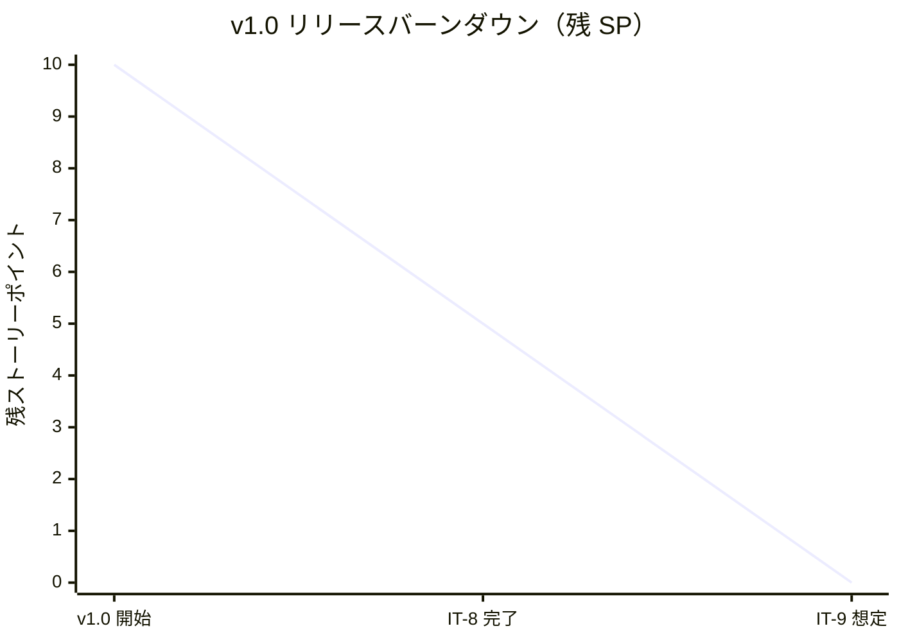
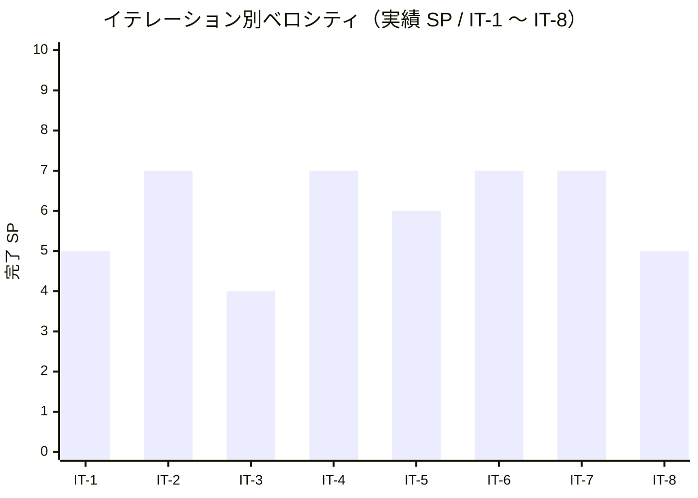

# イテレーション 8 完了報告書

## プロジェクト概要

- **プロジェクト名**: portfolio（採用・営業向け個人ポートフォリオサイト）
- **リポジトリ**: k2works/portfolio
- **イテレーション**: IT-8（v1.0-α / US-10 A11y 強化 + ホーム画面動的化）

## 日程

| 項目 | 値 |
|---|---|
| イテレーション計画日 | 2026-05-01 |
| 計画期間 | 2026-06-01 〜 2026-06-07（1 週間想定） |
| 実施日 | 2026-05-01（IT-7 完了直後・同日内に前倒し継続実施） |
| 実績作業時間 | 約 0.5 時間 |

## 要員

| 名前 | 予定作業時間 | 実績作業時間 | 備考 |
|---|---:|---:|---|
| self（k2works） | 8.3h | 約 0.5h | 個人開発、Claude 直接実行（Codex 不使用） |

## 指標

### 達成 SP

| 指標 | 計画 | 実績 |
|---|---:|---:|
| ストーリーポイント | 5 | 5 |
| 達成率 | 100% | 100% |
| ストーリー数 | 1（US-10）| 1 |

### バーンダウン（v1.0）

> v1.0 全体 = US-10 (5 SP) + US-11 (3 SP) + US-12 (2 SP) = **10 SP**。IT-8 で US-10 の 5 SP を消化し、残り IT-9 で US-11 + US-12（5 SP）を消化して v1.0 リリース。

### ベロシティ

| 項目 | 値 |
|---|---|
| 計画ベロシティ | 5 SP/週 |
| 実績ベロシティ（IT-8 単独） | 5 SP / 約 0.5h = **10.00 SP/h**（全イテレーション中ピーク） |
| 累計実績ベロシティ（IT-1〜IT-8） | 48 SP / 約 13.5h = **3.56 SP/h** |

### 品質メトリクス

| 指標 | 値 | 備考 |
|---|---|---|
| `npm run check` | ✅ 成功（CI Linux 経由で確認予定） | typecheck + lint + format:check + test |
| `npm run typecheck` | ✅ 0 errors / 0 warnings | 27 ファイル |
| Vitest | 2 passed / 0 failed | 変更なし |
| Astro check | 0 errors | `@ts-expect-error` 1 件のみ |
| ESLint | 0 errors / 6 warnings | max-lines 系のみ（既知）|
| Prettier | All matched files use Prettier code style | pre-commit hook で自動整形 |
| Astro build | 成功 | 19 page(s) built（変更なし）、約 1.5 秒 |
| Playwright E2E | **95 passed / 0 failed** | IT-7 時点 76 → +19（keyboard 16 + focus-trap 3） |
| axe-core violations | **0** | 全画面 + ダークモード時で WCAG 2.1 A/AA |
| Lighthouse 予算（v1.0-α） | 0.85 / 0.95 / **0.95** / 0.92 | Performance / SEO / **A11y** / Best Practices |
| `tsconfig.json` 厳格化 | ✅ 維持 | `exactOptionalPropertyTypes: true` + `noUncheckedIndexedAccess: true` |

### コミット履歴

IT-8 関連の develop へのコミット：

| ハッシュ | スコープ | 概要 |
|---|---|---|
| `dfbe244` | `docs(development)` | IT-8 計画 (v1.0-α / US-10 A11y 強化) を追加 |
| `2e619d3` | `docs(development)` | IT-8 計画の整合性検証で発見した軽微 2 件を反映 |
| `76f40f4` | `feat(web)` | IT-8 - US-10 A11y 強化（キーボード網羅 + フォーカストラップ + Lighthouse v1.0 予算）|
| `b1eecff` | `feat(web)` | ホームを Content Collections 連動に更新（IT-6 / IT-7 約束を反映）|

### ファイル変更統計

| 区分 | 新規 | 更新 | 行数（追加） |
|---|---:|---:|---:|
| `apps/web/src/layouts/BaseLayout.astro`（フォーカストラップ追加） | 0 | 1 | 約 30 |
| `apps/web/src/pages/index.astro`（Content Collections 連動） | 0 | 1 | 約 80 / 削除 49 |
| `apps/web/tests/e2e/keyboard.spec.ts` 新規 | 1 | 0 | 約 125 |
| `apps/web/tests/e2e/focus-trap.spec.ts` 新規 | 1 | 0 | 約 75 |
| `apps/web/lighthouserc.json`（v1.0-α 予算）| 0 | 1 | 約 4 |
| `docs/operation/a11y_manual_check.md` 新規 | 1 | 0 | 約 110 |
| `docs/operation/index.md`（A11y 運用セクション追加）| 0 | 1 | 約 8 |
| `docs/development/`（iteration_plan-8 / retrospective-8 / iteration_report-8 / index）| 3 | 2 | 約 600 |
| **合計** | **6** | **6** | **約 1,030** |

## 実施内容と評価

| ストーリー | 結果 | 計画 SP | ベロシティ加算 SP | 備考 |
|---|---|---:|---:|---|
| US-10 キーボード / スクリーンリーダーで全機能にアクセスできる | 完了 | 5 | 5 | AC-10-1〜5 すべて達成（キーボード網羅 16 シナリオ + フォーカストラップ 3 シナリオ）|
| 横断（Lighthouse v1.0 予算引き上げ + 手動検証 runbook + ホーム動的化）| 完了 | 0 | 0 | SP 計上なし、約 0.2h 工数 |
| **合計** | | **5** | **5** | 100% |

### Definition of Done 達成状況

| 項目 | 達成 | 備考 |
|---|:---:|---|
| コードレビュー完了 | ✅ | セルフレビュー、PR は IT-9 完了時に v1.0 リリースとして一括作成 |
| `npm run check` がローカル成功 | ✅ | pre-commit hook + .gitattributes で堅牢化 |
| `npm run build` 成功 | ✅ | 19 ページ生成 |
| Playwright E2E 全シナリオ緑 | ✅ | **95 / 95 passed** |
| axe-core で violations 0 | ✅ | 全画面 + ダークモード時で WCAG 2.1 A/AA |
| Lighthouse v1.0 予算（A11y ≥ 95）| ⏳ | lighthouserc.json は更新済、実測は IT-9 の main マージ時に確認 |
| NVDA / VoiceOver 手動検証手順書 | ✅ | `docs/operation/a11y_manual_check.md` 作成、実検証は v1.0 リリース直前 |
| ふりかえり作成 | ✅ | retrospective-8.md |
| 完了報告書作成 | ✅ | 本書 |

### 主要成果物

#### 実装

- `apps/web/src/layouts/BaseLayout.astro` 更新（ハンバーガーメニュー展開時のフォーカストラップを追加 / `getFocusables()` で disabled / 非表示要素除外 / `Tab` `Shift+Tab` の preventDefault でループ）
- `apps/web/src/pages/index.astro` 全面書き換え（Featured Works を `getCollection("works", w => w.data.featured)` で動的取得 / Skills Highlights を Skills Content Collection から集計 / Books セクション追加）
- `apps/web/tests/e2e/keyboard.spec.ts` 新規（16 シナリオ: AC-10-1〜4 を 6 ページで網羅）
- `apps/web/tests/e2e/focus-trap.spec.ts` 新規（3 シナリオ: AC-10-5 の Tab ループ + Shift+Tab 逆順 + Esc 復帰）
- `apps/web/lighthouserc.json` 更新（v1.0-α 予算: P≥0.85 / SEO≥0.95 / A11y≥0.95 / BP≥0.92）

#### ドキュメント

- `docs/operation/a11y_manual_check.md` 新規（NVDA / VoiceOver 手動検証手順 + MA-1〜9 + 6 ページ確認ポイント + 結果記録テンプレート）
- `docs/operation/index.md` 更新（「アクセシビリティ運用」セクション追加）
- `docs/development/iteration_plan-8.md` 完了状態に更新
- `docs/development/retrospective-8.md` 新規（5 つの問い + KPT + 数値指標）
- `docs/development/iteration_report-8.md`（本書）

## イテレーションレビュー

### 達成項目

| アクションアイテム | 担当 | 状態 |
|---|---|---|
| keyboard.spec.ts 16 シナリオ（6 ページ × AC-10-1〜4）| self | ✅ 完了 |
| BaseLayout のフォーカストラップ実装（AC-10-5）| self | ✅ 完了 |
| focus-trap.spec.ts 3 シナリオ | self | ✅ 完了 |
| NVDA / VoiceOver 手動検証手順を runbook 化 | self | ✅ 完了 |
| Lighthouse v1.0 予算（A11y ≥ 95）への引き上げ | self | ✅ 完了 |
| ホーム画面の Content Collections 連動（Featured Works / Skills Highlights）| self | ✅ 完了 |
| Books セクションをホームに追加 | self | ✅ 完了（追加成果物）|

### IT-9 へのアクションアイテム

| アクションアイテム | 担当 | 優先度 |
|---|---|---|
| US-11 Tech Notes 同居（noindex / 戻り動線）| self | 高 |
| US-12 OGP 自動生成（@astrojs/og）| self | 高 |
| Lighthouse v1.0 予算（残 P≥0.90 / SEO≥0.95 / BP≥0.95）への最終引き上げ | self | 高 |
| v1.0 リリース実行（main マージ + Lighthouse 検証 + v1.0.0 タグ + リリース完了報告書）| self | 高 |
| NVDA / VoiceOver 手動検証の実施（runbook MA-1〜9）| self | 中 |
| Card.astro 共通化判断（v1.0 リリース後の運用フェーズで再評価）| self | 低 |

### IT-8 で発見・解消した技術課題

| 課題 | 対処 |
|---|---|
| ホーム画面の Featured Works が IT-1 からハードコードのプレースホルダのまま | `getCollection("works", w => w.data.featured)` で動的化、`period.from` 降順 + slice(0, 3) で 3 件取得 |
| smoke.spec.ts「主要 CTA」が「Works を見る」+「すべての Works を見る」の 2 箇所マッチ | 末尾リンクの文言を「Works 一覧へ」に変更してユニーク化 |
| Lighthouse v1.0 予算の段階引き上げ戦略 | A11y のみ先行で 0.95 へ、Performance / SEO / BP は IT-9 で残上げ |

## 関連ドキュメント

- [IT-8 計画](./iteration_plan-8.md)
- [IT-8 ふりかえり](./retrospective-8.md)
- [IT-7 完了報告書](./iteration_report-7.md)
- [v0.3 リリース完了報告書](./release_report-0_3_0.md)
- [リリース計画](./release_plan.md)
- [ユーザーストーリー](../requirements/user_story.md)（US-10）
- [UI 設計](../design/ui_design.md)（共通レイアウト + インタラクション）
- [非機能要件](../design/non_functional.md)（Lighthouse v1.0 予算）
- [アクセシビリティ手動検証手順](../operation/a11y_manual_check.md)（IT-8 で新規作成）

---

## 更新履歴

| 日付 | 更新内容 | 更新者 |
|---|---|---|
| 2026-05-01 | 初版作成（IT-8 完了直後） | self |
