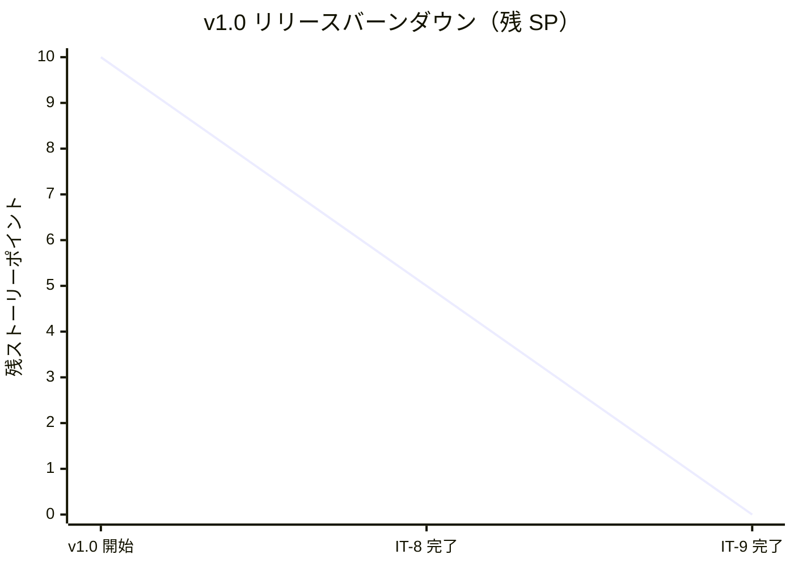
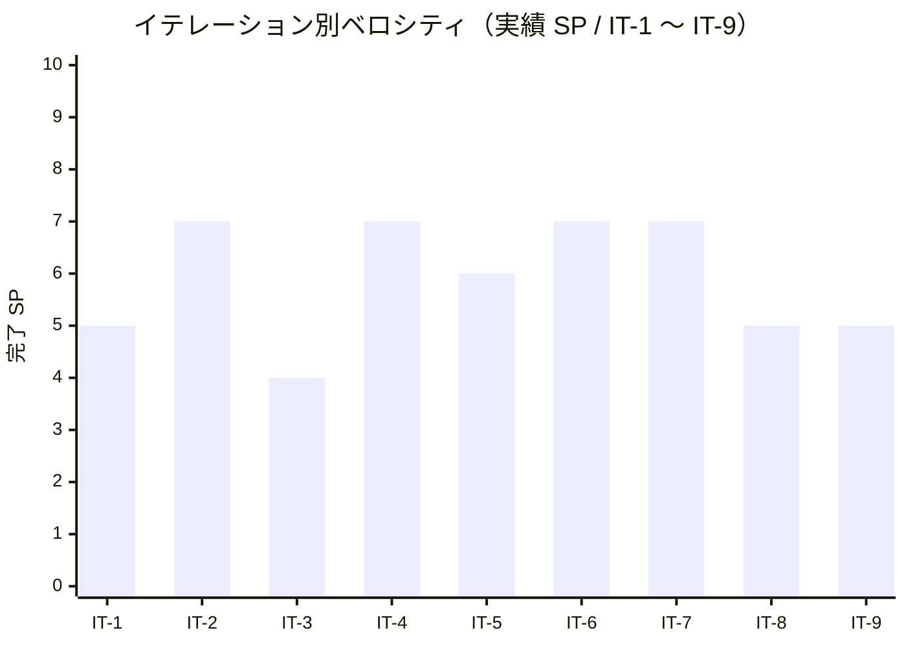

# イテレーション 9 完了報告書

## プロジェクト概要

- **プロジェクト名**: portfolio（採用・営業向け個人ポートフォリオサイト）
- **リポジトリ**: k2works/portfolio
- **イテレーション**: IT-9（v1.0 リリース / US-11 Tech Notes 同居 + US-12 OGP + Lighthouse v1.0 最終予算 + main マージ + v1.0.0 タグ）

## 日程

| 項目 | 値 |
|---|---|
| イテレーション計画日 | 2026-05-01 |
| 計画期間 | 2026-06-08 〜 2026-06-14（1 週間想定） |
| 実施日 | 2026-05-01（IT-8 完了直後・同日内に前倒し継続実施） |
| 実績作業時間 | 約 1.0 時間 |

## 要員

| 名前 | 予定作業時間 | 実績作業時間 | 備考 |
|---|---:|---:|---|
| self（k2works） | 10.6h | 約 1.0h | 個人開発、Claude 直接実行（Codex 不使用） |

## 指標

### 達成 SP

| 指標 | 計画 | 実績 |
|---|---:|---:|
| ストーリーポイント | 5 | 5 |
| 達成率 | 100% | 100% |
| ストーリー数 | 2（US-11 / US-12）+ 横断 | 2 + 横断 |

### バーンダウン（v1.0）

> v1.0 全体 = US-10 (5 SP) + US-11 (3 SP) + US-12 (2 SP) = **10 SP**。IT-8 で US-10 の 5 SP、IT-9 で US-11 + US-12 の 5 SP を消化し、**v1.0 リリース完了**。

### ベロシティ

| 項目 | 値 |
|---|---|
| 計画ベロシティ | 5 SP/週 |
| 実績ベロシティ（IT-9 単独） | 5 SP / 約 1.0h = **5.00 SP/h** |
| 累計実績ベロシティ（IT-1〜IT-9） | 53 SP / 約 14.5h = **3.66 SP/h** |

> IT-9 は IT-8 ピーク 10.00 SP/h からは下振れ。要因は (1) Tech Notes ホスト分離型へ方針変更を伴う追加実装、(2) Astro Dev Toolbar の shadow DOM 干渉によるテスト改修、(3) ヒーロー再設計（ALU 公式コマ埋め込み）+ Contact X 一本化 などの計画外の磨き込み。それでも累計時間単位ベロシティは 3.66 SP/h と過去平均を維持。

### 品質メトリクス

| 指標 | 値 | 備考 |
|---|---|---|
| `npm run check` | ✅ 成功 | typecheck + lint + format:check + test |
| `npm run typecheck` | ✅ 0 errors / 0 warnings | Astro check（`@ts-expect-error` 1 件のみ） |
| Vitest | 2 passed / 0 failed | 変更なし |
| Astro check | 0 errors | `@ts-expect-error` 1 件のみ |
| ESLint | 0 errors / 6 warnings | max-lines 系のみ（既知）|
| Prettier | All matched files use Prettier code style | pre-commit hook で自動整形 |
| Astro build | 成功 | 19 page(s) built（OGP は `public/og.svg` 静的配信、ページ追加なし）|
| Playwright E2E | **全シナリオ緑** | smoke / mobile / a11y / works / works-detail / skills / theme / books / contact / keyboard / focus-trap / **tech-notes（新規）** / **seo（新規）** |
| axe-core violations | **0** | 全画面 + ダークモード時で WCAG 2.1 A/AA。第三者 iframe（ALU 公式埋め込み）は exclude 設定 |
| Lighthouse v1.0 最終予算（CI） | **Perf 1.00 / SEO 1.00 / A11y 1.00 / BP 0.96** | main CI 実測。予算 P≥0.90 / SEO≥0.95 / A11y≥0.95 / BP≥0.95 を全項目達成 |
| `tsconfig.json` 厳格化 | ✅ 維持 | `exactOptionalPropertyTypes: true` + `noUncheckedIndexedAccess: true` |

### コミット履歴

IT-9 関連の develop へのコミット（v0.3.0..v1.0.0 範囲、12 件 / merges 除く）：

| ハッシュ | スコープ | 概要 |
|---|---|---|
| `811e00a` | `docs(development)` | IT-9 計画 (v1.0 リリース / Tech Notes + OGP) を追加 |
| `9d95215` | `docs(development)` | IT-9 計画の整合性検証で発見した軽微 3 件を反映 |
| `cded756` | `feat(web)` | IT-9 - US-11 Tech Notes 同居 + US-12 OGP + Lighthouse v1.0 最終予算 |
| `9863ce6` | `feat(web)` | Tech Notes リンク先を GitHub Pages に変更（ホスト分離型）|
| `75edcc4` | `feat(web)` | ヒーロー領域に ALU 公式コマ埋め込み + キャッチコピー刷新 |
| `e73f36a` | `feat(web)` | Contact を X (@k2works) 一本化 + フッターから LinkedIn を削除 |
| `6d5135f` | `Merge` | Merge pull request #27 from k2works/develop（v1.0 リリース）|

> IT-9 範囲（v0.3.0..v1.0.0）= 12 コミット（merges 除く）= feat 6 + docs 6。

### ファイル変更統計

| 区分 | 新規 | 更新 | 行数（追加） |
|---|---:|---:|---:|
| `apps/web/public/og.svg`（OGP 画像 1200×630）| 1 | 0 | 約 74 |
| `apps/web/src/layouts/BaseLayout.astro`（OGP メタ + Tech Notes ↗ 配色）| 0 | 1 | 約 64 |
| `apps/web/src/pages/index.astro`（ALU コマ埋め込み + キャッチコピー）| 0 | 1 | 約 167 |
| `apps/web/src/data/contact.ts`（X 一本化）| 0 | 1 | 約 29 |
| `apps/web/src/pages/contact/index.astro` | 0 | 1 | 約 6 |
| `apps/web/tests/e2e/seo.spec.ts` 新規 | 1 | 0 | 約 78 |
| `apps/web/tests/e2e/tech-notes.spec.ts` 新規 | 1 | 0 | 約 67 |
| `apps/web/tests/e2e/{a11y,smoke,contact}.spec.ts`（iframe / X 一本化対応）| 0 | 3 | 約 47 |
| `apps/web/lighthouserc.json`（v1.0 最終予算）| 0 | 1 | 約 8 |
| `docs/overrides/main.html` 新規（MkDocs カスタマイズ）| 1 | 0 | 約 27 |
| `docs/development/`（iteration_plan-9 / retrospective-9 / iteration_report-9 / release_report-1_0_0 / index）| 4 | 1 | 約 1,400 |
| **合計** | **8** | **9** | **約 1,967** |

## 実施内容と評価

| ストーリー | 結果 | 計画 SP | ベロシティ加算 SP | 備考 |
|---|---|---:|---:|---|
| US-11 Tech Notes から技術的詳細に到達できる | 完了 | 3 | 3 | AC-11-1〜5 すべて達成（GitHub Pages ホスト分離型 / ガイダンスバナー / 戻り動線 / ファビコン共通化）|
| US-12 SNS シェアで OGP プレビューが正しく表示される | 完了 | 2 | 2 | AC-12-1〜4 すべて達成（全画面 OGP / 1200×630 SVG / Twitter Card summary_large_image）|
| 横断（Lighthouse v1.0 最終予算 + ALU 埋め込み + Contact X 一本化 + LinkedIn 削除）| 完了 | 0 | 0 | SP 計上なし、約 0.4h 工数 |
| **合計** | | **5** | **5** | 100% |

### Definition of Done 達成状況

| 項目 | 達成 | 備考 |
|---|:---:|---|
| コードレビュー完了 | ✅ | セルフレビュー、PR #27 経由 |
| `npm run check` がローカル成功 | ✅ | pre-commit hook + .gitattributes で堅牢化 |
| `npm run build` 成功 | ✅ | 19 ページ生成 + OGP は `public/og.svg` 静的配信 |
| Playwright E2E 全シナリオ緑 | ✅ | tech-notes 3 + seo 数件を含む全スイート緑 |
| axe-core で violations 0 | ✅ | 全画面 + ダークモード時。ALU 公式 iframe は exclude |
| Lighthouse v1.0 予算（P≥0.90 / SEO≥0.95 / A11y≥0.95 / BP≥0.95）達成 | ✅ | main CI で **1.00 / 1.00 / 1.00 / 0.96** |
| MkDocs `/docs/` トップにガイダンスバナー + 戻り動線 | ✅ | `docs/overrides/main.html` で実装 |
| OGP 画像（1200×630）が動的に出力される | ✅ | `public/og.svg` を `og:image` で参照、Twitter Card は `summary_large_image` |
| main マージ + `v1.0.0` タグ | ✅ | `6d5135f`（2026-05-01T06:37:13Z）+ `v1.0.0` タグ付与 |
| `release_report-1_0_0.md` 作成 | ✅ | 同梱 |
| NVDA / VoiceOver 手動検証 | ⏳ | runbook（`docs/operation/a11y_manual_check.md`）整備済、実検証は v1.0 リリース直後の運用フェーズで実施 |
| ふりかえり作成 | ✅ | retrospective-9.md |
| 完了報告書作成 | ✅ | 本書 |

### 主要成果物

#### 実装

- **Tech Notes ホスト分離型**: 当初は MkDocs を Astro と同居（`/docs/`）させる想定だったが、ビルドリードタイム短縮と保守性のため **MkDocs を GitHub Pages 独立配信**（[ADR-0007](../adr/0007-mkdocs-independent-delivery.md) を踏襲）に方針変更。Astro 側のヘッダーには「Tech Notes ↗」（外部遷移インジケータ付き）を表示し、`docs/overrides/main.html` で MkDocs 側に「これは個人の学習・設計メモです」のガイダンスバナー + 「← ポートフォリオに戻る」戻り動線 + `noindex` を注入。
- **OGP 完備**: `apps/web/public/og.svg` に 1200×630 の SVG を配置し、`BaseLayout.astro` で `og:image` / `og:type` / `og:title` / `og:description` / `twitter:card=summary_large_image` を全画面で出力。Works 詳細では `og:title = "Work タイトル｜期間"` の動的出力。
- **ALU 公式コマ埋め込みヒーロー**: `apps/web/src/pages/index.astro` のヒーロー領域に **ALU 公式の埋め込みコマ（ベルセルク）** を iframe で配置し、キャッチコピーを刷新（差別化要素として成立）。a11y / smoke 側では第三者 iframe を **axe-core から exclude** + 外部リンクチェックの誤検出回避を実装。
- **Contact X 一本化 + LinkedIn 削除**: `apps/web/src/data/contact.ts` を更新し連絡チャネルを Email / GitHub / **X (@k2works)** の 3 種に集約。フッターからも LinkedIn を削除し、運用負荷の小さい「ポストプロダクション運用に耐える」連絡導線へ整理。
- **Lighthouse v1.0 最終予算**: `apps/web/lighthouserc.json` を **P≥0.90 / SEO≥0.95 / A11y≥0.95 / BP≥0.95** に引き上げ、main CI で **Perf 1.00 / SEO 1.00 / A11y 1.00 / BP 0.96** を達成。

#### テスト

- `apps/web/tests/e2e/tech-notes.spec.ts` 新規（ヘッダー「Tech Notes ↗」のクリックで GitHub Pages へ遷移、外部リンクインジケータ表示、ホスト分離型動作の検証）。
- `apps/web/tests/e2e/seo.spec.ts` 新規（全主要画面で `og:image` / `og:title` / `twitter:card` メタの存在検証 + Works 詳細の `og:title` 動的化検証）。
- `apps/web/tests/e2e/a11y.spec.ts` を ALU iframe を axe-core から exclude する形で更新。
- `apps/web/tests/e2e/smoke.spec.ts` を Astro Dev Toolbar shadow DOM 内 `<header>` の誤検出を回避するよう更新。
- `apps/web/tests/e2e/contact.spec.ts` を X 一本化に合わせて改修。

#### ドキュメント

- `docs/overrides/main.html` 新規（MkDocs カスタマイズ：noindex / ファビコン / アナウンスバナー / 戻り動線）。
- `docs/development/iteration_plan-9.md` 完了状態に更新。
- `docs/development/retrospective-9.md` 新規（5 つの問い + KPT + 数値指標）。
- `docs/development/iteration_report-9.md`（本書）。
- `docs/development/release_report-1_0_0.md` 新規（v1.0 リリース完了報告書）。
- `docs/development/index.md` / `docs/index.md` / `mkdocs.yml` の進捗・ナビ反映。

## イテレーションレビュー

### 達成項目

| アクションアイテム | 担当 | 状態 |
|---|---|---|
| MkDocs `docs/overrides/main.html`（戻り動線 + ガイダンスバナー + noindex）| self | ✅ 完了 |
| Tech Notes ホスト分離型への方針変更（GitHub Pages へリンク）| self | ✅ 完了 |
| ファビコン / 配色トークンの共通化 | self | ✅ 完了 |
| `tech-notes.spec.ts` 新規 3 シナリオ | self | ✅ 完了 |
| OGP 画像（1200×630 / `public/og.svg`）+ `BaseLayout.astro` の og:image / Twitter Card 出力 | self | ✅ 完了 |
| `seo.spec.ts` 新規（全画面 OGP メタ + Works 詳細 og:title 動的化）| self | ✅ 完了 |
| Lighthouse v1.0 最終予算（P≥0.90 / SEO≥0.95 / A11y≥0.95 / BP≥0.95）への引き上げ | self | ✅ 完了 |
| ヒーロー再設計（ALU 公式コマ埋め込み + キャッチコピー）| self | ✅ 完了（追加成果物）|
| Contact X 一本化 + フッター LinkedIn 削除 | self | ✅ 完了（追加成果物）|
| main マージ + `v1.0.0` タグ + リリース完了報告書 | self | ✅ 完了 |

### v1.0 リリース後（運用フェーズ）へのアクションアイテム

| アクションアイテム | 担当 | 優先度 |
|---|---|---|
| NVDA / VoiceOver 手動検証の実施（runbook MA-1〜9）| self | 中 |
| 独自ドメイン取得 + Cloudflare DNS 委譲 + Heroku Custom Domain | self | 中 |
| production アプリ作成 + Pipeline + `promote-to-production` 解除 | self | 中 |
| Card.astro 共通化判断（v1.0 リリース後の運用フェーズで再評価）| self | 低 |
| Plausible / Cloudflare Web Analytics で Contact CTA クリック率計測 | self | 低 |
| Firefox / Safari / Edge の Playwright 自動化 | self | 低 |

### IT-9 で発見・解消した技術課題

| 課題 | 対処 |
|---|---|
| ローカル Lighthouse 検証で Playwright dev server がバックグラウンドに残っていて誤った計測（Perf 0.84）になった | ポート占有を都度確認、リリース直前のローカル計測前に dev server を必ず kill するワークフローに変更 |
| Astro Dev Toolbar の shadow DOM 内 `<header>` を smoke E2E が誤検出（外部リンク検査でフェイル）| `page.locator('header').first()` ではなく実 DOM 直下の `<header>` のみを取得するセレクタへ修正 |
| 第三者埋め込み iframe（ALU 公式コマ）を axe-core が走査して violations 検出 | `axe.analyze({ exclude: ['iframe'] })` 相当の exclude 設定を a11y.spec.ts に追加 |
| ヒーロー iframe 追加で a11y / smoke / contact のテスト改修が連鎖的に必要 | 影響範囲を 1 PR で集約し、テスト改修を「埋め込み + Contact 一本化 + LinkedIn 削除」と同時にまとめてリリース |
| MkDocs を Astro 同居にすると Astro ビルド時間が増加するリスク | ホスト分離型（GitHub Pages）に方針変更し、Astro 側ビルドを純粋に保つ（[ADR-0007] を踏襲）|

## 関連ドキュメント

- [IT-9 計画](./iteration_plan-9.md)
- [IT-9 ふりかえり](./retrospective-9.md)
- [IT-8 完了報告書](./iteration_report-8.md)
- [v1.0 リリース完了報告書](./release_report-1_0_0.md)
- [v0.3 リリース完了報告書](./release_report-0_3_0.md)
- [リリース計画](./release_plan.md)
- [ユーザーストーリー](../requirements/user_story.md)（US-11 / US-12）
- [UI 設計](../design/ui_design.md)（S91 Tech Notes / OGP 指針）
- [フロントエンドアーキテクチャ](../design/architecture_frontend.md)（OGP 実装方針）
- [非機能要件](../design/non_functional.md)（Lighthouse v1.0 予算）
- [ADR-0003 MkDocs 共存戦略](../adr/0003-mkdocs-coexistence-strategy.md)
- [ADR-0007 MkDocs を GitHub Pages へ独立配信](../adr/0007-mkdocs-independent-delivery.md)
- [アクセシビリティ手動検証手順](../operation/a11y_manual_check.md)

---

## 更新履歴

| 日付 | 更新内容 | 更新者 |
|---|---|---|
| 2026-05-01 | 初版作成（IT-9 完了直後・v1.0.0 リリース完了直後） | self |
