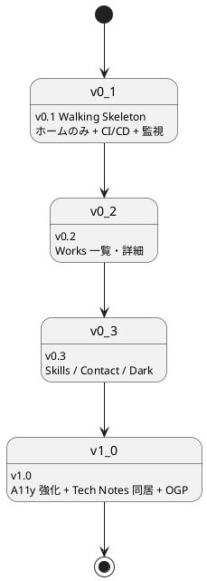
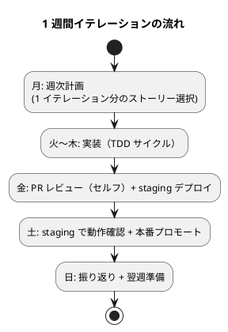

# リリース計画

## 概要

採用・営業向けポートフォリオサイトを **Walking Skeleton 方式**で段階的にリリースする。最小スコープから始めて実トラフィックでベロシティと品質を計測し、確信を持って次のリリースを進める。

設計方針：

- **小さなリリース**（XP 原則）: v0.1 はホーム 1 画面のみ。完全形でなく動く骨格をまず公開する
- **品質ゲートも段階導入**: Lighthouse 90/95/95 を初期から要求しない（コンテンツ追加が止まるリスクを避ける）
- **ベロシティ計測の母数獲得**: 最初の 2〜3 イテレーションは「見積もり校正」を目的にする
- **採用面接前後の停止回避**: リリース直後はソーク時間を取る

## リリース全体像

## バージョン定義

### v0.1: Walking Skeleton

**目的**: 採用面接で「見せられる最低限」を最短で公開し、CI/CD と監視を本物のトラフィックで検証する。

| 含む | 含まない |
|---|---|
| ホーム（S01）のみ | Works / Skills / Contact 専用ページ |
| プロフィール + 得意領域タグ + 実績ハイライト + 主要 CTA | ダークモード |
| Featured Works 3 件（静的記述、詳細遷移なし） | Tech Notes 同居 |
| Skills Highlights | OGP 自動生成（手動配置で代替） |
| 連絡先（フッター + 主要 CTA からの mailto） | View Transitions |
| `/healthz` + 404 | フィルタ機能 |
| GitHub Actions CI/CD（lint / test / build / E2E スモーク / Heroku デプロイ） | - |
| Cloudflare 前段配置 + Heroku Pipeline | - |
| UptimeRobot 死活監視 | - |

**含まれるストーリー**:

| US ID | ストーリー | ポイント |
|---|---|---|
| US-01 | プロフィールを 30 秒で把握できる | 5 |
| US-13 | Markdown 編集で公開できる | 3 |
| US-14 | 障害時に 1 時間以内で復旧できる | 3 |
| US-09 | 検索エンジンに正しく索引される | 2 |
| 横断 | アクセシビリティ基本（A11y ≥ 90） | 3 |
| **小計** | | **16 pt** |

**リリース基準**:

- Lighthouse Performance ≥ 80 / SEO ≥ 90 / A11y ≥ 90
- E2E（E01, E07, E10, E11 のうちホーム関連サブセット）が全て成功
- UptimeRobot で 24 時間連続 99% 以上の稼働
- ランブック `ops/runbook/{deploy,rollback,disaster-recovery,pre-interview-freeze}.md` のスケルトン作成済み
- README にサイトの開発・公開手順が記載

---

### v0.2: Works

**目的**: 業務委託発注検討者・採用技術リーダーが「再現性のある成果か」を判断できるようにする。

| 含む | 含まない |
|---|---|
| Works 一覧（S02）+ タグフィルタ（単一選択、URL 共有） | 業務領域での絞り込み（v2 以降） |
| Works 詳細（S03）+ ストーリー構造（課題 → 挑戦 → 解決 → 成果） | 比較機能 |
| パンくず + 戻り動線 | 関連 Works 推薦 |
| Astro Content Collections + Zod スキーマ | - |

**含まれるストーリー**:

| US ID | ストーリー | ポイント |
|---|---|---|
| US-02 | Works 一覧で実績の傾向を把握できる | 5 |
| US-03 | Works 詳細で関与の深さと成果を判断できる | 5 |
| **小計** | | **10 pt** |

**リリース基準**:

- v0.1 基準を維持
- E03, E04 が全て成功
- 公開時に Works が **5 件以上**揃っている（[レビュー指摘](../review/design_review_20260430.md) User Rep）
- Featured フラグの選定基準が `Profile.featured_works[]` で明文化されている

---

### v0.3: Skills / Contact / Dark

**目的**: 訪問者の多様な状況（モバイル・夜間・絞り込み検索）に対応し、業務委託発注検討者が問い合わせできる状態にする。

| 含む | 含まない |
|---|---|
| Skills（S04）+ since/status/works[] + 凡例 | スキルレベルの自己評価以外（資格・認定） |
| Contact（S05）+ availability + 案件規模 | コンタクトフォーム |
| ダークモード切替 | - |
| レスポンシブ完全対応（sm / md / lg + タッチターゲット 44px） | - |
| ハンバーガーメニュー + フォーカストラップ | - |

**含まれるストーリー**:

| US ID | ストーリー | ポイント |
|---|---|---|
| US-04 | Skills で技術領域の網羅性を確認できる | 3 |
| US-05 | 稼働可否を確認して問い合わせ判断できる | 2 |
| US-06 | 外部チャネルから連絡できる | 2 |
| US-07 | ダークモードで快適に閲覧できる | 3 |
| US-08 | モバイルで快適に閲覧できる | 3 |
| **小計** | | **13 pt** |

**リリース基準**:

- v0.2 基準を維持
- E05, E06, E08, E09 が全て成功
- 主要 4 ブラウザ（Chrome / Firefox / Safari / Edge）の最新版で動作確認
- iPhone SE（375px）と Android 標準ブラウザでのスクショを `ops/qa/` に残す

---

### v1.0: 完全版

**目的**: アクセシビリティ・SEO・Tech Notes 同居を整え、長期低頻度運用フェーズへ移行する。

| 含む | 含まない |
|---|---|
| WCAG 2.1 AA 準拠（axe-core 全画面 violations 0） | WCAG AAA |
| Tech Notes 同居 + ガイダンスバナー + 戻り動線 | MkDocs テーマフルカスタマイズ |
| OGP 自動生成（`@astrojs/og`） | OGP A/B テスト |
| `sitemap.xml` 自動生成 + `robots.txt` 整備 | RSS / Atom |
| Lighthouse 90 / 95 / 95 へ予算引き上げ | - |
| 月次・四半期・年次運用フローの開始 | - |

**含まれるストーリー**:

| US ID | ストーリー | ポイント |
|---|---|---|
| US-10 | キーボード / スクリーンリーダーで全機能にアクセスできる | 5 |
| US-11 | Tech Notes から技術的詳細に到達できる | 3 |
| US-12 | SNS シェアで OGP プレビューが正しく表示される | 2 |
| **小計** | | **10 pt** |

**リリース基準**:

- Lighthouse Performance ≥ 90 / SEO ≥ 95 / A11y ≥ 95（[非機能要件](../design/non_functional.md) 正式化）
- E02, E10, E11, E12 が全て成功
- axe-core via Playwright で違反 0
- NVDA / VoiceOver で主要画面の手動検証完了

---

## イテレーション計画

### 計画方針

- **期間**: 1 週間 / イテレーション（個人運用前提）
- **初期ベロシティ仮**: 5 ポイント / 週（最初の 3 イテレーションで校正）
- **作業時間**: 平日夜 + 週末で 5〜10 時間 / 週を想定
- **校正後の見直し**: イテレーション 3 完了時点で実績ベロシティを記録、計画を再調整

### 想定イテレーション

| 週 | スコープ | ポイント | 累計 | バージョン |
|---:|---|---:|---:|---|
| 1 | 環境構築 + Walking Skeleton 骨格（ホーム静的 HTML） | 5 | 5 | v0.1-α |
| 2 | US-13 + US-14（CI/CD + ランブック）+ 監視 | 5 | 10 | v0.1-β |
| 3 | US-09 + US-01 仕上げ + Cloudflare 前段配置 | 5 | 15 | **v0.1 リリース** |
| 4 | US-02 一覧 + Content Collections | 5 | 20 | v0.2-α |
| 5 | US-03 詳細 + 5 件のサンプル Works 投入 | 5 | 25 | **v0.2 リリース** |
| 6 | US-04 Skills + US-07 ダークモード | 5 | 30 | v0.3-α |
| 7 | US-05 + US-06 + US-08 モバイル仕上げ | 5 | 35 | **v0.3 リリース** |
| 8 | US-10 A11y 強化（axe-core / NVDA 検証） | 5 | 40 | v1.0-α |
| 9 | US-11 Tech Notes 同居 + US-12 OGP | 5 | 45 | v1.0-β |
| 10 | Lighthouse 90/95/95 達成 + 全体仕上げ | 5 | 50 | **v1.0 リリース** |

実績で 10 週間以上かかる可能性も許容する。**面接予定がある週は通常変更を控える**（[BUC-07](../requirements/business_usecase.md#buc-07-採用面接前後のサイト稼働確保) / pre-interview-freeze）。

### イテレーションリズム

### イテレーション運用

| 項目 | 内容 |
|---|---|
| ストーリー選択基準 | 受入条件の明確さ + ベロシティ範囲 |
| 完了の定義（DoD） | 受入条件全パス + CI 全グリーン + staging で動作確認 |
| 振り返り | 完了ポイント / 残ストーリー / 学び を `docs/development/iteration_NN.md` に記録（任意・目安） |
| ベロシティ更新 | 3 週ごとに実績の中央値で次の見積もりを校正 |

## 品質ゲートの段階導入

### Lighthouse 予算

| バージョン | Performance | SEO | Accessibility | Best Practices |
|---|---:|---:|---:|---:|
| v0.1 | ≥ 80 | ≥ 90 | ≥ 90 | ≥ 90 |
| v0.2 | ≥ 85 | ≥ 90 | ≥ 90 | ≥ 90 |
| v0.3 | ≥ 85 | ≥ 95 | ≥ 92 | ≥ 92 |
| v1.0 | **≥ 90** | **≥ 95** | **≥ 95** | ≥ 95 |

### CI ゲートのモード切替

| シナリオ | モード |
|---|---|
| コンテンツ変更（Markdown のみ） | 警告のみ、リリース継続可能 |
| コード変更（Astro / Express） | 厳格、リリースブロック |
| ラベル `lighthouse-skip` 付与 PR | 警告のみ（緊急時のエスケープ） |

[非機能要件](../design/non_functional.md) と [テスト戦略](../design/test_strategy.md) の予算と整合させる。

## トレーサビリティ（ストーリー → リリース → E2E）

| バージョン | ストーリー | 受入 E2E |
|---|---|---|
| v0.1 | US-01, US-09, US-13, US-14 | E01, E07, E10, E11（ホーム関連） |
| v0.2 | US-02, US-03 | E03, E04 |
| v0.3 | US-04, US-05, US-06, US-07, US-08 | E05, E06, E08, E09 |
| v1.0 | US-10, US-11, US-12 | E02, E10（OGP）, E11（フル）, E12 |

## リスクと緩和策

| リスク | 影響 | 緩和策 |
|---|---|---|
| 個人ベロシティが想定より低い | リリース遅延 | スコープを縮め、v0.1 をさらに最小化（ホームの一部要素を v0.2 に押し出す） |
| 公開時に Works が 0 件 | 採用評価が逆効果 | v0.2 までに最低 5 件の Works を準備、揃わなければリリース延期 |
| 採用面接前後の停止 | 機会損失 | pre-interview-freeze ルール、Cloudflare Always Online、GitHub Pages 常時ミラー |
| Lighthouse 予算未達でリリース停止 | コンテンツ更新の停止 | 段階導入 + コンテンツ変更時の警告モード |
| Heroku 課金超過 | コスト増 | UptimeRobot のスパイク警告、Cloudflare キャッシュで吸収 |

## 関連ドキュメント

- [要件定義書](../requirements/requirements_definition.md)
- [ユーザーストーリー](../requirements/user_story.md)
- [ビジネスユースケース](../requirements/business_usecase.md)
- [UI 設計](../design/ui_design.md)
- [テスト戦略](../design/test_strategy.md)
- [非機能要件](../design/non_functional.md)
- [運用要件](../design/operation.md)
- [リリース・イテレーション計画ガイド](../reference/リリース・イテレーション計画ガイド.md)
- [分析成果物レビュー（2026-04-30）](../review/design_review_20260430.md)（H02 への対応）
