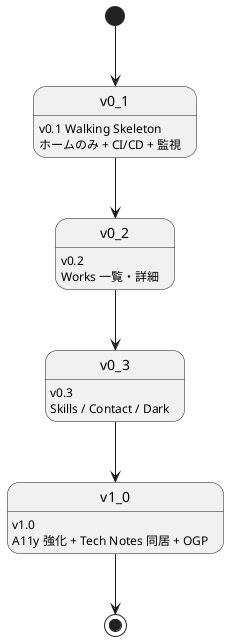
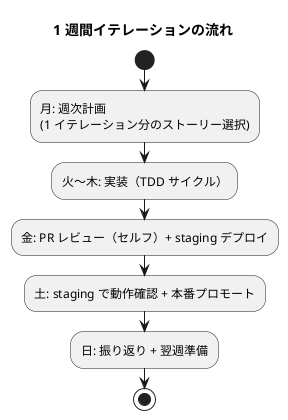

# リリース計画

## 概要

採用・営業向けポートフォリオサイトを **Walking Skeleton 方式**で段階的にリリースする。最小スコープから始めて実トラフィックでベロシティと品質を計測し、確信を持って次のリリースを進める。

設計方針：

- **小さなリリース**（XP 原則）: v0.1 はホーム 1 画面のみ。完全形でなく動く骨格をまず公開する
- **品質ゲートも段階導入**: Lighthouse 90/95/95 を初期から要求しない（コンテンツ追加が止まるリスクを避ける）
- **ベロシティ計測の母数獲得**: 最初の 2〜3 イテレーションは「見積もり校正」を目的にする
- **採用面接前後の停止回避**: リリース直後はソーク時間を取る

## リリース全体像

## バージョン定義

### v0.1: Walking Skeleton

**目的**: 採用面接で「見せられる最低限」を最短で公開し、CI/CD と監視を本物のトラフィックで検証する。

| 含む | 含まない |
|---|---|
| ホーム（S01）のみ | Works / Skills / Contact 専用ページ |
| プロフィール + 得意領域タグ + 実績ハイライト + 主要 CTA | ダークモード |
| Featured Works 3 件（静的記述、詳細遷移なし） | Tech Notes 同居 |
| Skills Highlights | OGP 自動生成（手動配置で代替） |
| 連絡先（フッター + 主要 CTA からの mailto） | View Transitions |
| `/healthz` + 404 | フィルタ機能 |
| GitHub Actions CI/CD（lint / test / build / E2E スモーク / Heroku デプロイ） | - |
| Cloudflare 前段配置 + Heroku Pipeline | - |
| UptimeRobot 死活監視 | - |

**含まれるストーリー**:

| US ID | ストーリー | ポイント |
|---|---|---|
| US-01 | プロフィールを 30 秒で把握できる | 5 |
| US-13 | Markdown 編集で公開できる | 3 |
| US-14 | 障害時に 1 時間以内で復旧できる | 3 |
| US-09 | 検索エンジンに正しく索引される | 2 |
| 横断 | アクセシビリティ基本（A11y ≥ 90） | 3 |
| **小計** | | **16 pt** |

**リリース基準**（2026-04-30 リリース時点の達成状況）:

- [x] Lighthouse Performance ≥ 80 / SEO ≥ 90 / A11y ≥ 90 → 達成（3 runs median、Best Practices ≥ 90 も達成）
- [x] E2E（E01, E07, E10, E11 のうちホーム関連サブセット）が全て成功 → 18/18 passed（smoke 12 + mobile 5 + a11y 1）
- [ ] UptimeRobot で 24 時間連続 99% 以上の稼働 → 監視登録済、ソーク継続中（v0.1 リリース後の確認事項）
- [x] ランブック（deploy / rollback / disaster-recovery / pre-interview-freeze）スケルトン作成済み → 9 本完成
- [x] README にサイトの開発・公開手順が記載 → Quick Start + 配信レイヤー仕様を記載
- [x] [追加] GitHub Actions から Heroku staging への自動デプロイ成立（[ADR-0006](../adr/0006-heroku-deploy-authentication.md)）

> **v0.1 は 2026-04-30 にリリース完了**（PR #1 / `fb533f5` / `v0.1.0` タグ）。詳細は [v0.1 リリース完了報告書](./release_report-0_1_0.md)。

---

### v0.2: Works

**目的**: 業務委託発注検討者・採用技術リーダーが「再現性のある成果か」を判断できるようにする。

| 含む | 含まない |
|---|---|
| Works 一覧（S02）+ タグフィルタ（単一選択、URL 共有） | 業務領域での絞り込み（v2 以降） |
| Works 詳細（S03）+ ストーリー構造（課題 → 挑戦 → 解決 → 成果） | 比較機能 |
| パンくず + 戻り動線 | 関連 Works 推薦 |
| Astro Content Collections + Zod スキーマ | - |

**含まれるストーリー**:

| US ID | ストーリー | ポイント |
|---|---|---|
| US-02 | Works 一覧で実績の傾向を把握できる | 5 |
| US-03 | Works 詳細で関与の深さと成果を判断できる | 5 |
| **小計** | | **10 pt** |

**リリース基準**:

- v0.1 基準を維持
- E03, E04 が全て成功
- 公開時に Works が **5 件以上**揃っている（[レビュー指摘](../review/design_review_20260430.md) User Rep）
- Featured フラグの選定基準が `Profile.featured_works[]` で明文化されている
  - 実装上は **`Work.featured: boolean`**（[フロントエンドアーキテクチャ - Featured Work の選定基準](../design/architecture_frontend.md#featured-work-の選定基準)）で実現する
  - v0.2 リリース時点では「選定基準の明文化」までを範囲とし、現在の暫定 featured 設定（11 件中 3 件: case-study-sales / getting-started-tdd / practical-database-design）を維持する
  - ホームの Featured Works は v0.3 home 再設計時に Content Collection 連動と合わせて再評価する

---

### v0.3: Skills / Contact / Dark

**目的**: 訪問者の多様な状況（モバイル・夜間・絞り込み検索）に対応し、業務委託発注検討者が問い合わせできる状態にする。

| 含む | 含まない |
|---|---|
| Skills（S04）+ since/status/works[] + 凡例 | スキルレベルの自己評価以外（資格・認定） |
| Contact（S05）+ availability + 案件規模 | コンタクトフォーム |
| ダークモード切替 | - |
| レスポンシブ完全対応（sm / md / lg + タッチターゲット 44px） | - |
| ハンバーガーメニュー + フォーカストラップ | - |

**含まれるストーリー**:

| US ID | ストーリー | ポイント |
|---|---|---|
| US-04 | Skills で技術領域の網羅性を確認できる | 3 |
| US-05 | 稼働可否を確認して問い合わせ判断できる | 2 |
| US-06 | 外部チャネルから連絡できる | 2 |
| US-07 | ダークモードで快適に閲覧できる | 3 |
| US-08 | モバイルで快適に閲覧できる | 3 |
| **小計** | | **13 pt** |

**リリース基準**:

- v0.2 基準を維持
- E05, E06, E08, E09 が全て成功
- 主要 4 ブラウザ（Chrome / Firefox / Safari / Edge）の最新版で動作確認
- iPhone SE（375px）と Android 標準ブラウザでのスクショを `ops/qa/` に残す

---

### v1.0: 完全版

**目的**: アクセシビリティ・SEO・Tech Notes 同居を整え、長期低頻度運用フェーズへ移行する。

| 含む | 含まない |
|---|---|
| WCAG 2.1 AA 準拠（axe-core 全画面 violations 0） | WCAG AAA |
| Tech Notes 同居 + ガイダンスバナー + 戻り動線 | MkDocs テーマフルカスタマイズ |
| OGP 自動生成（`@astrojs/og`） | OGP A/B テスト |
| `sitemap.xml` 自動生成 + `robots.txt` 整備 | RSS / Atom |
| Lighthouse 90 / 95 / 95 へ予算引き上げ | - |
| 月次・四半期・年次運用フローの開始 | - |

**含まれるストーリー**:

| US ID | ストーリー | ポイント |
|---|---|---|
| US-10 | キーボード / スクリーンリーダーで全機能にアクセスできる | 5 |
| US-11 | Tech Notes から技術的詳細に到達できる | 3 |
| US-12 | SNS シェアで OGP プレビューが正しく表示される | 2 |
| **小計** | | **10 pt** |

**リリース基準**:

- Lighthouse Performance ≥ 90 / SEO ≥ 95 / A11y ≥ 95（[非機能要件](../design/non_functional.md) 正式化）
- E02, E10, E11, E12 が全て成功
- axe-core via Playwright で違反 0
- NVDA / VoiceOver で主要画面の手動検証完了

---

## イテレーション計画

### 計画方針

- **期間**: 1 週間 / イテレーション（個人運用前提）
- **初期ベロシティ仮**: 5 ポイント / 週 → IT-2 完了時点で **7 ポイント / 週** に上方修正
- **作業時間**: 平日夜 + 週末で 5〜10 時間 / 週を想定
- **再校正方針**: 3 イテレーション完了時（IT-3 後）に再度見直し、その後は四半期ごと
- **3 シナリオ併記**: 楽観 / 標準 / 悲観でリリース日見込みを併記

### IT-1〜IT-6 実績（2026-05-01 時点・v0.3-α 完了）

| イテレーション | 計画 SP | 実績 SP | 計画工数 | 実績工数 | 状態 |
|---|---:|---:|---:|---:|---|
| IT-1 | 5 | 5 | 11.7h | 約 3h | 完了（v0.1-α） |
| IT-2 | 7 | 7 | 15.1h | 約 2h | 完了（v0.1-β） |
| IT-3 | 4 | 4 | 11.0h | 約 2h | 完了（v0.1 RC / コード完成） |
| IT-4 | 7 | 7 | 15.3h | 約 1.5h | 完了（v0.2-α） |
| IT-5 | 6 | 6 | 12.0h | 約 2h | 完了（v0.2 RC / コード完成） |
| IT-6 | 7 | 7 | 14.0h | 約 1.5h | 完了（v0.3-α） |
| **累計** | **36** | **36** | **79.1h** | **約 12h** | **100%** |

**実績ベロシティ**: 36 SP / 約 12h = **3.00 SP/h**（IT-1 1.67 → IT-2 3.50 → IT-3 2.00 → IT-4 4.67 → IT-5 3.00 → IT-6 4.67）

> v0.1 / v0.2 / v0.3-α 全体での生産性は「設計ドキュメントが豊富 + 手動構築の効率化 + Codex 不使用 + 個人開発の意思決定速度」によって達成。IT-6 でも設計先行ボーナスが継続して効き、IT-6 単独で **4.67 SP/h**（IT-4 と並ぶピーク）。IT-7 で v0.3 リリース（残 6 SP: US-05 + US-06 + US-08）と横断作業（ui_design 反映 / `.gitattributes` 拡張）を実施予定。

### 想定イテレーション（再校正）

| 週 | スコープ | 計画 SP | 累計 | バージョン |
|---:|---|---:|---:|---|
| 1（実施済み） | 環境構築 + Walking Skeleton 骨格（IT-1） | 5 | 5 | v0.1-α ✅ |
| 2（実施済み） | Tailwind 仕上げ + CI/CD + runbook + E2E + Lighthouse（IT-2） | 7 | 12 | v0.1-β ✅ |
| 3（実施済み） | 検索インデックス + ハンバーガー + axe-core + Cloudflare ガイド（IT-3） | 4 | 16 | v0.1 RC ✅ |
| -（実施済み） | Heroku staging 自動デプロイ成立 + main マージ + v0.1.0 タグ + リリース完了報告書 | -（外部依存） | 16 | **v0.1 リリース ✅（2026-04-30）** |
| 4（実施済み） | US-02 一覧 + Content Collections（works コレクション）+ US-13 残（IT-4） | 7 | 23 | v0.2-α ✅ |
| 5（実施済み） | US-03 詳細 + 5 件のサンプル Works 投入 + Works フィルタ（IT-5） | 6 | 29 | v0.2 RC ✅ |
| -（実施済み） | クローズド Work + 教材 URL 反映 + Featured 選定基準明文化 + 404 補完 + main マージ + v0.2.0 タグ + リリース完了報告書 | 4 | 33 | **v0.2 リリース ✅（2026-05-01）** |
| 6（実施済み） | US-04 Skills + US-07 ダークモード切替（IT-6） | 7 | 40 | v0.3-α ✅ |
| -（実施済み） | IT-6 後の追加コンテンツ + 品質改善: クローズド Work 2 件（business-saas-aws-iac / multi-gen-aws-iac）+ Skills 逆参照 + Books ページ（読書リスト 77 冊）+ 軸 × カテゴリフィルタ + pre-commit hook（husky + lint-staged）+ CI 緑化 | -（追加作業）| 40 | 開発活動継続 |
| 7 | US-05 Contact 稼働可否 + US-06 外部チャネル + US-08 モバイル仕上げ（IT-7）| 7 | 47 | **v0.3 リリース**（v0.3 = 13 SP / IT-7 で 7 SP）|
| 8 | US-10 A11y 強化（NVDA / VoiceOver 手動検証 + axe-core 全画面）（IT-8） | 5 | 51 | v1.0-α |
| 9 | US-11 Tech Notes 同居（noindex / 戻り動線）+ US-12 OGP（@astrojs/og）（IT-9） | 5 | 56 | **v1.0 リリース**（v1.0 = 10 SP） |

> 再校正後は **9 週間** で v1.0 完了見込み（IT-1+IT-2 が同日に完了したため、暦上は更に短縮可能）。

### 3 シナリオでのリリース日見込み

実施日 2026-04-30 を起点として：

| シナリオ | ベロシティ前提 | v0.1 リリース | v0.2 リリース | v0.3 リリース | v1.0 リリース |
|---|---|---|---|---|---|
| 楽観 | 7 SP/週（IT-1〜IT-2 ペース継続） | ~~2026-05-04~~ → **2026-04-30 実績** | 2026-05-18 | 2026-06-08 | 2026-06-22 |
| 標準 | 5 SP/週（IT-3 以降は実装複雑度↑で減速） | ~~2026-05-11~~ → **2026-04-30 実績** | 2026-06-01 | 2026-06-29 | 2026-07-20 |
| 悲観 | 3 SP/週（外部依存で停滞・体調不良など） | ~~2026-05-18~~ → **2026-04-30 実績** | 2026-06-29 | 2026-08-31 | 2026-10-19 |

> **v0.1 は楽観シナリオより 4 日早く完了** した。設計先行ボーナス + 個人開発の意思決定速度 + Codex 不使用判断が効いた。v0.2 以降は同様のボーナスが効きにくいため、**標準シナリオ（5 SP/週）** で見積もる。
>
> **外部依存リスク**: ドメイン取得 / Cloudflare DNS 委譲伝播（最長 24h） / Heroku production アカウント審査などはコード進捗と独立。v0.1 は「Heroku staging への自動デプロイ成立」をリリース条件とした（独自ドメイン公開は v1.0 までに完了予定）。
| 8 | US-10 A11y 強化（axe-core / NVDA 検証） | 5 | 40 | v1.0-α |
| 9 | US-11 Tech Notes 同居 + US-12 OGP | 5 | 45 | v1.0-β |
| 10 | Lighthouse 90/95/95 達成 + 全体仕上げ | 5 | 50 | **v1.0 リリース** |

実績で 10 週間以上かかる可能性も許容する。**面接予定がある週は通常変更を控える**（[BUC-07](../requirements/business_usecase.md#buc-07-採用面接前後のサイト稼働確保) / pre-interview-freeze）。

### イテレーションリズム

### イテレーション運用

| 項目 | 内容 |
|---|---|
| ストーリー選択基準 | 受入条件の明確さ + ベロシティ範囲 |
| 完了の定義（DoD） | 受入条件全パス + CI 全グリーン + staging で動作確認 |
| 振り返り | 完了ポイント / 残ストーリー / 学び を `docs/development/iteration_NN.md` に記録（任意・目安） |
| ベロシティ更新 | 3 週ごとに実績の中央値で次の見積もりを校正 |

## 品質ゲートの段階導入

### Lighthouse 予算

| バージョン | Performance | SEO | Accessibility | Best Practices |
|---|---:|---:|---:|---:|
| v0.1 | ≥ 80 | ≥ 90 | ≥ 90 | ≥ 90 |
| v0.2 | ≥ 85 | ≥ 90 | ≥ 90 | ≥ 90 |
| v0.3 | ≥ 85 | ≥ 95 | ≥ 92 | ≥ 92 |
| v1.0 | **≥ 90** | **≥ 95** | **≥ 95** | ≥ 95 |

### CI ゲートのモード切替

| シナリオ | モード |
|---|---|
| コンテンツ変更（Markdown のみ） | 警告のみ、リリース継続可能 |
| コード変更（Astro / Express） | 厳格、リリースブロック |
| ラベル `lighthouse-skip` 付与 PR | 警告のみ（緊急時のエスケープ） |

[非機能要件](../design/non_functional.md) と [テスト戦略](../design/test_strategy.md) の予算と整合させる。

## トレーサビリティ（ストーリー → リリース → E2E）

| バージョン | ストーリー | 受入 E2E |
|---|---|---|
| v0.1 | US-01, US-09, US-13, US-14 | E01, E07, E10, E11（ホーム関連） |
| v0.2 | US-02, US-03 | E03, E04 |
| v0.3 | US-04, US-05, US-06, US-07, US-08 | E05, E06, E08, E09 |
| v1.0 | US-10, US-11, US-12 | E02, E10（OGP）, E11（フル）, E12 |

## リスクと緩和策

| リスク | 影響 | 緩和策 |
|---|---|---|
| 個人ベロシティが想定より低い | リリース遅延 | スコープを縮め、v0.1 をさらに最小化（ホームの一部要素を v0.2 に押し出す） |
| 公開時に Works が 0 件 | 採用評価が逆効果 | v0.2 までに最低 5 件の Works を準備、揃わなければリリース延期 |
| 採用面接前後の停止 | 機会損失 | pre-interview-freeze ルール、Cloudflare Always Online、GitHub Pages 常時ミラー |
| Lighthouse 予算未達でリリース停止 | コンテンツ更新の停止 | 段階導入 + コンテンツ変更時の警告モード |
| Heroku 課金超過 | コスト増 | UptimeRobot のスパイク警告、Cloudflare キャッシュで吸収 |
| Windows ローカルでの `format:check` 環境問題（`core.autocrlf=true` × `endOfLine: "lf"` の衝突） | ローカル品質ゲート機能不全 → CI で初めて発覚 | pre-commit hook（husky + lint-staged）を `7d5caf9` で導入、commit 時に prettier --write + eslint --fix を staged ファイルに自動適用。`.gitattributes` 拡張は IT-7 横断タスク 3.2 で恒久対応 |

## 関連ドキュメント

- [要件定義書](../requirements/requirements_definition.md)
- [ユーザーストーリー](../requirements/user_story.md)
- [ビジネスユースケース](../requirements/business_usecase.md)
- [UI 設計](../design/ui_design.md)
- [テスト戦略](../design/test_strategy.md)
- [非機能要件](../design/non_functional.md)
- [運用要件](../design/operation.md)
- [リリース・イテレーション計画ガイド](../reference/リリース・イテレーション計画ガイド.md)
- [分析成果物レビュー（2026-04-30）](../review/design_review_20260430.md)（H02 への対応）
