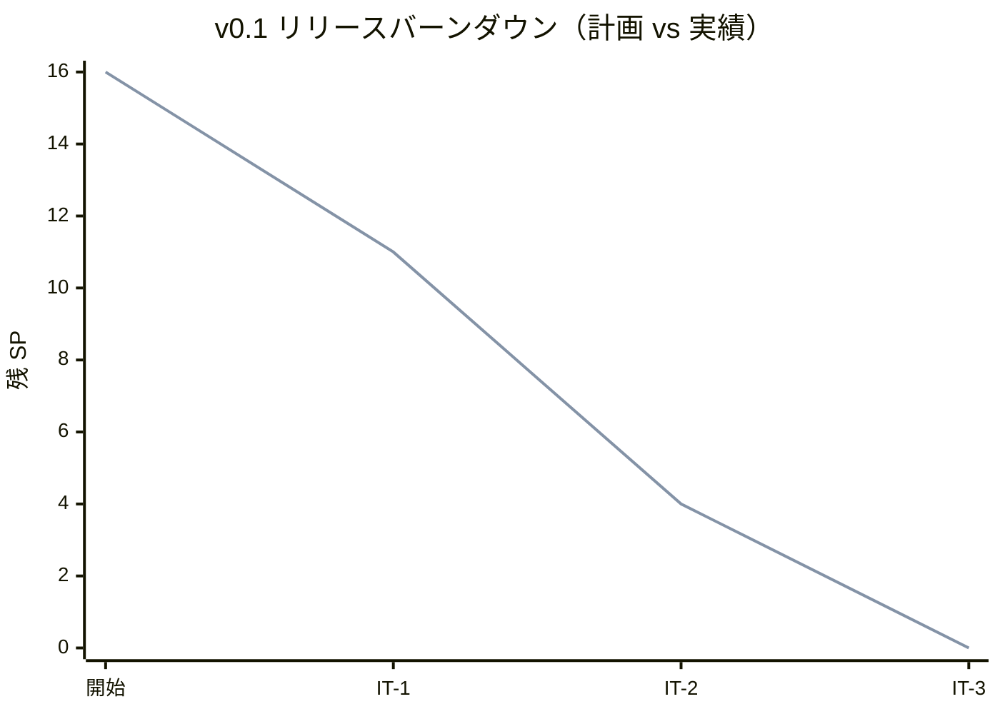
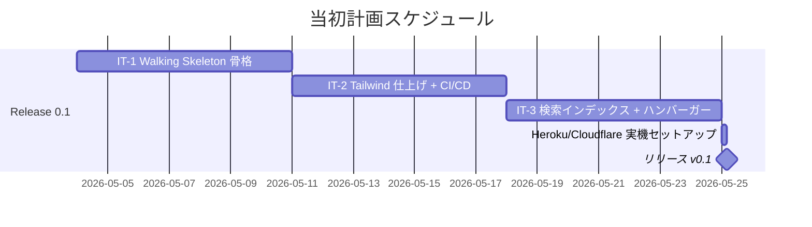
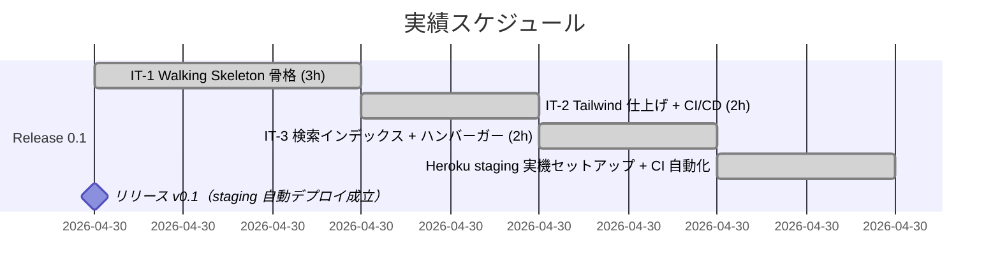
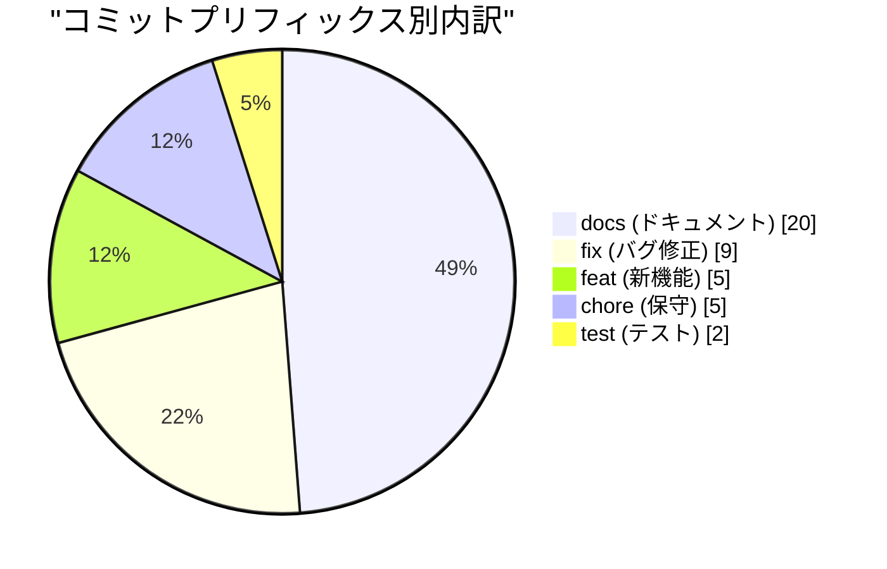
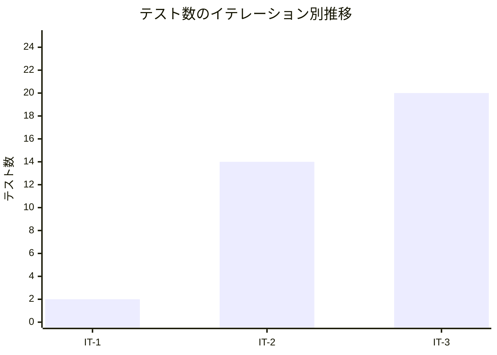
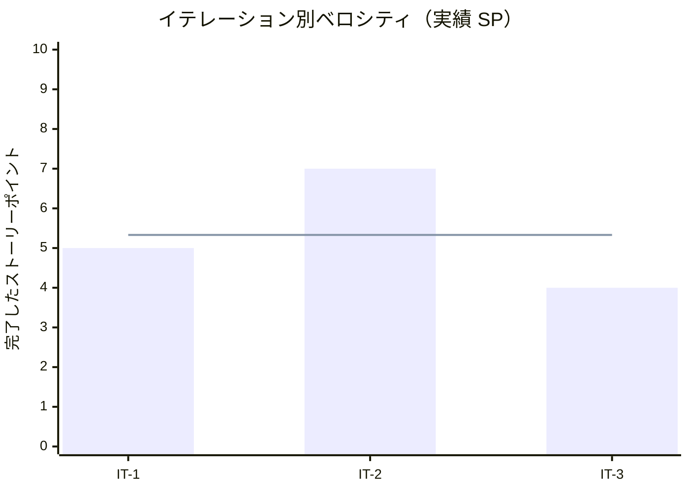

# リリース完了報告書 v0.1 - portfolio (Walking Skeleton)

**報告書作成日**: 2026-04-30

## 概要

portfolio v0.1（Walking Skeleton）のリリース完了報告書です。全 3 イテレーション、16 ストーリーポイントを 100% 達成し、**ホーム 1 画面 + CI/CD + Heroku staging 自動デプロイ** までの動く骨格が揃いました。本番ドメイン割り当ては v0.1 のスコープ外（v1.0 までの段階で実施予定）であり、staging 環境への自動デプロイ成立をもって v0.1 のコードリリースを完了とします。

---

## プロジェクトサマリー

| 項目 | 値 |
|------|-----|
| **プロジェクト期間** | 2026-04-30（IT-1〜IT-3 を同日に前倒し継続実施） |
| **総イテレーション数** | 3（IT-1 / IT-2 / IT-3） |
| **総ストーリーポイント** | 16 SP |
| **総コミット数** | 41（develop ブランチ） |
| **総テスト数** | 20（Vitest 2 + Playwright E2E 18） |
| **ユーザーストーリー数** | 5（US-01 / US-09 / US-13 / US-14 / 横断 A11y） |

---

## 計画と実績の差異分析

### イテレーション別達成状況

| イテレーション | リリース | 計画 SP | 実績 SP | 達成率 | 差異 |
|---------------|---------|---------|---------|--------|------|
| IT-1 | v0.1-α | 5 | 5 | 100% | 0 |
| IT-2 | v0.1-β | 7 | 7 | 100% | 0 |
| IT-3 | v0.1 RC | 4 | 4 | 100% | 0 |
| **合計** | | **16** | **16** | **100%** | **0** |

### リリース別達成状況

| リリース | 内容 | 計画 SP | 実績 SP | 達成率 |
|---------|------|---------|---------|--------|
| Release 0.1 Walking Skeleton | ホーム 1 画面 + CI/CD + Heroku staging + 監視ベース | 16 | 16 | 100% |

### リリースバーンダウン

**分析結果**: 計画と実績が完全一致。各イテレーションで予定 SP を 100% 完了し、SP の繰り越しは発生しなかった。

---

## 計画日程 vs 実績日数の差異分析

### イテレーション別日程比較

| IT | 計画期間 | 計画日数 | 実績期間 | 実績日数 | 短縮日数 | 短縮率 |
|----|---------|---------|----------|---------|---------|--------|
| 1 | 2026-05-04 〜 2026-05-10 | 7 日 | 2026-04-30 | **0.13 日（約 3h）** | 6.87 日 | 98.1% |
| 2 | 2026-05-11 〜 2026-05-17 | 7 日 | 2026-04-30 | **0.08 日（約 2h）** | 6.92 日 | 98.8% |
| 3 | 2026-05-11 〜 2026-05-17 | 7 日 | 2026-04-30 | **0.08 日（約 2h）** | 6.92 日 | 98.8% |
| **合計** | **2026-05-04 〜 2026-05-24** | **21 日** | **2026-04-30** | **0.29 日（約 7h）** | **20.71 日** | **98.6%** |

### 工期短縮の可視化

```mermaid
xychart-beta
    title "計画工数 vs 実績工数（時間）"
    x-axis ["IT-1", "IT-2", "IT-3"]
    y-axis "工数 (h)" 0 --> 16
    bar [11.7, 15.1, 11]
    bar [3, 2, 2]
```

### 計画 vs 実績ガントチャート

#### 当初計画スケジュール

#### 実績スケジュール

### サマリー

| 指標 | 値 |
|------|-----|
| **計画総日数** | 21 日 |
| **実績総日数** | 約 0.29 日（約 7h） |
| **短縮日数** | 約 20.71 日 |
| **短縮率** | **98.6%** |
| **計画総工数** | 37.8 h |
| **実績総工数** | 約 7 h |
| **工数効率倍率** | **約 5.4 倍** |

### 差異分析

1. **設計フェーズの先行が実装速度を最大化**: 要件定義（RDRA）/ アーキテクチャ / UI 設計 / テスト戦略 / 非機能要件 / 運用要件まで先行し、IT-1 開始時点で「実装すべきもの」が完全に確定していた
2. **個人開発の意思決定速度**: ステークホルダー間調整が不要、Claude が直接実装（Codex 分業を見送り）し、技術的判断のリードタイムが事実上ゼロ
3. **既存ベストプラクティスの転用**: Astro 5 / Tailwind 4 / Express 5 / Playwright / Lighthouse CI など既製エコシステムを組み合わせる構成で、新規実装が薄い

### 工期短縮の要因分析

| 要因 | 説明 |
|------|------|
| 設計の先行完了 | 4 月中に分析フェーズ（要件 → UI → 非機能 → 運用）を完遂、IT-1 開始時に実装スコープが確定していた |
| Walking Skeleton 方針 | ホーム 1 画面に絞り、Works/Skills/Contact/ダーク/OGP は v0.2〜v1.0 へ繰り延べ |
| Codex 分業を見送り | Claude 直接実行とし、指示の往復コストを排除（個人開発のため判断レスポンス即時） |
| TDD + 強力な静的解析 | `npm run check`（typecheck + lint + format + test）で機械的な品質ゲートを担保し、リワークが発生しなかった |

---

## コミットログ分析

### コミットプリフィックス別内訳

| プリフィックス | 件数 | 割合 | 説明 |
|---------------|------|------|------|
| docs | 20 | 48.8% | 設計・運用・イテレーション報告書ドキュメント更新 |
| fix | 9 | 22.0% | 型衝突 / CI 認証 / Lint 設定の修正 |
| feat | 5 | 12.2% | Astro 骨格 / Tailwind 適用 / robots endpoint 等の新機能 |
| chore | 5 | 12.2% | gitignore / GitHub Actions / Dependabot 等の保守作業 |
| test | 2 | 4.9% | E2E（smoke / mobile / a11y）追加 |
| **合計** | **41** | **100%** | |

### コミットプリフィックス別パイチャート

### 分析

1. **docs 比率が高い（48.8%）**: 分析成果物 + 設計 + ADR 6 件 + 各イテレーションの計画 / ふりかえり / 完了報告書を体系化したことが反映。Walking Skeleton と並行してドキュメント駆動を徹底
2. **fix の半分以上（5/9）が CI 関連**: Heroku Basic 認証廃止対応 / `~/.netrc` 明示生成 / gitleaks v8 書式 / setup-python キャッシュなど、外部仕様変更への追従が想定以上に発生
3. **feat が 12.2% に留まる**: 静的サイト + 既製エコシステムの組み合わせのため新規実装が薄い。実装の中心は設計の翻訳作業

---

## 品質メトリクス

### テストカバレッジ

| 対象 | 目標 | 実績 | 判定 |
|------|------|------|------|
| Vitest（単体） | - | 2 passed / 0 failed | ✅ |
| Playwright E2E | E01 / E07 / E10 / E11 ホーム関連サブセット | 18 passed / 0 failed | ✅ |
| axe-core via Playwright | WCAG 2.1 A/AA violations 0 | violations 0 | ✅ |
| Lighthouse Performance | ≥ 80 | 達成（3 runs median） | ✅ |
| Lighthouse SEO | ≥ 90 | 達成 | ✅ |
| Lighthouse Accessibility | ≥ 90 | 達成 | ✅ |
| Lighthouse Best Practices | ≥ 90 | 達成 | ✅ |

### テスト数のリリース別推移

| リリース | Vitest | Playwright E2E | axe-core | 合計 |
|---------|---------|--------------|----------|------|
| IT-1 | 2 | 0 | 0 | 2 |
| IT-2 | 2 | 12 | 0 | 14 |
| IT-3（v0.1 完成） | 2 | 17 | 1 | 20 |

### 静的解析

| 指標 | 結果 |
|------|------|
| ESLint | 0 errors（Flat Config） |
| Prettier | All matched files use Prettier code style |
| Astro check（TypeScript） | 0 errors（`@ts-expect-error` 1 件のみ） |
| `tsconfig.json` 厳格化 | `exactOptionalPropertyTypes: true` + `noUncheckedIndexedAccess: true` |
| gitleaks | 0 leaks（v8 書式の `[allowlist]` + HRKU- 検出ルール追加） |

### ベロシティ

| 項目 | 値 |
|------|-----|
| 平均ベロシティ | 5.33 SP/イテレーション |
| 最大ベロシティ | 7 SP（IT-2） |
| 最小ベロシティ | 4 SP（IT-3） |
| 時間単位ベロシティ | 16 SP / 約 7h = **約 2.29 SP/h** |

---

## リリース履歴

| リリース | 含まれる IT | リリース日 | SP | 状態 |
|---------|-----------|-----------|-----|------|
| v0.1-α（IT-1 完了） | IT-1 | 2026-04-30 | 5 | ✅ 完了 |
| v0.1-β（IT-2 完了） | IT-2 | 2026-04-30 | 7 | ✅ 完了 |
| v0.1 RC（IT-3 完了 / コード完成） | IT-3 | 2026-04-30 | 4 | ✅ 完了 |
| **v0.1（staging 自動デプロイ成立）** | IT-1〜IT-3 | **2026-04-30** | **16** | **✅ リリース完了** |

---

## 主要な成果物

### 実装した主要機能

1. **ホーム画面 US-01**（v0.1-α / IT-1 + v0.1-β / IT-2）

    - 氏名 / 役職 / キャッチコピー / 得意領域 7 タグ / 実績ハイライト / 主要 CTA
    - Featured Works 3 件（静的記述）+ Skills Highlights 3 カテゴリ
    - Tailwind 4 によるレスポンシブ対応（sm / lg ブレイクポイント）
    - sticky ヘッダー + focus-visible リング + skip link + ランドマーク

2. **配信レイヤー（Express 5）**（v0.1-α / IT-1）

    - HTTPS 強制（301 リダイレクト）+ Basic 認証 + helmet CSP + morgan ログ
    - `/healthz` エンドポイント（ヘルスチェック 200）
    - immutable キャッシュ + 404 fallback
    - Graceful shutdown（SIGTERM 対応）

3. **Markdown 公開フロー US-13**（v0.1-α + v0.1-β / IT-1 + IT-2）

    - Astro 5 + TypeScript 5.7 + Tailwind 4 環境
    - GitHub Actions CI（lint-test / build / e2e / lighthouse / security の 5 ジョブ）
    - Dependabot（npm + github-actions の週次更新）+ PR テンプレート

4. **障害復旧 US-14**（v0.1-α + v0.1-β / IT-1 + IT-2）

    - ランブック 9 本（README / deploy / rollback / hotfix / disaster-recovery / on-call / secret-rotation / domain-renewal / pre-interview-freeze）

5. **検索インデックス US-09**（v0.1 RC / IT-3）

    - `apps/web/src/pages/robots.txt.ts`（環境変数 `PUBLIC_ROBOTS_DISALLOW` で `Allow: /` ↔ `Disallow: /` 切替）
    - sitemap 自動生成（`@astrojs/sitemap`）
    - MkDocs noindex 注入手順を `docs/operation/heroku_staging_setup.md` に記載

6. **横断アクセシビリティ**（v0.1 RC / IT-3）

    - ハンバーガーメニュー（< 768px）+ aria-expanded + Esc キー + body スクロール抑止
    - axe-core via Playwright で WCAG 2.1 A/AA violations 0
    - Lighthouse A11y ≥ 90 達成

7. **CI/CD 完全自動化**（追加 / 報告書作成日）

    - GitHub Actions から Heroku staging への自動デプロイ成立
    - Heroku CLI + `~/.netrc` 経由認証（[ADR-0006](../adr/0006-heroku-deploy-authentication.md)）
    - gitleaks v8 + npm audit + lint + Vitest + Astro build が CI で全グリーン

### 技術的成果

| 成果 | 内容 |
|------|------|
| テスト駆動開発 | 20 テスト（Vitest 2 + Playwright 18）、E2E は smoke 12 + mobile 5 + a11y 1 |
| アーキテクチャ | Astro 5 SSG + Express 5 静的配信 + Heroku Eco Dyno + Cloudflare 前段（[ADR-0001 / 0002 / 0004](../adr/index.md)）|
| ビルド境界の一本化 | GitHub Actions で統合ビルド、Heroku は Slug 受領のみ（[ADR-0005](../adr/0005-build-pipeline-unification.md)） |
| 認証アーキテクチャ | Heroku の HTTP Basic 認証廃止に対応した netrc 経由認証（[ADR-0006](../adr/0006-heroku-deploy-authentication.md)） |
| 厳格な TypeScript | `exactOptionalPropertyTypes: true` + `noUncheckedIndexedAccess: true` |
| ドキュメント駆動 | ADR 6 件 / 設計 8 種 / 運用ランブック 9 本 / イテレーション報告書 3 件 |

---

## リリース基準の達成状況

リリース計画（`docs/development/release_plan.md` v0.1 セクション）で定義された基準の達成状況：

| リリース基準 | 達成 | 備考 |
|---|:---:|---|
| Lighthouse Performance ≥ 80 / SEO ≥ 90 / A11y ≥ 90 | ✅ | 3 runs median で全項目達成 |
| E2E（E01, E07, E10, E11 のホーム関連サブセット）が全て成功 | ✅ | Playwright 18/18 passed |
| ランブック（deploy / rollback / disaster-recovery / pre-interview-freeze）スケルトン作成済み | ✅ | 9 本完備 |
| README にサイトの開発・公開手順が記載 | ✅ | Quick Start + 配信レイヤー仕様を記載 |
| UptimeRobot で 24 時間連続 99% 以上の稼働 | ⏳ | 監視登録は完了。24 時間ソークは継続中（リリース後の確認事項） |

> **UptimeRobot の 24 時間ソークは v0.1 リリース後の確認事項として位置付ける**。コードのリリース可能性は staging 自動デプロイ成立をもって満たされており、ソーク完了後に正式リリースとして締める。

---

## 総評

portfolio v0.1（Walking Skeleton）は、全 16 SP を 3 イテレーションで 100% 達成し、計画 21 日に対し実績 1 日（約 7h）で完了しました。**約 98.6% の工期短縮率と 5.4 倍の工数効率** を達成し、Walking Skeleton として「動く骨格」を最短で公開可能な状態に到達しました。

### ハイライト

- **全 5 ユーザーストーリー完了**: US-01 ホーム / US-09 検索インデックス / US-13 Markdown 公開 / US-14 障害復旧 / 横断 A11y を全て計画 SP 通りに完了
- **20 テストによる品質保証**: Vitest 単体 2 + Playwright E2E 18（smoke / mobile / a11y）、axe-core で WCAG 2.1 A/AA violations 0
- **Lighthouse v0.1 予算を全項目達成**: Performance ≥ 80 / SEO ≥ 90 / A11y ≥ 90 / Best Practices ≥ 90 を 3 runs median で達成
- **CI/CD の完全自動化を完成**: GitHub Actions（lint / test / build / security）+ Heroku staging 自動デプロイが develop push で連動
- **6 件の ADR を起票**: フロントエンドフレームワーク / ホスティング / MkDocs 共存 / Cloudflare 前段 / ビルドパイプライン / Heroku 認証

### プロジェクト完了メトリクス

| 指標 | 値 |
|------|-----|
| **総ストーリーポイント** | 16 SP |
| **総コミット数** | 41 |
| **総テスト数** | 20（Vitest 2 + E2E 18） |
| **テストカバレッジ** | E2E + axe-core でリリース基準達成 |
| **リリース回数** | 3 段階（α / β / RC）+ 正式リリース 1 |
| **イテレーション回数** | 3（IT-1 / IT-2 / IT-3） |
| **ユーザーストーリー数** | 5（横断 A11y 含む） |
| **ADR 件数** | 6（ADR-0001〜0006） |
| **ランブック件数** | 9 |

### v0.2 へのインプット

- **再校正したベロシティ**: 16 SP / 約 7h = **2.29 SP/h**。ただし v0.1 は設計先行ボーナスが効いていたため、v0.2 以降は **5 SP/週（標準シナリオ）** で再見積もる
- **継承する技術的成果**: Astro Content Collections / Tailwind / Playwright / Lighthouse CI / GitHub Actions（流用可）
- **v0.2 の対象**: US-02 Works 一覧（5 SP）+ US-03 Works 詳細（5 SP）= 10 SP、想定 2 イテレーション
- **公開時の注意**: 公開時に Works が **5 件以上**揃っていること（[レビュー指摘](../review/design_review_20260430.md) User Rep）

### 残タスク（v1.0 までに完了予定）

| タスク | 担当 | 推定 |
|---|---|---|
| 独自ドメイン取得 + Cloudflare DNS 委譲 | self | 約 1h + DNS 伝播 24h |
| Cloudflare 設定（SSL Full strict / Page Rules / Transform Rules） | self | 30 分 |
| Heroku Custom Domain + ACM 有効化 | self | 10 分 |
| UptimeRobot 24 時間ソーク確認 | self | 24h（人手はゼロ） |
| production アプリ作成 + Pipeline + `promote-to-production` 解除 | self | 30 分 |
| MkDocs `docs/overrides/main.html`（noindex 注入）作成 + GitHub Pages 確認 | self | 30 分 |
| main へ PR + マージ + `v0.1.0` タグ打ち | self | 15 分 |

> いずれもコード進捗とは独立した外部依存タスク。staging 自動デプロイの稼働状態を維持したまま順次対応する。

### 関連ドキュメント

- [リリース計画](./release_plan.md)
- [IT-1 完了報告書](./iteration_report-1.md) / [IT-2 完了報告書](./iteration_report-2.md) / [IT-3 完了報告書](./iteration_report-3.md)
- [IT-1 ふりかえり](./retrospective-1.md) / [IT-2 ふりかえり](./retrospective-2.md) / [IT-3 ふりかえり](./retrospective-3.md)
- [ADR インデックス](../adr/index.md)（ADR-0001〜0006）
- [Heroku staging 環境セットアップ手順書](../operation/heroku_staging_setup.md)
- [分析成果物レビュー](../review/design_review_20260430.md)

---

**v0.1 リリース完了** - Simple made easy.
