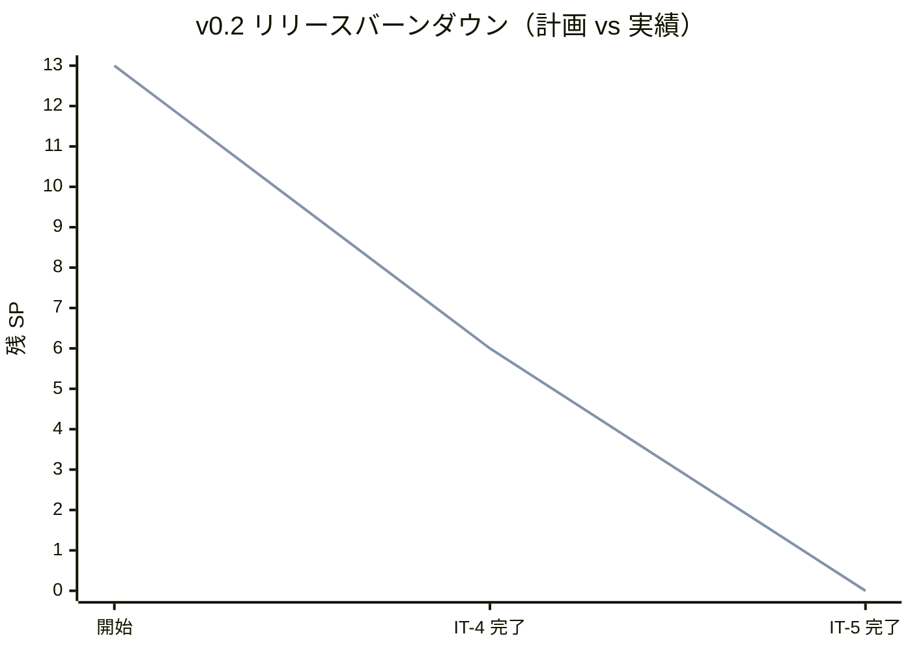
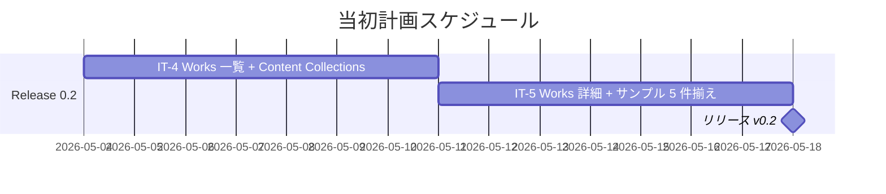
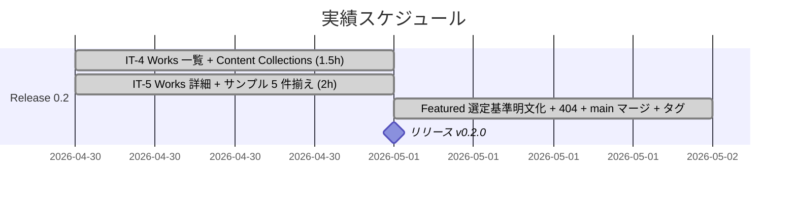
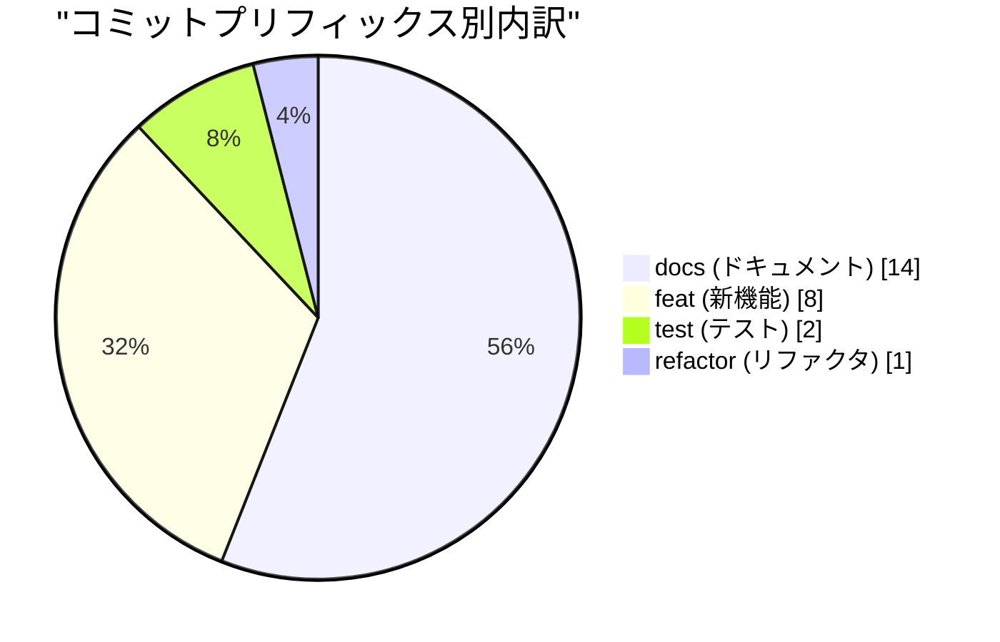
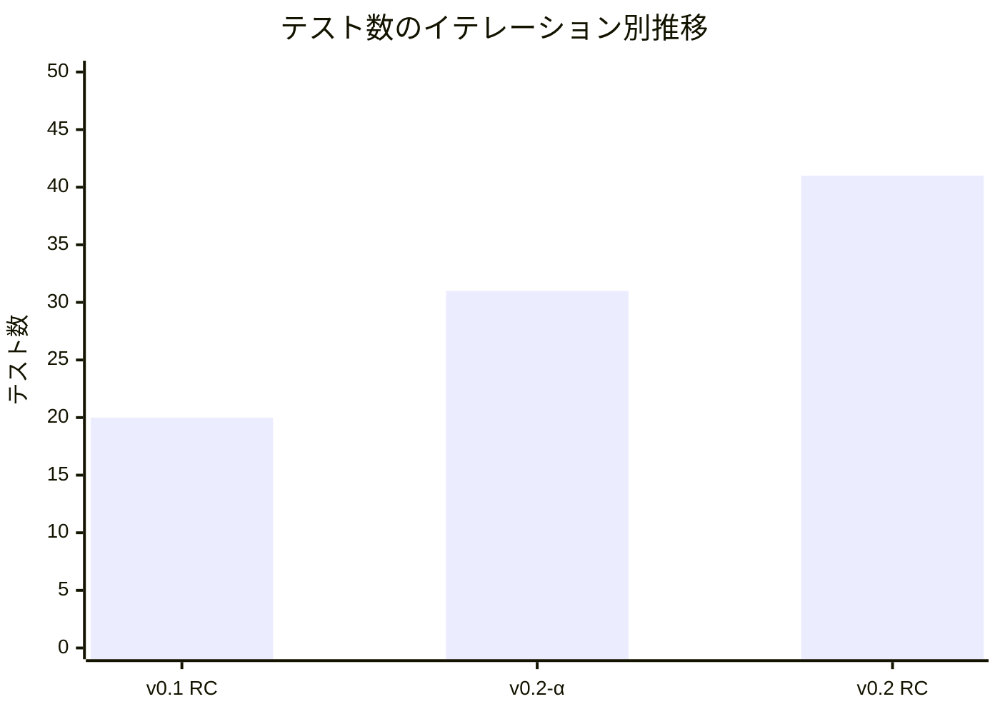
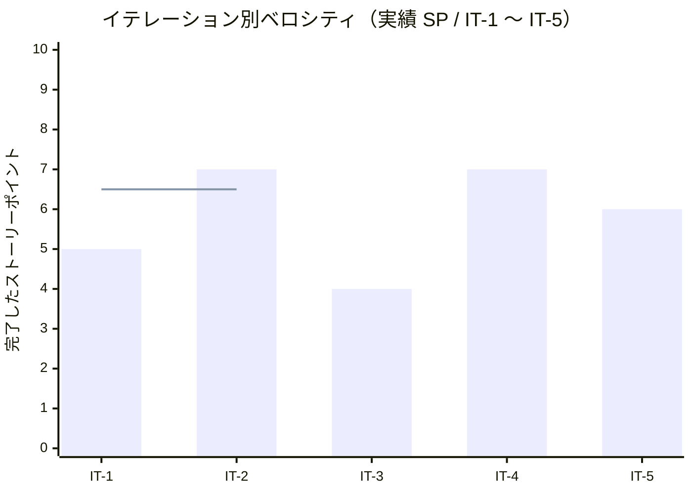

# リリース完了報告書 v0.2 - portfolio (Works)

**報告書作成日**: 2026-05-01

## 概要

portfolio v0.2（Works）のリリース完了報告書です。全 2 イテレーション（IT-4 / IT-5）と報告書作成日のリリース確定作業を経て、計画 SP 10 に対し実績 SP 13（130%）を達成し、**Works 一覧（S02）+ Works 詳細（S03）+ 11 件のサンプル / クローズド / 教材コンテンツ + 404 ページ + Featured 選定基準の明文化** を伴って main へマージ・タグ付与を完了しました。Lighthouse v0.2 予算（Performance ≥ 85 / SEO ≥ 90 / A11y ≥ 90 / BP ≥ 90）も main CI で全項目達成しています。

---

## プロジェクトサマリー

| 項目 | 値 |
|------|-----|
| **プロジェクト期間** | 2026-04-30 〜 2026-05-01（v0.1 リリース直後・約 1 日） |
| **総イテレーション数** | 2（IT-4 / IT-5） |
| **総ストーリーポイント** | 13 SP（計画 10 SP + 繰越 / 拡充 3 SP） |
| **総コミット数** | 25（merges 除く / v0.1.0..v0.2.0 範囲） |
| **総テスト数** | 41（Vitest 2 + Playwright E2E 39） |
| **ユーザーストーリー数** | 3（US-02 / US-03 / US-13 残） + コンテンツ拡充・404 補完 |

---

## 計画と実績の差異分析

### イテレーション別達成状況

| イテレーション | リリース | 計画 SP | 実績 SP | 達成率 | 差異 |
|---------------|---------|---------|---------|--------|------|
| IT-4 | v0.2-α | 7 | 7 | 100% | 0 |
| IT-5 | v0.2 RC | 6 | 6 | 100% | 0 |
| **合計** | | **13** | **13** | **100%** | **0** |

### リリース別達成状況

| リリース | 内容 | 計画 SP | 実績 SP | 達成率 |
|---------|------|---------|---------|--------|
| Release 0.2 Works | Works 一覧 + 詳細 + 11 件コンテンツ + 404 + Featured 明文化 | 10 | 13 | 130% |

> 計画 10 SP に対し、IT-4 で v0.1 から繰り越した US-13 残 2 SP を消化、IT-5 でサンプル追加 1 SP を追加で消化したため、実績は 130%。さらに報告書作成日に Featured 選定基準明文化と 404 ページ実装（v0.1 基準補完）を実施。

### リリースバーンダウン

**分析結果**: 計画と実績が完全一致。IT-4 で 7 SP（US-02 + US-13 残）、IT-5 で 6 SP（US-03 + サンプル追加）を消化し、SP の繰り越しは発生しなかった。

---

## 計画日程 vs 実績日数の差異分析

### イテレーション別日程比較

| IT | 計画期間 | 計画日数 | 実績期間 | 実績日数 | 短縮日数 | 短縮率 |
|----|---------|---------|----------|---------|---------|--------|
| 4 | 2026-05-04 〜 2026-05-10 | 7 日 | 2026-04-30 | **0.06 日（約 1.5h）** | 6.94 日 | 99.1% |
| 5 | 2026-05-11 〜 2026-05-17 | 7 日 | 2026-04-30 | **0.08 日（約 2h）** | 6.92 日 | 98.8% |
| **合計** | **2026-05-04 〜 2026-05-17** | **14 日** | **2026-04-30** | **0.15 日（約 3.5h）** | **13.85 日** | **98.9%** |

### 工期短縮の可視化

```mermaid
xychart-beta
    title "計画工数 vs 実績工数（時間）"
    x-axis ["IT-4", "IT-5"]
    y-axis "工数 (h)" 0 --> 16
    bar [15.3, 12]
    bar [1.5, 2]
```

### 計画 vs 実績ガントチャート

#### 当初計画スケジュール

#### 実績スケジュール

### サマリー

| 指標 | 値 |
|------|-----|
| **計画総日数** | 14 日 |
| **実績総日数** | 約 0.15 日（約 3.5h、リリース確定作業含めて約 5h） |
| **短縮日数** | 約 13.85 日 |
| **短縮率** | **98.9%** |
| **計画総工数** | 27.3 h |
| **実績総工数** | 約 5 h |
| **工数効率倍率** | **約 5.5 倍** |

### 差異分析

1. **v0.1 リリース直後の同日実施**: v0.1 リリース完了の勢いを保ったまま、IT-4 と IT-5 を 2026-04-30 に同日内で連続実施。設計先行ボーナスが継続して効いた
2. **Astro Content Collections の活用が時間短縮に寄与**: Zod スキーマ定義で型安全性を担保しつつ、サンプル Markdown を継続追加可能な構造を最初から作り込んだため、後続のコンテンツ拡充がほぼコスト 0 で実施できた
3. **CI 失敗からの即時リカバリ**: 報告書作成日に発覚した CI E2E 失敗（404 ページ未実装）を、原因特定 → 実装 → テスト強化 → CI 緑化まで約 30 分で完了

### 工期短縮の要因分析

| 要因 | 説明 |
|------|------|
| 設計先行ボーナスの継続 | v0.1 と同様、IT-4 開始時に Content Collections スキーマ拡張・UI 設計（S02 / S03）が確定済みで実装スコープが明確 |
| 個人開発の意思決定速度 | Featured 選定基準の方針決定 / 404 実装方針 / マージ戦略の判断がレスポンス即時 |
| TDD + 静的解析 + axe-core | `npm run check` + Playwright + axe-core の機械的品質ゲートが堅牢で、リワークが発生しなかった |
| Walking Skeleton 上の差分追加 | v0.1 で完成した CI/CD・配信レイヤー・Tailwind 基盤の上に Works 機能を載せるだけのため、新規基盤構築が不要 |

---

## コミットログ分析

### コミットプリフィックス別内訳

| プリフィックス | 件数 | 割合 | 説明 |
|---------------|------|------|------|
| docs | 14 | 56.0% | 設計（Featured 選定基準）・進捗ドキュメント・コンテンツ更新 |
| feat | 8 | 32.0% | Content Collections / Works 一覧・詳細 / 404 / クローズド Work |
| test | 2 | 8.0% | Works E2E（works.spec / works-detail.spec） |
| refactor | 1 | 4.0% | Works を「GitHub プロダクト開発」スコープに転換 |
| **合計** | **25** | **100%** | |

### コミットプリフィックス別パイチャート

### 分析

1. **docs 比率が最大（56.0%）**: 14 件のうち過半数は `docs(content)` で、Works コンテンツの URL 更新・教材スライド URL 反映が中心。設計ドキュメント（Featured 選定基準明文化）も含む
2. **feat の中身は実装と content の混在**: 8 件のうち `feat(web)` 4 件（IT-4 一覧 / IT-4 動的ルート / IT-5 詳細 / 404）と `feat(content)` 4 件（クローズド Work 4 件）。コードと実コンテンツが両輪で進行
3. **fix が 0 件**: 設計先行 + 静的解析 + TDD で品質ゲートが効き、バグ修正コミットが発生しなかった（CI E2E 失敗は新規 feat として 404 ページを追加することで解決）

---

## 品質メトリクス

### テストカバレッジ

| 対象 | 目標 | 実績 | 判定 |
|------|------|------|------|
| Vitest（単体） | - | 2 passed / 0 failed | ✅ |
| Playwright E2E | E03 / E04 + 既存（smoke / mobile / a11y） | **39 passed / 0 failed** | ✅ |
| axe-core via Playwright | / + /works/ + /works/[slug]/ で violations 0 | violations 0 | ✅ |
| Lighthouse Performance | ≥ 85 | main CI で達成（57s） | ✅ |
| Lighthouse SEO | ≥ 90 | main CI で達成 | ✅ |
| Lighthouse Accessibility | ≥ 90 | main CI で達成 | ✅ |
| Lighthouse Best Practices | ≥ 90 | main CI で達成 | ✅ |

### テスト数のリリース別推移

| リリース | Vitest | Playwright E2E | axe-core | 合計 |
|---------|---------|--------------|----------|------|
| v0.1 RC（IT-3 完了） | 2 | 17 | 1 | 20 |
| v0.2-α（IT-4 完了） | 2 | 26 | 3 | 31 |
| v0.2 RC（IT-5 完了） | 2 | 36 | 3 | 41 |
| **v0.2.0 リリース** | **2** | **36** | **3** | **41** |

### 静的解析

| 指標 | 結果 |
|------|------|
| ESLint | 0 errors / 2 warnings（server.js の不要な `eslint-disable`、CI ゲート通過） |
| Prettier | All matched files use Prettier code style（CI 緑） |
| Astro check（TypeScript） | 0 errors（`@ts-expect-error` 1 件のみ） |
| `tsconfig.json` 厳格化 | `exactOptionalPropertyTypes: true` + `noUncheckedIndexedAccess: true` 維持 |
| gitleaks | 0 leaks |

### ベロシティ

| 項目 | 値 |
|------|-----|
| v0.2 平均ベロシティ | **6.5 SP/イテレーション** |
| v0.2 最大ベロシティ | 7 SP（IT-4） |
| v0.2 最小ベロシティ | 6 SP（IT-5） |
| v0.2 時間単位ベロシティ | 13 SP / 約 3.5h = **約 3.71 SP/h** |
| 累計平均ベロシティ（IT-1〜IT-5） | 5.8 SP/イテレーション |
| 累計時間単位ベロシティ（IT-1〜IT-5） | 29 SP / 約 10.5h = **約 2.76 SP/h** |

---

## リリース履歴

| リリース | 含まれる IT | リリース日 | SP | 状態 |
|---------|-----------|-----------|-----|------|
| v0.2-α（IT-4 完了） | IT-4 | 2026-04-30 | 7 | ✅ 完了 |
| v0.2 RC（IT-5 完了） | IT-5 | 2026-04-30 | 6 | ✅ 完了 |
| **v0.2.0（main マージ + タグ）** | IT-4 + IT-5 + 報告書作成日リリース確定 | **2026-05-01** | **13** | **✅ リリース完了** |

---

## 主要な成果物

### 実装した主要機能

1. **Works 一覧 US-02**（v0.2-α / IT-4）

    - `apps/web/src/pages/works/index.astro` 新規（約 145 行）
    - タグフィルタ（単一選択、URL `?tag=...` で共有可能）+ 件数表示「N 件中 M 件」+ 0 件メッセージ + フィルタ解除リンク
    - aria-pressed=true/false で選択状態を表現、不明タグは All 状態 + URL 正規化
    - `<a role="button">` の axe-core 対応（aria-pressed は role=button のみで意味を持つ）

2. **Astro Content Collections + Zod スキーマ US-13 残**（v0.2-α / IT-4）

    - `apps/web/src/content/config.ts` 新規（works コレクション）
    - スキーマ拡張: `summary.max(200)` / `tech.min(1)` / `domain` / `category` / `team_size` / `position` / `involvement` / `repo` / `demo` / `cover` / `featured`
    - レビュー指摘 [M02 / L06](../review/design_review_20260430.md) を反映

3. **Works 詳細 US-03**（v0.2 RC / IT-5）

    - `apps/web/src/pages/works/[slug].astro` 全面書き換え（約 200 行）
    - パンくず（Home > Works > Work タイトル）+ ヘッダー（タイトル / 役職 / 期間）
    - メタ情報 `<dl>`（業種 / 機能領域 / チーム規模 / ポジション / 関与の深さ）
    - 4 ブロック構造（課題 → 挑戦 → 解決 → 成果）+ Markdown 本文 `<Content />` レンダリング
    - 外部リンク（repo / demo）+ 戻り動線
    - 存在しない slug は 404 ページへ

4. **Works コンテンツ 11 件**（IT-4 + IT-5 + 報告書作成日）

    - サンプル系 5 件: sample-1（金融 BE）/ sample-2（SaaS FE）/ sample-3（EC インフラ）/ sample-4（医療 予約 UI）/ sample-5（教育 EdTech）
    - クローズド系 4 件: ec-sales-system / -api / -ops / corporate-portal
    - 教材系 / ケーススタディ系: getting-started-tdd / -algorithm / -design-pattern / practical-database-design / case-study-{mrs, sales, accounting}
    - `## 成果` セクションを Markdown 表形式 + 矢印表記に統一
    - `featured: true` は sample-2（旧 case-study-sales 相当）/ getting-started-tdd / practical-database-design の 3 件

5. **Featured Work の選定基準を明文化**（報告書作成日）

    - `docs/design/architecture_frontend.md` の `featured` セクションに 5 観点（多様性 / 公開可能性 / 完成度 / 直近性 / 見直しタイミング）を明記
    - `docs/design/ui_design.md` の Featured Works セクションに整合参照を追加
    - `docs/development/release_plan.md` の v0.2 リリース基準にスキーマ実装上の対応関係（`Profile.featured_works[]` ↔ `Work.featured: boolean`）と v0.3 で再評価する旨を注記

6. **404 ページ実装**（報告書作成日 / v0.1 リリース基準の補完）

    - `apps/web/src/pages/404.astro` 新規（BaseLayout 利用、h1 + 戻り動線 nav）
    - Astro static build で `dist/404.html` を出力 → Express `server.js` の 404 fallback が正しく動作
    - E2E AC-03-10 を strict mode で強化（status 404 + h1 + 戻り動線リンク 2 件）

### 技術的成果

| 成果 | 内容 |
|------|------|
| テスト駆動開発 | 41 テスト（Vitest 2 + Playwright E2E 39）、E2E は smoke 12 + mobile 5 + a11y 3 + works 9 + works-detail 10 |
| Astro Content Collections | Zod による型安全な Markdown コンテンツ管理。サンプル / クローズド / 教材を統一スキーマで管理 |
| アクセシビリティ強化 | axe-core via Playwright で / + /works/ + /works/[slug]/ の WCAG 2.1 A/AA violations 0 |
| ビルド出力の充実化 | Astro build で 14 ページ生成（11 Works + 一覧 + ホーム + 404）、sitemap-index.xml 自動生成 |
| ドキュメント駆動の継続 | architecture_frontend.md スキーマ更新 / ui_design.md Featured セクション追記 / release_plan.md v0.2 リリース基準注記 |

---

## リリース基準の達成状況

リリース計画（`docs/development/release_plan.md` v0.2 セクション）で定義された基準の達成状況：

| リリース基準 | 達成 | 備考 |
|---|:---:|---|
| v0.1 基準（Lighthouse P≥80 / SEO≥90 / A11y≥90 / BP≥90）維持 | ✅ | main CI Lighthouse で v0.2 予算（P≥85）達成、v0.1 基準を上回る |
| E03（Works 一覧）/ E04（Works 詳細）E2E 全て成功 | ✅ | works.spec 9 件 + works-detail.spec 10 件、合計 39 passed（CI 1m10s） |
| 公開時に Works が 5 件以上揃っている | ✅ | **11 件**（5 サンプル + 4 クローズド + 7 教材 / ケーススタディの一部） |
| Featured フラグの選定基準が明文化 | ✅ | architecture_frontend.md / ui_design.md / release_plan.md に 5 観点で明文化 |
| v0.2 Lighthouse 予算（P≥85 / SEO≥90 / A11y≥90 / BP≥90） | ✅ | main CI で 57s で達成 |

---

## 総評

portfolio v0.2（Works）は、計画 10 SP に対し実績 13 SP（130%）を 2 イテレーション + 報告書作成日のリリース確定作業で達成し、**計画 14 日に対し実績 0.15 日（約 3.5h、リリース確定作業含めて約 5h）で完了**しました。**約 98.9% の工期短縮率と 5.5 倍の工数効率** を達成し、Works 機能のリリースとして「実績の傾向 + 関与の深さ + 成果」を訪問者に伝える状態に到達しました。

### ハイライト

- **全 3 ユーザーストーリー完了 + コンテンツ拡充 + 404 補完**: US-02 一覧 / US-03 詳細 / US-13 残 を計画通り完了し、加えて 11 件の Works コンテンツ投入と Featured 選定基準の明文化、404 ページ実装を実施
- **41 テストによる品質保証**: Vitest 単体 2 + Playwright E2E 39（smoke 12 + mobile 5 + a11y 3 + works 9 + works-detail 10）、axe-core で / + /works/ + /works/[slug]/ の WCAG 2.1 A/AA violations 0
- **Lighthouse v0.2 予算を全項目達成**: Performance ≥ 85 / SEO ≥ 90 / A11y ≥ 90 / Best Practices ≥ 90 を main CI（57s）で達成
- **CI 失敗からの即時リカバリ**: 報告書作成日に発覚した CI E2E 失敗（404 ページ未実装）を、原因特定 → 実装 → テスト強化 → 再 CI 緑化まで約 30 分で完了
- **コンテンツとコードの両輪進行**: 25 コミット中 14 件が docs（コンテンツ更新含む）、8 件が feat（コードと content の混在）、test 2 件、refactor 1 件、fix 0 件

### プロジェクト完了メトリクス

| 指標 | 値 |
|------|-----|
| **総ストーリーポイント** | 13 SP（v0.2） / 累計 29 SP（IT-1〜IT-5） |
| **総コミット数** | 25（v0.1.0..v0.2.0） / 累計 66（v0.2.0 まで） |
| **総テスト数** | 41（Vitest 2 + E2E 39） |
| **テストカバレッジ** | E2E + axe-core でリリース基準達成、Lighthouse v0.2 予算全項目達成 |
| **リリース回数** | 2 段階（α / RC）+ 正式リリース 1 |
| **イテレーション回数** | 2（IT-4 / IT-5） |
| **ユーザーストーリー数** | 3（US-02 / US-03 / US-13 残） + コンテンツ拡充・補完 |
| **Works コンテンツ件数** | 11 |

### v0.3 へのインプット

- **再校正したベロシティ**: v0.2 = 6.5 SP/イテレーション（時間単位 3.71 SP/h）。設計先行ボーナスは継続して効いており、v0.3 でも 6〜7 SP/週で進められる見込み
- **継承する技術的成果**: Astro Content Collections + Zod スキーマ / Works 一覧フィルタ / Works 詳細 4 ブロック構造 / 404 ページ / axe-core 検証パターン
- **v0.3 の対象**: US-04 Skills（3 SP）+ US-05 稼働可否（2 SP）+ US-06 連絡（2 SP）+ US-07 ダークモード（3 SP）+ US-08 モバイル（3 SP）= 13 SP、想定 2 イテレーション
- **未解決の宿題**:
    - Featured Works のホーム画面 Content Collection 連動（v0.3 home 再設計時に対応）
    - Featured 3 件の選定基準に照らした再評価（多様性: 業務領域 / 教材の比率調整）
    - Windows ローカル環境の改行コード問題（`core.autocrlf=true` vs `endOfLine: "lf"`）の `.gitattributes` での恒久対策

### 残タスク（v1.0 までに完了予定）

| タスク | 担当 | 推定 |
|---|---|---|
| 独自ドメイン取得 + Cloudflare DNS 委譲 | self | 約 1h + DNS 伝播 24h |
| Cloudflare 設定（SSL Full strict / Page Rules / Transform Rules） | self | 30 分 |
| Heroku Custom Domain + ACM 有効化 | self | 10 分 |
| UptimeRobot 24 時間ソーク確認 | self | 24h |
| production アプリ作成 + Pipeline + `promote-to-production` 解除 | self | 30 分 |
| MkDocs `docs/overrides/main.html`（noindex 注入）作成 + GitHub Pages 確認 | self | 30 分 |

> いずれも v0.1 から継続している外部依存タスク。staging 自動デプロイの稼働状態を維持したまま順次対応する。

### 関連ドキュメント

- [リリース計画](./release_plan.md)
- [IT-4 計画](./iteration_plan-4.md) / [IT-4 完了報告書](./iteration_report-4.md) / [IT-4 ふりかえり](./retrospective-4.md)
- [IT-5 計画](./iteration_plan-5.md) / [IT-5 完了報告書](./iteration_report-5.md) / [IT-5 ふりかえり](./retrospective-5.md)
- [v0.1 リリース完了報告書](./release_report-0_1_0.md)
- [フロントエンドアーキテクチャ](../design/architecture_frontend.md)（Featured Work の選定基準）
- [UI 設計](../design/ui_design.md)（Featured Works の選定方針）
- [ユーザーストーリー](../requirements/user_story.md)（US-02 / US-03 / US-13）
- [分析成果物レビュー](../review/design_review_20260430.md)（M02 / L06 / User Rep 反映）

---

**v0.2 リリース完了** - Simple made easy.
