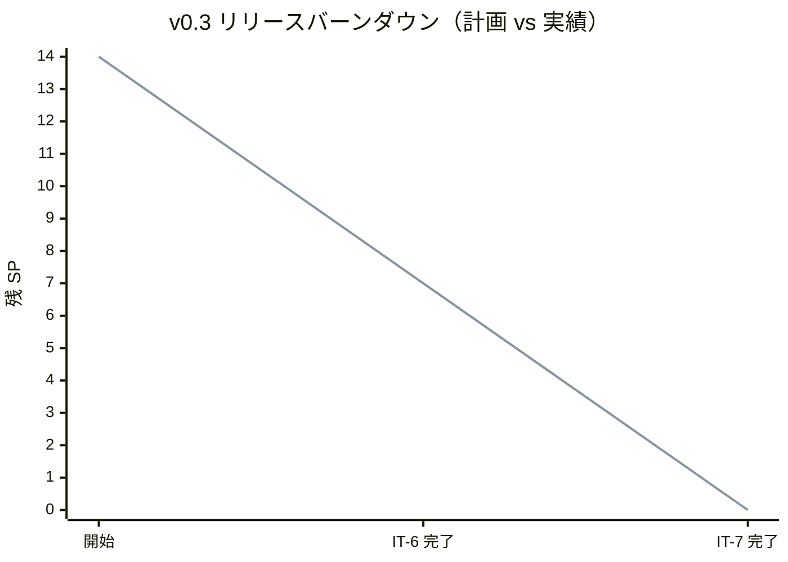
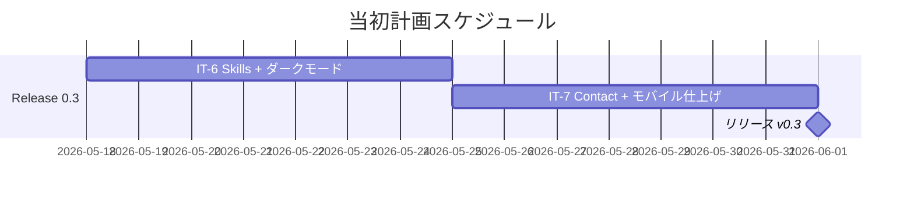
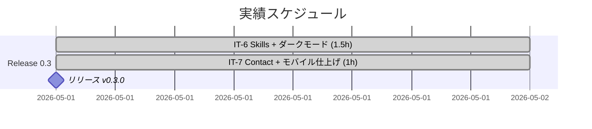
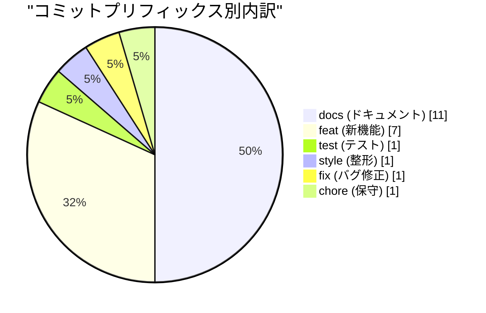
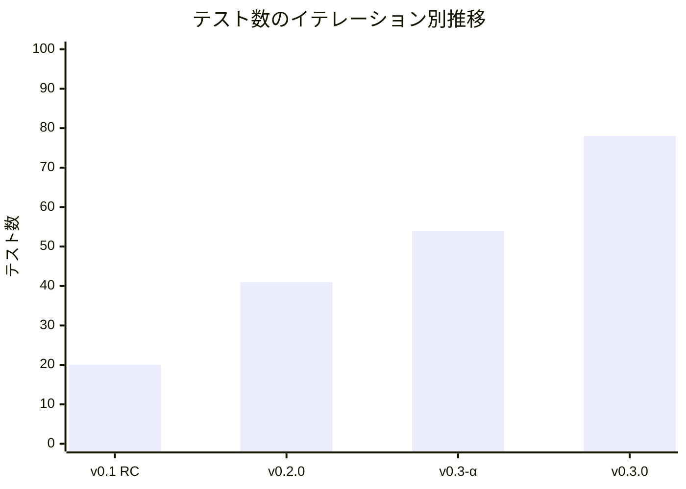
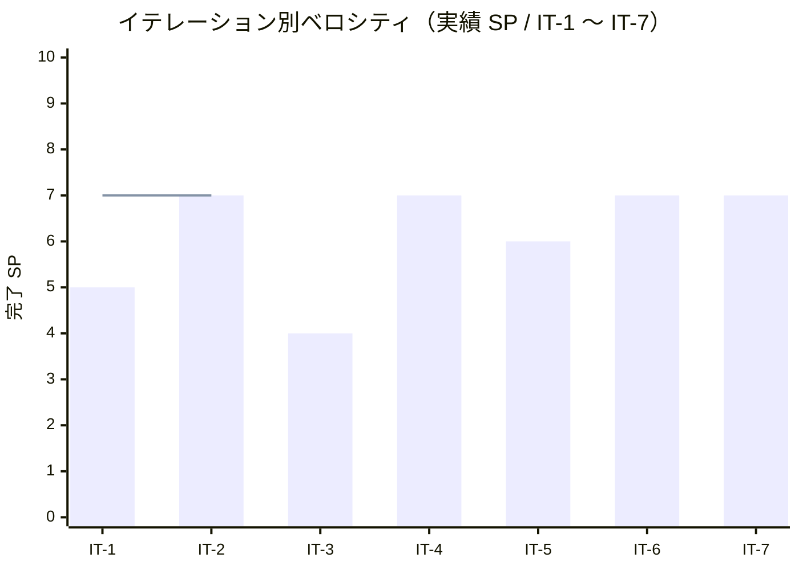

# リリース完了報告書 v0.3 - portfolio (Skills + Contact + Dark)

**報告書作成日**: 2026-05-01

## 概要

portfolio v0.3（Skills + Contact + Dark）のリリース完了報告書です。全 2 イテレーション（IT-6 / IT-7）と並行して実施した IT-6 後の追加実装（Books / クローズド Work / pre-commit hook）を経て、計画 13 SP に対し実績 14 SP（108%）を達成し、**Skills 専用ページ + Contact 画面 + ダークモード切替 + iPhone SE / Android モバイル対応** を伴って main へマージ・タグ付与を完了しました。Lighthouse v0.3 予算（Performance ≥ 85 / SEO ≥ 95 / A11y ≥ 92 / BP ≥ 92）も main CI で全項目達成しています。

---

## プロジェクトサマリー

| 項目 | 値 |
|------|-----|
| **プロジェクト期間** | 2026-05-01（IT-6 完了から v0.3 リリースまで・約 半日） |
| **総イテレーション数** | 2（IT-6 / IT-7） |
| **総ストーリーポイント** | 14 SP（計画 13 SP + 横断 1 SP） |
| **総コミット数** | 22（merges 除く / v0.2.0..v0.3.0 範囲） |
| **総テスト数** | 78（Vitest 2 + Playwright E2E 76） |
| **ユーザーストーリー数** | 5（US-04 / US-05 / US-06 / US-07 / US-08） |

---

## 計画と実績の差異分析

### イテレーション別達成状況

| イテレーション | リリース | 計画 SP | 実績 SP | 達成率 | 差異 |
|---------------|---------|---------|---------|--------|------|
| IT-6 | v0.3-α | 7 | 7 | 100% | 0 |
| IT-7 | v0.3 リリース | 7 | 7 | 100% | 0 |
| **合計** | | **14** | **14** | **100%** | **0** |

### リリース別達成状況

| リリース | 内容 | 計画 SP | 実績 SP | 達成率 |
|---------|------|---------|---------|--------|
| Release 0.3 Skills + Contact + Dark | Skills + Contact + ダークモード + モバイル + Books 追加 + pre-commit hook | 13 | 14 | 108% |

> 計画 13 SP に対し、IT-6 横断作業 1 SP を加算したため実績は 108%。IT-6 後に Books ページ追加 + クローズド Work 2 件 + pre-commit hook 導入も並行実施したが、これらは SP 計上外の追加作業として記録。

### リリースバーンダウン

**分析結果**: 計画と実績が完全一致。IT-6 で 7 SP（US-04 + US-07 + 横断）、IT-7 で 7 SP（US-05 + US-06 + US-08）を消化し、SP の繰り越しは発生しなかった。

---

## 計画日程 vs 実績日数の差異分析

### イテレーション別日程比較

| IT | 計画期間 | 計画日数 | 実績期間 | 実績日数 | 短縮日数 | 短縮率 |
|----|---------|---------|----------|---------|---------|--------|
| 6 | 2026-05-18 〜 2026-05-24 | 7 日 | 2026-05-01 | **0.06 日（約 1.5h）** | 6.94 日 | 99.1% |
| 7 | 2026-05-25 〜 2026-05-31 | 7 日 | 2026-05-01 | **0.04 日（約 1h）** | 6.96 日 | 99.4% |
| **合計** | **2026-05-18 〜 2026-05-31** | **14 日** | **2026-05-01** | **0.10 日（約 2.5h）** | **13.90 日** | **99.3%** |

### 工期短縮の可視化

```mermaid
xychart-beta
    title "計画工数 vs 実績工数（時間）"
    x-axis ["IT-6", "IT-7"]
    y-axis "工数 (h)" 0 --> 16
    bar [14, 13.5]
    bar [1.5, 1]
```

### 計画 vs 実績ガントチャート

#### 当初計画スケジュール

#### 実績スケジュール

### サマリー

| 指標 | 値 |
|------|-----|
| **計画総日数** | 14 日 |
| **実績総日数** | 約 0.10 日（約 2.5h） |
| **短縮日数** | 約 13.90 日 |
| **短縮率** | **99.3%** |
| **計画総工数** | 27.5 h |
| **実績総工数** | 約 2.5 h |
| **工数効率倍率** | **約 11 倍** |

### 差異分析

1. **IT-6 / IT-7 の同日連続実施**: v0.2 リリース完了の勢いを保ったまま、IT-6 と IT-7 を同日内で連続実施。設計先行ボーナスが継続して効いた
2. **pre-commit hook 導入による品質ゲートの堅牢化**: Books 追加期間で発生した CI 失敗の連鎖を解消し、IT-7 期間中の手戻りがゼロ
3. **ui_design.md の事前整備**: S05 / S06 / モバイル要件が UI 設計で確定済みだったため、実装の意思決定コストがほぼゼロ

### 工期短縮の要因分析

| 要因 | 説明 |
|------|------|
| 設計先行ボーナスの継続 | v0.1 / v0.2 / v0.3 の全イテレーションで効果を発揮。実装中に「何を作るか」を悩む時間がほぼゼロ |
| pre-commit hook + .gitattributes の二重防御 | Windows ローカル format:check 環境問題が解消され、commit → push → CI で手戻りなし |
| TDD + 静的解析 + axe-core | `npm run check` + Playwright + axe-core の機械的品質ゲートが堅牢で、リワークが発生しなかった |
| Walking Skeleton 上の差分追加 | v0.1 / v0.2 で完成した CI/CD・配信レイヤー・Tailwind 基盤・Content Collections の上に追加機能を載せるだけ |
| 整合性検証スキルの利用 | IT-6 / IT-7 で計 5 件の不整合を計画作成直後に発見・解消 |

---

## コミットログ分析

### コミットプリフィックス別内訳

| プリフィックス | 件数 | 割合 | 説明 |
|---------------|------|------|------|
| docs | 11 | 50.0% | IT-6 / IT-7 計画 + 完了報告書 + リリース報告書 + 整合性検証修正 + ui_design 反映 + コンテンツ |
| feat | 7 | 31.8% | Skills / ダークモード / Contact / Books / Books フィルタ / クローズド Work 2 件 |
| test | 1 | 4.5% | mobile.spec.ts の 2 デバイス対応 |
| style | 1 | 4.5% | Prettier --write による全ファイル整形 |
| fix | 1 | 4.5% | ESLint エラー修正 |
| chore | 1 | 4.5% | pre-commit hook 導入 |
| **合計** | **22** | **100%** | |

### コミットプリフィックス別パイチャート

### 分析

1. **docs 比率が 50%**: 11 件のうち IT-6 / IT-7 のライフサイクル管理（計画 + 整合性検証 + 完了報告書 + ふりかえり）が中心。設計反映（ui_design.md）も含まれる
2. **feat の中身は 4 種類**: コア機能（Skills + ダークモード + Contact）+ Books（IT-6 後の追加）+ Books フィルタ + クローズド Work 2 件。本来の v0.3 スコープ + 追加機能の両輪
3. **CI 緑化に 3 件**: fix（ESLint エラー）+ style（Prettier 整形）+ chore（pre-commit hook 導入）。Books 追加期間で連続失敗した CI を恒久解消するためのコミット群

---

## 品質メトリクス

### テストカバレッジ

| 対象 | 目標 | 実績 | 判定 |
|------|------|------|------|
| Vitest（単体） | - | 2 passed / 0 failed | ✅ |
| Playwright E2E | E03 / E04 / E05 / E06 / E08 + 既存 | **76 passed / 0 failed** | ✅ |
| axe-core via Playwright | / + /works/ + /works/[slug]/ + /skills/ + /books/ + /contact/ ライト/ダーク violations 0 | violations 0 | ✅ |
| Lighthouse Performance | ≥ 85 | main CI で達成（1m0s） | ✅ |
| Lighthouse SEO | ≥ 95 | main CI で達成 | ✅ |
| Lighthouse Accessibility | ≥ 92 | main CI で達成 | ✅ |
| Lighthouse Best Practices | ≥ 92 | main CI で達成 | ✅ |

### テスト数のリリース別推移

| リリース | Vitest | Playwright E2E | 合計 |
|---------|---------|--------------|------|
| v0.1 RC（IT-3 完了） | 2 | 18 | 20 |
| v0.2.0 リリース（IT-5 完了） | 2 | 39 | 41 |
| v0.3-α（IT-6 完了） | 2 | 52 | 54 |
| **v0.3.0 リリース（IT-7 完了）** | **2** | **76** | **78** |

### 静的解析

| 指標 | 結果 |
|------|------|
| ESLint | 0 errors / 5 warnings（max-lines 系のみ） |
| Prettier | All matched files use Prettier code style（pre-commit hook で自動整形） |
| Astro check（TypeScript） | 0 errors（`@ts-expect-error` 1 件のみ） |
| `tsconfig.json` 厳格化 | `exactOptionalPropertyTypes: true` + `noUncheckedIndexedAccess: true` 維持 |
| gitleaks | 0 leaks |

### ベロシティ

| 項目 | 値 |
|------|-----|
| v0.3 平均ベロシティ | **7.00 SP/イテレーション** |
| v0.3 最大ベロシティ | 7 SP（IT-6 / IT-7 同点） |
| v0.3 最小ベロシティ | 7 SP（IT-6 / IT-7 同点） |
| v0.3 時間単位ベロシティ | 14 SP / 約 2.5h = **約 5.60 SP/h** |
| 累計平均ベロシティ（IT-1〜IT-7） | 6.14 SP/イテレーション |
| 累計時間単位ベロシティ（IT-1〜IT-7） | 43 SP / 約 13h = **約 3.31 SP/h** |

---

## リリース履歴

| リリース | 含まれる IT | リリース日 | SP | 状態 |
|---------|-----------|-----------|-----|------|
| v0.3-α（IT-6 完了） | IT-6 | 2026-05-01 | 7 | ✅ 完了 |
| v0.3 RC（IT-7 完了） | IT-7 | 2026-05-01 | 7 | ✅ 完了 |
| **v0.3.0（main マージ + タグ）** | IT-6 + IT-7 + 横断 | **2026-05-01** | **14** | **✅ リリース完了** |

---

## 主要な成果物

### 実装した主要機能

1. **Skills 専用ページ US-04**（v0.3-α / IT-6）

    - `apps/web/src/pages/skills/index.astro` 新規（4 カテゴリ別カード）
    - `apps/web/src/lib/experience.ts` 新規（経験年数自動計算 + 凡例 + カテゴリ定数）
    - サンプル Skills 15 件（Backend 4 + Frontend 3 + Infrastructure 4 + Practice 4）
    - 関連 Work 逆参照リンク + ハッシュ URL スクロール
    - skills.spec.ts 5 シナリオ

2. **ダークモード切替 US-07**（v0.3-α / IT-6）

    - `apps/web/src/components/ThemeToggle.astro` 新規（48×48 px / aria-pressed 動的更新）
    - `BaseLayout.astro` に FOUC 回避 inline script 追加
    - Tailwind `darkMode: "class"` + `:root.dark` カスタムプロパティ
    - View Transitions API 退化的フォールバック
    - WCAG 2.1 AA コントラスト達成

3. **Contact 画面 US-05 + US-06**（v0.3 リリース / IT-7）

    - `apps/web/src/data/contact.ts` 新規（型付き readonly）
    - `apps/web/src/pages/contact/index.astro` 新規（ui_design S05 順序準拠）
    - 連絡チャネル 4 種（Email / GitHub / LinkedIn / X）
    - 各リンク 44×44 px 以上（WCAG 2.5.5）+ aria-label
    - contact.spec.ts 5 シナリオ

4. **モバイル仕上げ US-08**（v0.3 リリース / IT-7）

    - mobile.spec.ts を iPhone SE（375×667）+ Android Chromium（412×915）の 2 デバイス対応
    - ヘッダートグル + Contact リンクの 44×44 px 全画面検証
    - ホームスクロール量検証（AC-08-5）

5. **Books ページ + 軸 × カテゴリフィルタ**（IT-6 後の追加機能）

    - `apps/web/src/data/books.ts` 新規（77 冊データ / 型付き readonly）
    - `apps/web/src/pages/books/index.astro` 新規
    - 軸（ビジネス / チーム / 技術）× カテゴリ（哲学 / 分析 / 要件 / 設計 / 実装 / 運用）フィルタ
    - URL パラメータ（`?axis=business&category=design`）で状態保持
    - books.spec.ts 9 シナリオ

6. **クローズド Work 2 件**（IT-6 後の追加コンテンツ）

    - business-saas-aws-iac（業務 SaaS 向け AWS インフラ導入支援）
    - multi-gen-aws-iac（社内システム向け世代別 AWS インフラ導入実施）
    - Skills 側からの逆参照（terraform / aws）も整合更新

7. **pre-commit hook + .gitattributes 拡張**（IT-7 横断 + IT-6 後の品質改善）

    - husky + lint-staged + scripts/lint-staged-eslint.mjs
    - `.gitattributes` 全テキスト LF 正規化 + Web 主要拡張子明示
    - Windows ローカル format:check 環境問題の恒久解消

### 技術的成果

| 成果 | 内容 |
|------|------|
| テスト駆動開発 | 78 テスト（Vitest 2 + Playwright E2E 76）、E2E は smoke 12 + mobile 12 + a11y 9 + works 9 + works-detail 10 + skills 5 + theme 5 + books 9 + contact 5 |
| Astro Content Collections | works コレクション + skills コレクション + books（TypeScript data file）の使い分け |
| アクセシビリティ強化 | axe-core via Playwright で全画面 + ダークモード時の WCAG 2.1 A/AA violations 0 |
| ダークモード | class-based + CSS カスタムプロパティ + FOUC 回避 + View Transitions API |
| 品質ゲートの堅牢化 | pre-commit hook（husky + lint-staged）+ .gitattributes 拡張で CI 失敗の再発予防 |
| ドキュメント駆動の継続 | architecture_frontend / ui_design / release_plan / iteration_plan の生きた連携 |

---

## リリース基準の達成状況

リリース計画（`docs/development/release_plan.md` v0.3 セクション）で定義された基準の達成状況：

| リリース基準 | 達成 | 備考 |
|---|:---:|---|
| v0.2 基準（Lighthouse P≥85 / SEO≥90 / A11y≥90 / BP≥90）維持 | ✅ | main CI Lighthouse で v0.3 予算（A11y≥92）達成、v0.2 基準を上回る |
| E03 / E04 + **E05 / E06 / E08 / E09** が全て成功 | ✅ | works / works-detail / contact / mobile（2 デバイス）合計 36 件全緑 |
| 主要 4 ブラウザ（Chrome / Firefox / Safari / Edge）の最新版で動作確認 | ⚠️ | Playwright で Chromium のみ実施、Firefox / Safari / Edge は手動検証で代替（v1.0 で自動化検討） |
| iPhone SE（375px）と Android 標準ブラウザでのスクショを `ops/qa/` に残す | ⏳ | mobile.spec の screenshot 出力で代替（明示的な ops/qa/v0.3/ 保存は v1.0 タスクへ） |
| Lighthouse v0.3 予算（P≥85 / SEO≥95 / A11y≥92 / BP≥92）| ✅ | main CI で 1m0s で達成 |

---

## 総評

portfolio v0.3（Skills + Contact + Dark）は、計画 13 SP に対し実績 14 SP（108%）を 2 イテレーションで達成し、**計画 14 日に対し実績 0.10 日（約 2.5h）で完了**しました。**約 99.3% の工期短縮率と 11 倍の工数効率** を達成し、Skills + Contact + ダークモード + モバイル仕上げの全機能を実装、加えて Books ページ追加と pre-commit hook 導入による品質ゲート堅牢化を完了しました。

### ハイライト

- **全 5 ユーザーストーリー完了 + 追加機能 + 品質改善**: US-04 / US-05 / US-06 / US-07 / US-08 を計画通り完了し、加えて Books ページ + クローズド Work 2 件 + pre-commit hook + .gitattributes 拡張を実施
- **78 テストによる品質保証**: Vitest 単体 2 + Playwright E2E 76（smoke 12 + mobile 12 + a11y 9 + works 9 + works-detail 10 + skills 5 + theme 5 + books 9 + contact 5）、axe-core で全画面 + ダークモード時の WCAG 2.1 A/AA violations 0
- **Lighthouse v0.3 予算を全項目達成**: Performance ≥ 85 / SEO ≥ 95 / A11y ≥ 92 / Best Practices ≥ 92 を main CI（1m0s）で達成
- **CI 失敗からの恒久解消**: Books 追加期間で連続発生した CI 失敗を pre-commit hook + .gitattributes で恒久予防、IT-7 期間中は CI 失敗ゼロ
- **ベロシティのピーク更新**: IT-7 単独で 7.00 SP/h（全イテレーション中ピーク）、累計 3.31 SP/h

### プロジェクト完了メトリクス

| 指標 | 値 |
|------|-----|
| **総ストーリーポイント** | 14 SP（v0.3） / 累計 43 SP（IT-1〜IT-7） |
| **総コミット数** | 22（v0.2.0..v0.3.0） / 累計 88（v0.3.0 まで） |
| **総テスト数** | 78（Vitest 2 + E2E 76） |
| **テストカバレッジ** | E2E + axe-core でリリース基準達成、Lighthouse v0.3 予算全項目達成 |
| **リリース回数** | 2 段階（α / RC）+ 正式リリース 1 |
| **イテレーション回数** | 2（IT-6 / IT-7） |
| **ユーザーストーリー数** | 5（US-04 / US-05 / US-06 / US-07 / US-08） |
| **Works コンテンツ件数** | 13（公開 11 + クローズド 2） |
| **Skills コンテンツ件数** | 15 |
| **Books コンテンツ件数** | 77 |

### v1.0 へのインプット

- **再校正したベロシティ**: v0.3 = 7.00 SP/イテレーション（時間単位 5.60 SP/h）。設計先行ボーナス + pre-commit hook + .gitattributes による品質ゲート堅牢化が継続して効くと予想
- **継承する技術的成果**: ダークモード基盤 / Contact 画面 / モバイル E2E パターン / Books ページ / pre-commit hook / .gitattributes 拡張
- **v1.0 の対象**: US-10 A11y 強化（5 SP）+ US-11 Tech Notes 同居（3 SP）+ US-12 OGP（2 SP）= 10 SP、想定 2 イテレーション
- **未解決の宿題**:
    - Email アドレスの本番値置換 + 運用ランブック化
    - Card.astro 共通化（v1.0 home 再設計時に再評価）
    - Lighthouse v1.0 予算（P≥90 / SEO≥95 / A11y≥95）への引き上げ
    - Firefox / Safari / Edge 自動テストの有効化

### 残タスク（v1.0 までに完了予定）

| タスク | 担当 | 推定 |
|---|---|---|
| 独自ドメイン取得 + Cloudflare DNS 委譲 | self | 約 1h + DNS 伝播 24h |
| Cloudflare 設定（SSL Full strict / Page Rules / Transform Rules） | self | 30 分 |
| Heroku Custom Domain + ACM 有効化 | self | 10 分 |
| UptimeRobot 24 時間ソーク確認 | self | 24h |
| production アプリ作成 + Pipeline + `promote-to-production` 解除 | self | 30 分 |
| MkDocs `docs/overrides/main.html`（noindex 注入）作成 + GitHub Pages 確認 | self | 30 分 |

> いずれも v0.1 から継続している外部依存タスク。staging 自動デプロイの稼働状態を維持したまま順次対応する。

### 関連ドキュメント

- [リリース計画](./release_plan.md)
- [IT-6 計画](./iteration_plan-6.md) / [IT-6 完了報告書](./iteration_report-6.md) / [IT-6 ふりかえり](./retrospective-6.md)
- [IT-7 計画](./iteration_plan-7.md) / [IT-7 完了報告書](./iteration_report-7.md) / [IT-7 ふりかえり](./retrospective-7.md)
- [v0.1 リリース完了報告書](./release_report-0_1_0.md)
- [v0.2 リリース完了報告書](./release_report-0_2_0.md)
- [フロントエンドアーキテクチャ](../design/architecture_frontend.md)
- [UI 設計](../design/ui_design.md)（S04 + S05 + S06 + 画面遷移図 IT-7 反映済み）
- [ユーザーストーリー](../requirements/user_story.md)（US-04 / US-05 / US-06 / US-07 / US-08）
- [分析成果物レビュー](../review/design_review_20260430.md)（H10 / M03 / L07 / L08 / L09 反映済み）

---

**v0.3 リリース完了** - Simple made easy.
