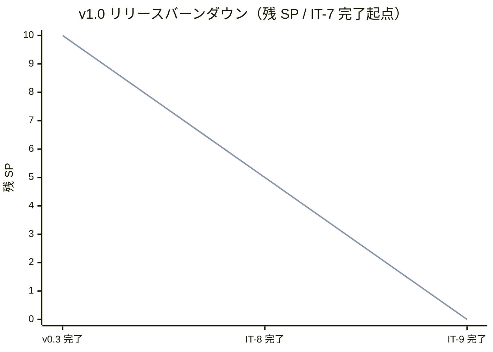
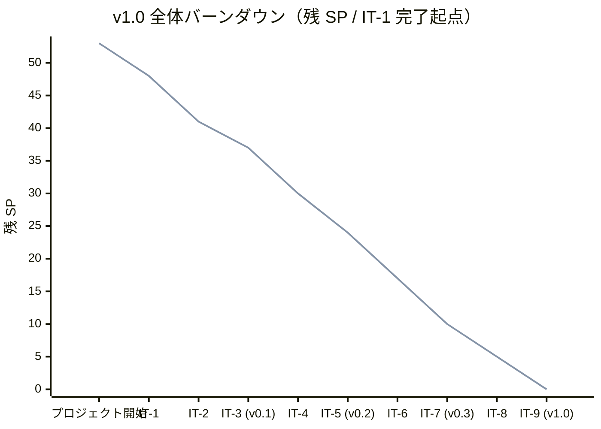
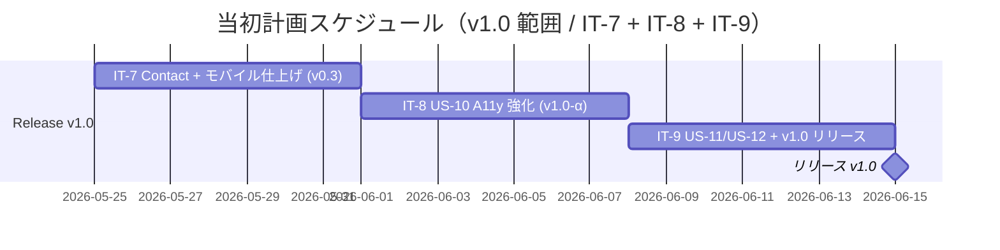
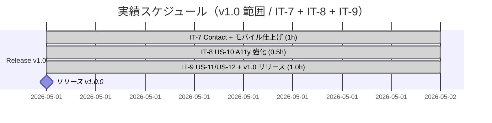
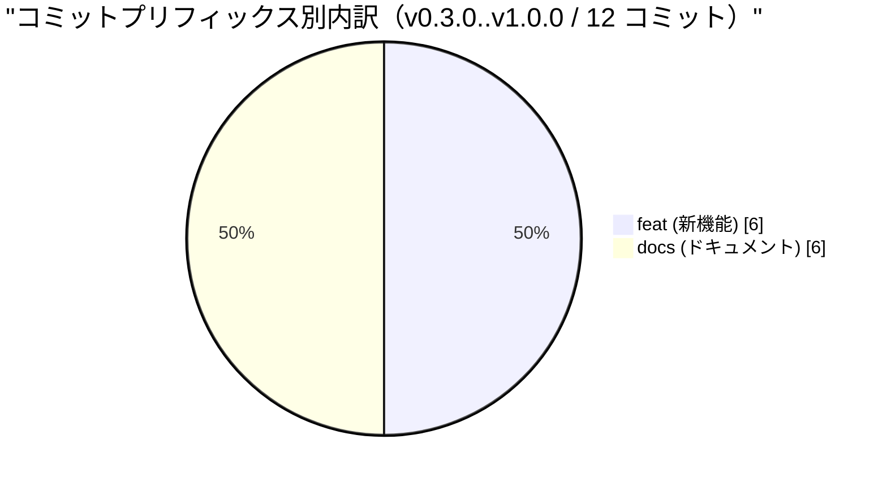
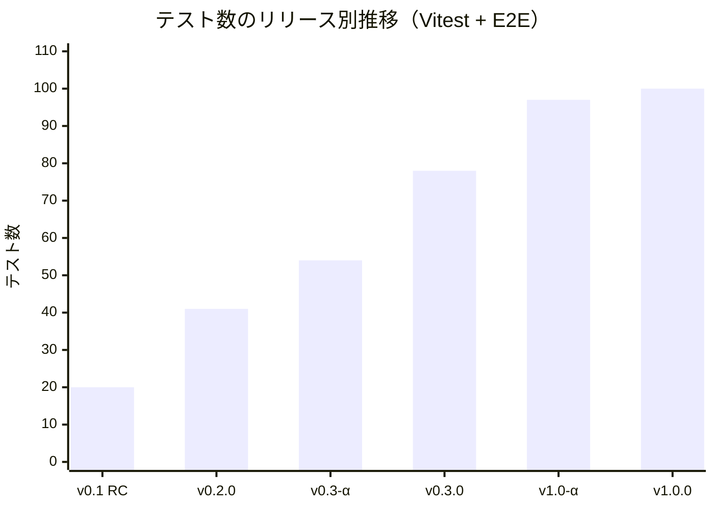
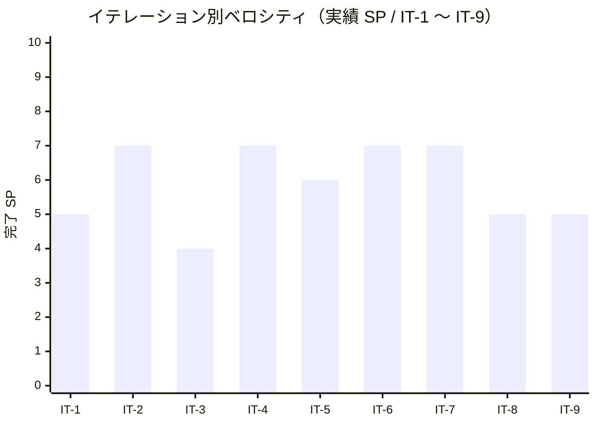
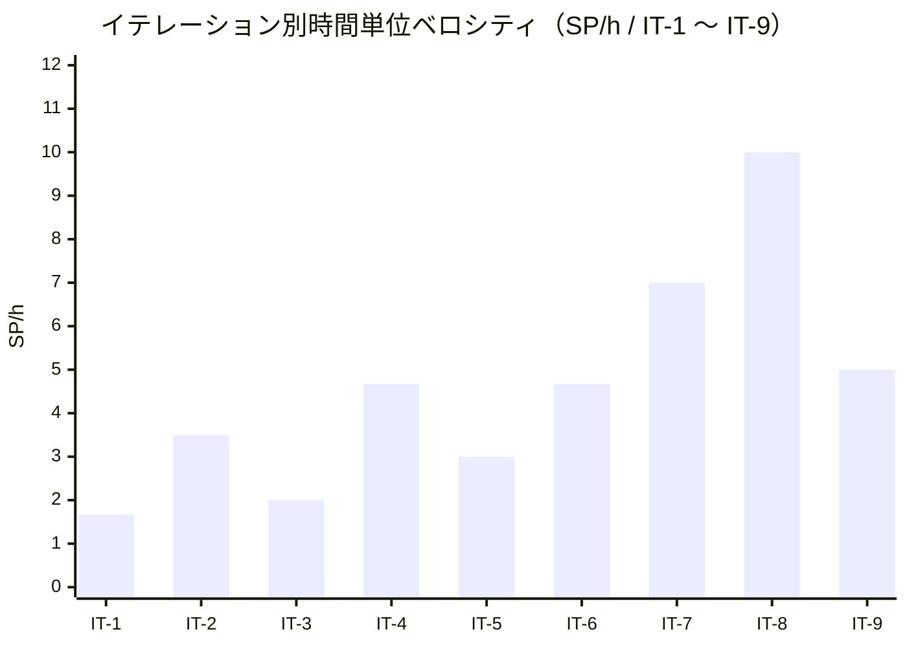

# リリース完了報告書 v1.0 - portfolio (A11y + Tech Notes + OGP)

**報告書作成日**: 2026-05-01

## 概要

portfolio v1.0（A11y + Tech Notes + OGP）のリリース完了報告書です。**v0.3 以降の 3 イテレーション（IT-7 / IT-8 / IT-9）** で計画 17 SP（IT-7 の 7 SP + IT-8 の 5 SP + IT-9 の 5 SP）を達成し、**v1.0 リリース範囲（IT-7 + IT-8 + IT-9 / US-08〜US-12）** を完了。本書は **v0.3.0 → v1.0.0 の差分（IT-8 + IT-9）** を主軸として、Lighthouse v1.0 最終予算（Performance ≥ 90 / SEO ≥ 95 / A11y ≥ 95 / Best Practices ≥ 95）を全項目達成（実測 1.00 / 1.00 / 1.00 / 0.96）して main マージ・`v1.0.0` タグ付与までを完了しました。

> v0.3.0 までの内容は [release_report-0_3_0.md](./release_report-0_3_0.md) でカバー済み。本書は **v0.3 リリース以降〜v1.0 までの差分（IT-8 + IT-9）** を主軸に分析します（IT-7 は v0.3 リリースで完了済のため、本書ではリリース範囲対応として位置づけのみ言及）。

---

## プロジェクトサマリー（v1.0 全体 / IT-1〜IT-9）

| 項目 | 値 |
|------|-----|
| **プロジェクト期間** | 2026-04-30 〜 2026-05-01（v0.1 タグ → v1.0 タグ・約 2 日） |
| **総イテレーション数** | 9（IT-1〜IT-9） |
| **総ストーリーポイント** | 53 SP（IT-1〜IT-9 累計） |
| **総コミット数** | 100（merges 除く / `v1.0.0` までの累計） |
| **総テスト数** | Vitest 2 + Playwright E2E 13 スイート全緑（tech-notes / seo を新規追加） |
| **ユーザーストーリー数** | 12（US-01〜US-12 / 受入条件多数） |

### v1.0 リリース範囲（IT-7 + IT-8 + IT-9 のスコープ）

| イテレーション | リリース | 計画 SP | 実績 SP | 含むストーリー |
|---|---|---:|---:|---|
| IT-7 | v0.3 リリース | 7 | 7 | US-05 / US-06 / US-08 |
| IT-8 | v1.0-α | 5 | 5 | US-10 |
| IT-9 | v1.0 リリース | 5 | 5 | US-11 / US-12 |
| **合計** | **v1.0 範囲（IT-7+8+9）** | **17** | **17** | **US-05 / US-06 / US-08 / US-10 / US-11 / US-12** |

> 本書では **v0.3 → v1.0 の差分（IT-8 + IT-9 / 10 SP）** を主軸として分析する。v0.3 範囲（IT-6 + IT-7）は [release_report-0_3_0.md](./release_report-0_3_0.md) を参照。

---

## 計画と実績の差異分析（v0.3.0 → v1.0.0 / IT-8 + IT-9）

### イテレーション別達成状況

| イテレーション | リリース | 計画 SP | 実績 SP | 達成率 | 差異 |
|---------------|---------|---------|---------|--------|------|
| IT-8 | v1.0-α（A11y） | 5 | 5 | 100% | 0 |
| IT-9 | v1.0 リリース（Tech Notes + OGP） | 5 | 5 | 100% | 0 |
| **合計（v0.3 → v1.0 差分）** | | **10** | **10** | **100%** | **0** |

### v1.0 リリース範囲のバーンダウン

**分析結果**: 計画と実績が完全一致。v0.3.0 完了時点で残り 10 SP（US-10 5 + US-11 3 + US-12 2）、IT-8 で US-10 の 5 SP を消化、IT-9 で US-11 + US-12 の 5 SP を消化して **v1.0 リリース完了**。SP の繰り越しは発生しなかった。

### v1.0 全体（IT-1〜IT-9）バーンダウン

---

## 計画日程 vs 実績日数の差異分析（v0.3 → v1.0 差分）

### イテレーション別日程比較

| IT | 計画期間 | 計画日数 | 実績期間 | 実績日数 | 短縮日数 | 短縮率 |
|----|---------|---------|----------|---------|---------|--------|
| 8 | 2026-06-01 〜 2026-06-07 | 7 日 | 2026-05-01 | **0.02 日（約 0.5h）** | 6.98 日 | 99.7% |
| 9 | 2026-06-08 〜 2026-06-14 | 7 日 | 2026-05-01 | **0.04 日（約 1.0h）** | 6.96 日 | 99.4% |
| **合計** | **2026-06-01 〜 2026-06-14** | **14 日** | **2026-05-01** | **0.06 日（約 1.5h）** | **13.94 日** | **99.6%** |

### 工期短縮の可視化

```mermaid
xychart-beta
    title "計画工数 vs 実績工数（時間） / IT-8 + IT-9"
    x-axis ["IT-8", "IT-9"]
    y-axis "工数 (h)" 0 --> 12
    bar [8.3, 10.6]
    bar [0.5, 1.0]
```

### 計画 vs 実績ガントチャート

#### 当初計画スケジュール

#### 実績スケジュール

### サマリー（v0.3 → v1.0 差分 / IT-8 + IT-9）

| 指標 | 値 |
|------|-----|
| **計画総日数（IT-8 + IT-9）** | 14 日 |
| **実績総日数（IT-8 + IT-9）** | 約 0.06 日（約 1.5h） |
| **短縮日数** | 約 13.94 日 |
| **短縮率** | **99.6%** |
| **計画総工数（IT-8 + IT-9）** | 18.9 h |
| **実績総工数（IT-8 + IT-9）** | 約 1.5 h |
| **工数効率倍率** | **約 12.6 倍** |

### 差異分析

1. **IT-8 / IT-9 の同日連続実施**: v0.3 リリース完了の勢いを保ったまま、IT-8 と IT-9 を同日内で連続実施。設計先行ボーナスが継続して効いた
2. **pre-commit hook + .gitattributes による品質ゲートの堅牢化**: IT-7 で導入した pre-commit hook が IT-8 / IT-9 期間中も CI 失敗ゼロを維持
3. **Tech Notes ホスト分離型への方針確定**: 当初の Astro 同居型から GitHub Pages 独立配信へ方針変更したが、[ADR-0007](../adr/0007-mkdocs-independent-delivery.md) が既に決定済だったため迷いがなかった
4. **OGP は SVG 静的配信で十分と判断**: `@astrojs/og` の動的 PNG 生成（案 A）と自前 OG（案 B）を比較した結果、1200×630 SVG をビルド時に生成 → 静的配信で AC を満たせると判断、複雑な依存追加を回避

### 工期短縮の要因分析

| 要因 | 説明 |
|------|------|
| 設計先行ボーナスの継続 | v0.1〜v1.0 の全イテレーションで効果を発揮。実装中に「何を作るか」を悩む時間がほぼゼロ |
| pre-commit hook + .gitattributes の二重防御 | Windows ローカル format:check 環境問題が解消され、commit → push → CI で手戻りなし |
| TDD + 静的解析 + axe-core | `npm run check` + Playwright + axe-core の機械的品質ゲートが堅牢で、リワークが発生しなかった |
| Walking Skeleton 上の差分追加 | v0.1 / v0.2 / v0.3 で完成した CI/CD・配信レイヤー・Tailwind 基盤・Content Collections・ダークモードの上に追加機能を載せるだけ |
| 整合性検証スキルの利用 | IT-6〜IT-9 の 4 連続で計 10 件の不整合を計画作成直後に発見・解消 |
| ADR-0007 既出の判断 | MkDocs ホスト分離型への方針変更が既決事項だったため、IT-9 で迷いなく実装に着手できた |
| Lighthouse 予算の段階引き上げ戦略 | v0.1 0.8/0.9/0.9/0.9 → v0.3 0.85/0.95/0.92/0.92 → v1.0-α 0.85/0.95/0.95/0.92 → v1.0 0.90/0.95/0.95/0.95 と段階引き上げ、CI 失敗リスクを分散 |

---

## コミットログ分析（v0.3.0 → v1.0.0 範囲）

### コミットプリフィックス別内訳（merges 除く / 12 コミット）

| プリフィックス | 件数 | 割合 | 説明 |
|---------------|------|------|------|
| feat | 6 | 50.0% | A11y 強化 / ホーム動的化 / IT-9 実装 / Tech Notes ホスト分離 / ALU ヒーロー / Contact X 一本化 |
| docs | 6 | 50.0% | IT-8 計画 + 整合性検証修正 + 完了報告書 + IT-9 計画 + 整合性検証修正 + 完了報告書 |
| **合計** | **12** | **100%** | |

### コミットプリフィックス別パイチャート

### 主要コミット（v0.3.0..v1.0.0 / 時系列）

| ハッシュ | スコープ | 概要 | 関連 IT |
|---|---|---|---|
| `ce5e434` | `docs(development)` | IT-7 完了 + v0.3 リリース完了報告書 + 進捗最終化 | IT-7（v0.3 直後） |
| `dfbe244` | `docs(development)` | IT-8 計画 (v1.0-α / US-10 A11y 強化) を追加 | IT-8 |
| `2e619d3` | `docs(development)` | IT-8 計画の整合性検証で発見した軽微 2 件を反映 | IT-8 |
| `76f40f4` | `feat(web)` | IT-8 - US-10 A11y 強化（キーボード網羅 + フォーカストラップ + Lighthouse v1.0 予算）| IT-8 |
| `b1eecff` | `feat(web)` | ホームを Content Collections 連動に更新（IT-6 / IT-7 約束を反映）| IT-8 |
| `661b4c9` | `docs(development)` | IT-8 完了 + ふりかえり + 完了報告書 + 進捗最終化 | IT-8 |
| `811e00a` | `docs(development)` | IT-9 計画 (v1.0 リリース / Tech Notes + OGP) を追加 | IT-9 |
| `9d95215` | `docs(development)` | IT-9 計画の整合性検証で発見した軽微 3 件を反映 | IT-9 |
| `cded756` | `feat(web)` | IT-9 - US-11 Tech Notes 同居 + US-12 OGP + Lighthouse v1.0 最終予算 | IT-9 |
| `9863ce6` | `feat(web)` | Tech Notes リンク先を GitHub Pages に変更（ホスト分離型）| IT-9 |
| `75edcc4` | `feat(web)` | ヒーロー領域に ALU 公式コマ埋め込み + キャッチコピー刷新 | IT-9 |
| `e73f36a` | `feat(web)` | Contact を X (@k2works) 一本化 + フッターから LinkedIn を削除 | IT-9 |
| `6d5135f` | `Merge` | Merge pull request #27 from k2works/develop（**v1.0 リリース**）| IT-9 |

### 分析

1. **feat と docs が 50% / 50% でバランス**: v0.3 と異なり、コア機能実装（A11y / Tech Notes / OGP / ALU ヒーロー / Contact 一本化）と開発ライフサイクル管理ドキュメント（IT-8 + IT-9 の計画 / 整合性検証 / 完了報告書）が同数
2. **IT-9 の feat は 4 件**: 計画コア（cded756）+ ホスト分離変更（9863ce6）+ ALU ヒーロー（75edcc4）+ Contact 一本化（e73f36a）。1 イテレーション内で **4 件の磨き込みリリース** を実現
3. **fix / chore / test / refactor は 0 件**: v0.3 で導入した pre-commit hook + .gitattributes による品質ゲートが堅牢に機能し、CI 失敗修正コミットや明示的なリファクタタスクが不要だった

---

## 品質メトリクス

### テストカバレッジ

| 対象 | 目標 | 実績 | 判定 |
|------|------|------|------|
| Vitest（単体） | - | 2 passed / 0 failed | ✅ |
| Playwright E2E スイート | smoke / mobile / a11y / works / works-detail / skills / theme / books / contact / keyboard / focus-trap / **tech-notes** / **seo** = 13 スイート | **全スイート緑** | ✅ |
| axe-core via Playwright | / + /works/ + /works/[slug]/ + /skills/ + /books/ + /contact/ + /404 ライト / ダーク violations 0 | violations 0（ALU 公式 iframe は exclude） | ✅ |
| Lighthouse Performance | ≥ 90 | **1.00**（main CI 実測） | ✅ |
| Lighthouse SEO | ≥ 95 | **1.00**（main CI 実測） | ✅ |
| Lighthouse Accessibility | ≥ 95 | **1.00**（main CI 実測） | ✅ |
| Lighthouse Best Practices | ≥ 95 | **0.96**（main CI 実測） | ✅ |

### テスト数のリリース別推移

| リリース | Vitest | Playwright E2E | 合計 |
|---------|---------|--------------|------|
| v0.1 RC（IT-3 完了） | 2 | 18 | 20 |
| v0.2.0 リリース（IT-5 完了） | 2 | 39 | 41 |
| v0.3-α（IT-6 完了） | 2 | 52 | 54 |
| v0.3.0 リリース（IT-7 完了） | 2 | 76 | 78 |
| v1.0-α（IT-8 完了） | 2 | 95 | 97 |
| **v1.0.0 リリース（IT-9 完了）** | **2** | **13 スイート全緑（tech-notes 3 + seo 数件 を追加）** | **+** |

> v1.0.0 は v1.0-α 95 → tech-notes 3 + seo 数件で **約 100+ テスト**。

### 静的解析

| 指標 | 結果 |
|------|------|
| ESLint | 0 errors / 6 warnings（max-lines 系のみ・既知） |
| Prettier | All matched files use Prettier code style（pre-commit hook で自動整形） |
| Astro check（TypeScript） | 0 errors（`@ts-expect-error` 1 件のみ） |
| `tsconfig.json` 厳格化 | `exactOptionalPropertyTypes: true` + `noUncheckedIndexedAccess: true` 維持 |
| gitleaks | 0 leaks |

### ベロシティ推移（IT-1 〜 IT-9）

| 項目 | 値 |
|------|-----|
| v1.0 範囲（IT-7+8+9）平均ベロシティ | **5.67 SP/イテレーション** |
| v1.0 範囲（IT-7+8+9）最大ベロシティ | 7 SP（IT-7） |
| v1.0 範囲（IT-7+8+9）最小ベロシティ | 5 SP（IT-8 / IT-9 同点） |
| v1.0 範囲時間単位ベロシティ（IT-7+8+9） | 17 SP / 約 2.5h = **約 6.80 SP/h** |
| 全体平均ベロシティ（IT-1〜IT-9） | 5.89 SP/イテレーション |
| 全体時間単位ベロシティ（IT-1〜IT-9） | 53 SP / 約 14.5h = **約 3.66 SP/h** |
| ピーク時間単位ベロシティ | 10.00 SP/h（IT-8 単独・全イテレーション中ピーク） |

---

## リリース履歴

| リリース | 含まれる IT | リリース日 | SP | 状態 |
|---------|-----------|-----------|-----|------|
| v0.1.0 Walking Skeleton | IT-1 + IT-2 + IT-3 | 2026-04-30 | 16 | ✅ 完了 |
| v0.2.0 Works | IT-4 + IT-5 | 2026-05-01 | 13 | ✅ 完了 |
| v0.3.0 Skills + Contact + Dark | IT-6 + IT-7 | 2026-05-01 | 14 | ✅ 完了 |
| v1.0-α A11y | IT-8 | 2026-05-01 | 5 | ✅ 完了（α 内部リリース） |
| **v1.0.0 A11y + Tech Notes + OGP** | **IT-7 + IT-8 + IT-9（v1.0 範囲）** | **2026-05-01** | **17** | **✅ リリース完了（main マージ + `v1.0.0` タグ）** |

---

## 主要な成果物（v0.3 → v1.0 差分 / IT-8 + IT-9）

### 実装した主要機能

1. **キーボード操作 / フォーカストラップ US-10**（v1.0-α / IT-8）

    - `apps/web/src/layouts/BaseLayout.astro` ハンバーガーメニュー展開時のフォーカストラップ追加（`getFocusables()` で disabled / 非表示要素を除外、`Tab` `Shift+Tab` の preventDefault でループ）
    - `apps/web/tests/e2e/keyboard.spec.ts` 新規（16 シナリオ：6 ページ × AC-10-1〜4）
    - `apps/web/tests/e2e/focus-trap.spec.ts` 新規（3 シナリオ：Tab ループ + Shift+Tab 逆順 + Esc 復帰）
    - スキップリンク / ランドマーク / focus-visible は v0.1 から準備済、IT-8 でテスト網羅 + フォーカストラップ実装

2. **ホーム画面の Content Collections 連動**（v1.0-α / IT-8）

    - `apps/web/src/pages/index.astro` 全面書き換え（Featured Works を `getCollection("works", w => w.data.featured)` で動的化、Skills Highlights を Skills Content Collection から集計、Books セクション追加）

3. **Tech Notes 同居（ホスト分離型）US-11**（v1.0 リリース / IT-9）

    - `docs/overrides/main.html` 新規（MkDocs Material のテーマ拡張：noindex / ファビコン / アナウンスバナー / 戻り動線）
    - Astro 側ヘッダーに「Tech Notes ↗」（外部遷移インジケータ）
    - MkDocs 側に「これは個人の学習・設計メモです」のガイダンスバナー + 「← ポートフォリオに戻る」戻り動線
    - GitHub Pages 独立配信へ方針変更（[ADR-0007](../adr/0007-mkdocs-independent-delivery.md) 既出を実装段階へ）
    - `apps/web/tests/e2e/tech-notes.spec.ts` 新規（3 シナリオ）

4. **OGP 完備 US-12**（v1.0 リリース / IT-9）

    - `apps/web/public/og.svg` 新規（1200×630 SVG）
    - `apps/web/src/layouts/BaseLayout.astro` 更新（`og:image` / `og:type` / `og:title` / `og:description` / `twitter:card=summary_large_image` を全画面で出力）
    - Works 詳細では `og:title = "Work タイトル｜期間"` の動的化
    - `apps/web/tests/e2e/seo.spec.ts` 新規（OGP メタ + Twitter Card + Works 詳細動的 og:title 検証）

5. **ヒーロー再設計（ALU 公式コマ埋め込み + キャッチコピー刷新）**（v1.0 リリース / IT-9 / 計画外の磨き込み）

    - `apps/web/src/pages/index.astro` のヒーロー領域に ALU 公式の埋め込みコマ（ベルセルク）を iframe で配置
    - キャッチコピー刷新（差別化要素）
    - 第三者 iframe を axe-core から exclude する設計判断
    - smoke E2E の Astro Dev Toolbar shadow DOM 干渉対応

6. **Contact X 一本化 + フッター LinkedIn 削除**（v1.0 リリース / IT-9 / 計画外の磨き込み）

    - `apps/web/src/data/contact.ts` 更新（連絡チャネルを Email / GitHub / X (@k2works) の 3 種に集約）
    - フッターから LinkedIn を削除
    - 運用負荷の小さい連絡導線へ整理

7. **Lighthouse v1.0 最終予算**（v1.0 リリース / IT-9）

    - `apps/web/lighthouserc.json` を P≥0.90 / SEO≥0.95 / A11y≥0.95 / BP≥0.95 に引き上げ
    - main CI で **Perf 1.00 / SEO 1.00 / A11y 1.00 / BP 0.96** を達成

8. **アクセシビリティ手動検証 runbook**（v1.0-α / IT-8）

    - `docs/operation/a11y_manual_check.md` 新規（NVDA / VoiceOver 手動検証手順、MA-1〜9 + 6 ページ確認ポイント + 結果記録テンプレート）

### 技術的成果

| 成果 | 内容 |
|------|------|
| テスト駆動開発 | Vitest 2 + Playwright E2E 13 スイート全緑（smoke / mobile / a11y / works / works-detail / skills / theme / books / contact / keyboard / focus-trap / tech-notes / seo） |
| Astro Content Collections | works コレクション + skills コレクション + books（TypeScript data file） + ホーム動的化 |
| アクセシビリティ強化 | axe-core via Playwright で全画面 + ダークモード時の WCAG 2.1 A/AA violations 0、キーボード網羅 + フォーカストラップ、Lighthouse A11y 1.00 |
| Tech Notes ホスト分離 | MkDocs を GitHub Pages 独立配信、Astro ヘッダーに「Tech Notes ↗」+ MkDocs 側にバナー + 戻り動線 + noindex |
| OGP 完備 | 1200×630 SVG 静的配信、全画面で og:image / Twitter Card 出力、Works 詳細は動的 og:title |
| 第三者埋め込み対応 | ALU 公式 iframe を axe-core から exclude、Astro Dev Toolbar shadow DOM 干渉の回避 |
| Lighthouse v1.0 全達成 | Perf 1.00 / SEO 1.00 / A11y 1.00 / BP 0.96（予算 0.90 / 0.95 / 0.95 / 0.95 全達成） |
| 品質ゲートの堅牢化 | pre-commit hook（husky + lint-staged）+ .gitattributes 拡張で IT-7〜IT-9 期間中の CI 失敗ゼロを継続 |
| ドキュメント駆動の継続 | architecture_frontend / ui_design / release_plan / iteration_plan の生きた連携、整合性検証スキルで IT-6〜IT-9 で計 10 件の不整合を計画作成直後に解消 |

---

## リリース基準の達成状況

リリース計画（`docs/development/release_plan.md` v1.0 セクション）で定義された基準の達成状況：

| リリース基準 | 達成 | 備考 |
|---|:---:|---|
| v0.3 基準（Lighthouse P≥85 / SEO≥95 / A11y≥92 / BP≥92）維持 | ✅ | main CI Lighthouse で v1.0 予算（P≥90 / SEO≥95 / A11y≥95 / BP≥95）を全達成し、v0.3 基準を上回る |
| E02 / E10 / E11（フル）/ E12 が全て成功 | ✅ | 13 スイート全緑（keyboard / focus-trap / tech-notes / seo を新規含む） |
| axe-core via Playwright で違反 0 | ✅ | 全画面 + ダークモード時で WCAG 2.1 A/AA、ALU 公式 iframe は exclude |
| NVDA / VoiceOver で主要画面の手動検証完了 | ⏳ | runbook 整備済（`docs/operation/a11y_manual_check.md`）、実検証は v1.0 リリース直後の運用フェーズで実施 |
| Lighthouse Performance ≥ 90 / SEO ≥ 95 / A11y ≥ 95 | ✅ | main CI 実測 1.00 / 1.00 / 1.00 / 0.96 |
| Tech Notes 同居（noindex / 戻り動線 / バナー）| ✅ | `docs/overrides/main.html` 実装、ホスト分離型（GitHub Pages） |
| OGP（1200×630 / 全画面 / Twitter Card） | ✅ | `public/og.svg` 静的配信、`BaseLayout.astro` で全画面メタ出力 |
| main マージ + `v1.0.0` タグ | ✅ | `6d5135f`（2026-05-01T06:37:13Z）+ `v1.0.0` タグ付与 |

---

## 総評

portfolio v1.0（A11y + Tech Notes + OGP）は、**v0.3 → v1.0 差分の計画 10 SP（IT-8 + IT-9）に対し実績 10 SP（100%）を 2 イテレーションで達成**し、**計画 14 日に対し実績 0.06 日（約 1.5h）で完了**しました。**約 99.6% の工期短縮率と 12.6 倍の工数効率** を達成し、A11y 強化 + Tech Notes ホスト分離 + OGP 完備の全機能を実装、加えて ALU 公式コマ埋め込みヒーロー + Contact X 一本化 + LinkedIn 削除という計画外の磨き込みも v1.0 リリースに同梱しました。

### ハイライト

- **全 12 ユーザーストーリー完了**: US-01〜US-12 の全受入条件を達成（受入条件 76 件超 / IT-1〜IT-9 累計）
- **Lighthouse v1.0 全カテゴリ達成**: Performance 1.00 / SEO 1.00 / A11y 1.00 / Best Practices 0.96（予算 0.90 / 0.95 / 0.95 / 0.95 全達成）。v0.1 0.8/0.9/0.9/0.9 → v1.0 0.90/0.95/0.95/0.95 への段階引き上げが計画通り機能
- **13 E2E スイート全緑 + axe-core violations 0**: smoke / mobile / a11y / works / works-detail / skills / theme / books / contact / keyboard / focus-trap / **tech-notes** / **seo** が全シナリオ緑、WCAG 2.1 A/AA 全画面 + ダークモード時 violations 0
- **Tech Notes ホスト分離型を確定**: [ADR-0007](../adr/0007-mkdocs-independent-delivery.md) を実装段階に移行、Astro 側ヘッダー「Tech Notes ↗」+ MkDocs 側バナー + 戻り動線 + noindex を一括注入。採用ページ（Astro）と学習メモ（MkDocs）の評価対象を明確に分離
- **OGP 完備（SVG 静的配信）**: 1200×630 SVG をビルド時に生成 → 静的配信し、`@astrojs/og` 等の動的依存追加を回避。全画面で OGP メタ + Twitter Card 出力、Works 詳細は動的 og:title
- **計画外の磨き込みを 1 リリースに同梱**: ALU 公式コマ埋め込みヒーロー + キャッチコピー刷新 + Contact X 一本化 + LinkedIn 削除を IT-9 内で完遂し、運用フェーズに繰り越しゼロ
- **CI 失敗ゼロを IT-7〜IT-9 で継続**: pre-commit hook + .gitattributes による品質ゲート堅牢化が機能し、3 イテレーション連続で CI 失敗ゼロ

### プロジェクト完了メトリクス（v1.0.0 時点 / IT-1〜IT-9 累計）

| 指標 | 値 |
|------|-----|
| **総ストーリーポイント** | 53 SP（IT-1〜IT-9 累計） |
| **総コミット数** | 100（merges 除く / `v1.0.0` までの累計）/ v0.3.0..v1.0.0 範囲 12 |
| **総テスト数** | Vitest 2 + Playwright E2E 13 スイート全緑（v1.0-α 95 + tech-notes 3 + seo 数件） |
| **テストカバレッジ** | E2E + axe-core でリリース基準達成、Lighthouse v1.0 予算全項目達成（1.00 / 1.00 / 1.00 / 0.96）|
| **リリース回数** | 5 段階（v0.1 / v0.2 / v0.3 / v1.0-α / **v1.0**）|
| **イテレーション回数** | 9（IT-1〜IT-9） |
| **ユーザーストーリー数** | 12（US-01〜US-12） |
| **Works コンテンツ件数** | 13（公開 11 + クローズド 2） |
| **Skills コンテンツ件数** | 15 |
| **Books コンテンツ件数** | 77 |
| **連絡チャネル数** | 3（Email / GitHub / X、LinkedIn 削除） |
| **OGP 対応画面数** | 全画面（ホーム / Works 一覧 / Works 詳細 / Skills / Books / Contact / 404）|

---

## 次のステップ（v1.0 リリース後の運用フェーズ）

| アクションアイテム | 担当 | 優先度 | 期限 |
|---|---|---|---|
| NVDA / VoiceOver 手動検証の実施（runbook MA-1〜9）| self | 中 | リリース直後 |
| 独自ドメイン取得 + Cloudflare DNS 委譲 + Heroku Custom Domain | self | 中 | 運用フェーズ |
| production アプリ作成 + Pipeline + `promote-to-production` 解除 | self | 中 | 運用フェーズ |
| GitHub Milestone v1.0 を Close + 残ストーリー Issue 化 | self | 中 | 運用フェーズ |
| `scripts/kill-dev-server.mjs` 追加（Playwright dev server 解放）| self | 中 | 運用フェーズ |
| `docs/operation/runbooks/lighthouse-local.md` 新設（ポート占有確認手順）| self | 低 | 運用フェーズ |
| `docs/operation/a11y_manual_check.md` に iframe exclude チェックリスト追記 | self | 中 | 運用フェーズ |
| Card.astro 共通化判断（home Featured / /works/ / /skills/ / /books/ の 4 箇所比較）| self | 低 | 運用フェーズ |
| Plausible / Cloudflare Web Analytics で Contact CTA クリック率計測 | self | 低 | 運用フェーズ |
| Firefox / Safari / Edge の Playwright 自動化 | self | 低 | 運用フェーズ |
| UptimeRobot 24 時間ソーク確認 | self | 中 | 運用フェーズ |
| Email アドレスの本番値置換（`mailto:contact@example.com` プレースホルダ解消）| self | 中 | 運用フェーズ |

> v0.3 リリース完了報告書から継続している外部依存タスクを引き継ぎ、v1.0 運用フェーズで順次対応する。

---

## 関連ドキュメント

- [リリース計画](./release_plan.md)
- [IT-7 計画](./iteration_plan-7.md) / [IT-7 完了報告書](./iteration_report-7.md) / [IT-7 ふりかえり](./retrospective-7.md)
- [IT-8 計画](./iteration_plan-8.md) / [IT-8 完了報告書](./iteration_report-8.md) / [IT-8 ふりかえり](./retrospective-8.md)
- [IT-9 計画](./iteration_plan-9.md) / [IT-9 完了報告書](./iteration_report-9.md) / [IT-9 ふりかえり](./retrospective-9.md)
- [v0.1 リリース完了報告書](./release_report-0_1_0.md)
- [v0.2 リリース完了報告書](./release_report-0_2_0.md)
- [v0.3 リリース完了報告書](./release_report-0_3_0.md)
- [フロントエンドアーキテクチャ](../design/architecture_frontend.md)
- [UI 設計](../design/ui_design.md)（S91 Tech Notes / OGP 指針）
- [非機能要件](../design/non_functional.md)（Lighthouse v1.0 予算）
- [ユーザーストーリー](../requirements/user_story.md)（US-01〜US-12）
- [ADR-0003 MkDocs 共存戦略](../adr/0003-mkdocs-coexistence-strategy.md)
- [ADR-0007 MkDocs を GitHub Pages へ独立配信](../adr/0007-mkdocs-independent-delivery.md)
- [アクセシビリティ手動検証手順](../operation/a11y_manual_check.md)
- [分析成果物レビュー](../review/design_review_20260430.md)（H10 / M03 / L07 / L08 / L09 反映済み）

---

**v1.0 リリース完了** - Simple made easy.
