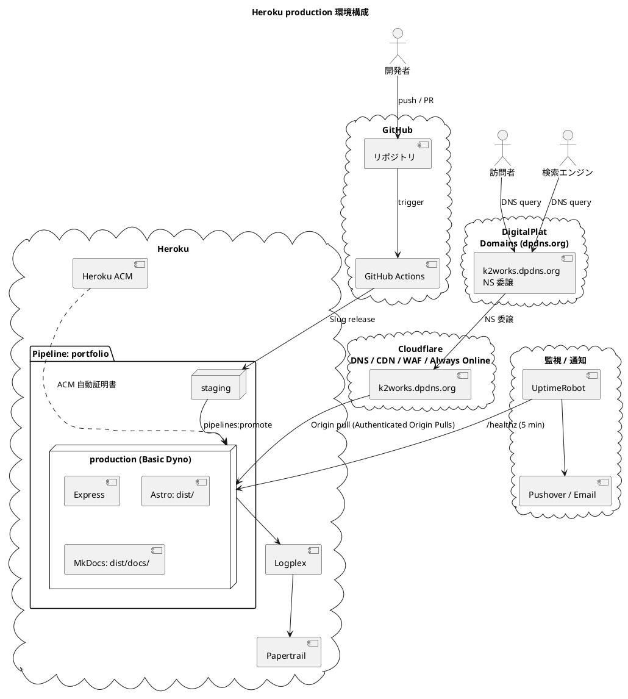
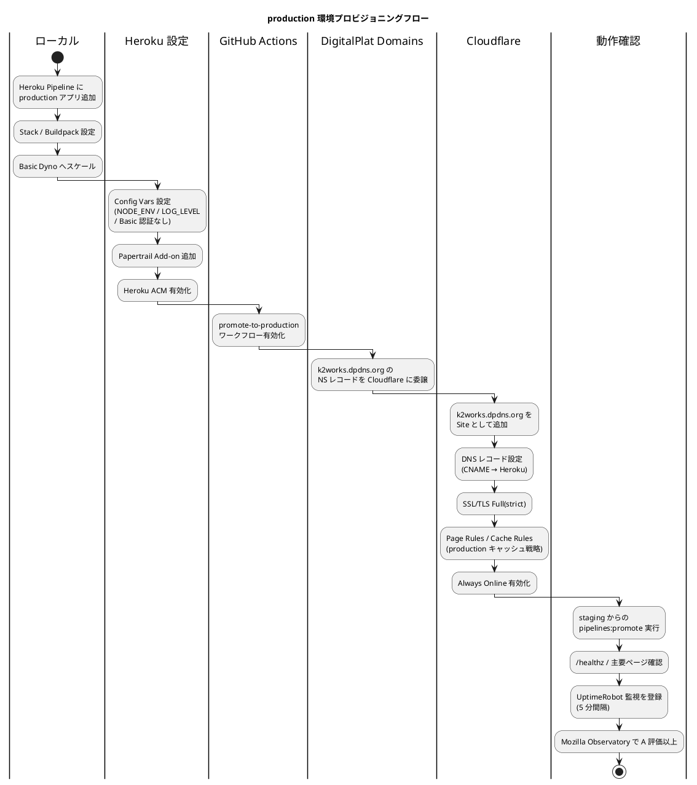
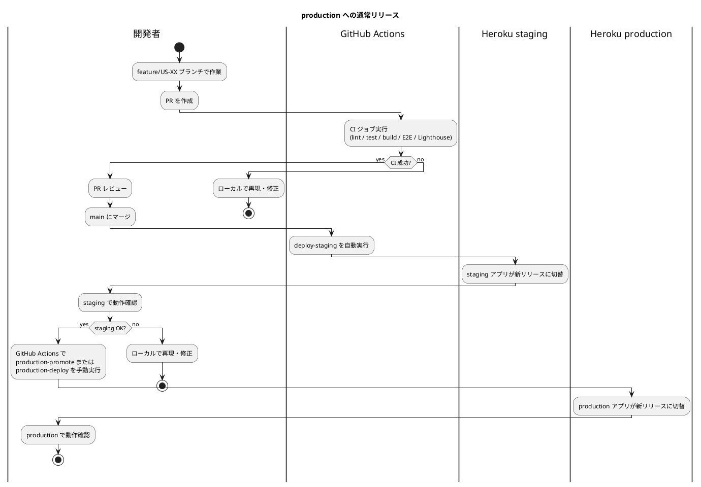

# Heroku production 環境セットアップ手順書

## 概要

本ドキュメントは、**portfolio**（採用・営業向け個人ポートフォリオサイト）の **Heroku production 環境**を構築する手順を説明します。

設計の背景：

- ホスティング先として Heroku を採用（[ADR-0002](../adr/0002-hosting-heroku.md)）
- ビルドは GitHub Actions に一本化、Heroku は Slug 受領のみ（[ADR-0005](../adr/0005-build-pipeline-unification.md)）
- Cloudflare 無料プランを前段に配置（[ADR-0004](../adr/0004-cloudflare-front-cdn.md)）
- production は Basic Dyno（$7/月、スリープなし）で公開、Basic 認証なし、`Allow: /` + Sitemap 公開
- ドメインは **DigitalPlat Domains（dpdns.org）** の無料サブドメイン `k2works.dpdns.org` を使用

| 環境 | Dyno タイプ | 月額 | 用途 |
|---|---|---|---|
| staging | Eco（512MB） | $5 | 統合確認、Lighthouse CI、レビュー（[前段階](./heroku_staging_setup.md)） |
| **production** | **Basic（512MB、スリープなし）** | **$7** | **公開** |

> 本書は production 環境の構築を対象とします。staging 環境の構築・運用については [Heroku staging 環境セットアップ手順書](./heroku_staging_setup.md) を参照してください。

---

## アーキテクチャ



---

## 前提条件

### 完了している前段階

- [Heroku staging 環境セットアップ手順書](./heroku_staging_setup.md) のセットアップ完了（Pipeline `portfolio` と `k2works-portfolio-stg` アプリが作成済み）
- staging で `/healthz` および主要ページが動作することを確認済み

### アカウント

- Heroku アカウント（2FA 有効化必須）— staging で取得済み
- Cloudflare アカウント（無料プラン）— staging で取得済み
- **DigitalPlat Domains アカウント**（[https://dash.digitalplat.org](https://dash.digitalplat.org)）— `k2works.dpdns.org` を保有
- GitHub アカウント（リポジトリは `k2works/portfolio`）
- UptimeRobot アカウント
- Pushover アカウント（Critical 通知用、任意）

### ツール

[Heroku staging 環境セットアップ手順書](./heroku_staging_setup.md) と同一。Heroku CLI が動作することを確認：

```bash
heroku --version
heroku auth:whoami
```

### 想定スキーマ

| 項目 | 値 |
|---|---|
| Heroku Pipeline 名 | `portfolio`（staging と共有） |
| production アプリ名 | `k2works-portfolio-prd`（要 Heroku 上でユニーク） |
| Stack | `heroku-24`（または最新） |
| Region | `us`（[ADR-0002](../adr/0002-hosting-heroku.md)） |
| Buildpack | `heroku/nodejs` のみ（[ADR-0005](../adr/0005-build-pipeline-unification.md)） |
| ドメインレジストラ | DigitalPlat Domains（dpdns.org） |
| 公開 URL | `https://k2works.dpdns.org/` |

---

## セットアップフロー



---

## 1. Heroku production アプリの作成

### 1.1 Pipeline に production ステージを追加

staging で作成済みの Pipeline `portfolio` に production ステージを追加します。

```bash
# production アプリを作成しつつ Pipeline に紐付け
heroku create k2works-portfolio-prd --stack heroku-24 --region us
heroku pipelines:add portfolio --app k2works-portfolio-prd --stage production

# 確認
heroku pipelines:info portfolio
```

> **実機メモ**: `heroku pipelines:add` は staging 用の `pipelines:create --stage staging` と異なり、既存 Pipeline へのステージ追加コマンド。`--stage production` を必ず指定する。

### 1.2 Stack と Region の確認

```bash
heroku stack -a k2works-portfolio-prd
# heroku-24 になっていることを確認

heroku info -a k2works-portfolio-prd
# Region: us であることを確認
```

### 1.3 Buildpack の設定

```bash
# heroku/nodejs のみを設定（staging と完全一致）
heroku buildpacks:clear -a k2works-portfolio-prd
heroku buildpacks:add heroku/nodejs -a k2works-portfolio-prd

heroku buildpacks -a k2works-portfolio-prd
# heroku/nodejs だけが表示されることを確認
```

### 1.4 Basic Dyno の有効化

```bash
# Basic Dyno はスリープなし、$7/月
heroku ps:type basic -a k2works-portfolio-prd
heroku ps:scale web=1 -a k2works-portfolio-prd
```

> **コスト**: Basic Dyno は $7/月でスリープなし、コールドスタートなし。Eco との合計で月 $12（staging $5 + production $7）。

> **実機メモ**: 初回は `Procfile` 反映後でないと `ps:type` がエラーになる場合がある（staging 同様）。初回プロモート（後述）後に再実行すれば成功する。

---

## 2. アプリコードの確認

production と staging は **同一のリポジトリ・同一のビルド成果物・同一の `apps/web/server.js`** を共有します。`Procfile`、`package.json`、`server.js` の内容は [Heroku staging 環境セットアップ手順書 §2](./heroku_staging_setup.md#2-アプリコードの最小準備) の通り。

production 固有の挙動は環境変数で切り替えます：

| 挙動 | 制御変数 | production の値 |
|---|---|---|
| HTTPS 強制リダイレクト | `NODE_ENV` | `production`（有効） |
| Basic 認証 | `BASIC_AUTH_USER` / `BASIC_AUTH_PASS` | **未設定**（無効） |
| ログレベル | `LOG_LEVEL` | `info` |
| `robots.txt` | `PUBLIC_ROBOTS_DISALLOW` | **未設定** または `false`（`Allow: /` + Sitemap） |

---

## 3. Heroku Config Vars の設定

```bash
# 必須
heroku config:set NODE_ENV=production -a k2works-portfolio-prd
heroku config:set LOG_LEVEL=info -a k2works-portfolio-prd
heroku config:set PUBLIC_SITE_ORIGIN=https://k2works.dpdns.org -a k2works-portfolio-prd

# Basic 認証は設定しない（公開のため）
# BASIC_AUTH_USER / BASIC_AUTH_PASS は設定しない

# 確認
heroku config -a k2works-portfolio-prd
# BASIC_AUTH_* が表示されないことを確認
```

> **重要**: `BASIC_AUTH_USER` / `BASIC_AUTH_PASS` を誤って設定すると、production が Basic 認証で守られて公開アクセスできなくなります。本番デプロイ前に必ず確認。

> **`PORT` の取り扱い**: Heroku は `PORT` を自動で割り当てるため、明示的に設定しない（staging と同様）。

---

## 4. Add-on の追加

### 4.1 Papertrail（ログ集約）

staging と同じ無料枠（`choklad`）を production にも適用：

```bash
heroku addons:create papertrail:choklad -a k2works-portfolio-prd
heroku addons -a k2works-portfolio-prd
```

ログ追跡：

```bash
heroku addons:open papertrail -a k2works-portfolio-prd
heroku logs --tail -a k2works-portfolio-prd
```

> **将来の検討**: 月間 100MB を超える場合は `papertrail:fixa`（$7/月、1GB）にアップグレードを検討。

### 4.2 Heroku Metrics

Basic Dyno では無料で標準メトリクス（Dyno load、レスポンス時間、メモリ使用率、Throughput）を取得可能。`https://dashboard.heroku.com/apps/k2works-portfolio-prd/metrics/web` で確認。

### 4.3 Heroku ACM（自動証明書管理）

Cloudflare の SSL/TLS を「Full (strict)」で運用するため、Heroku 側にも証明書が必要。

```bash
heroku certs:auto:enable -a k2works-portfolio-prd
heroku certs:auto -a k2works-portfolio-prd
# Status が "ACM is enabled on this app" になることを確認
```

> **注意**: Heroku ACM はカスタムドメイン登録（後述 §6.2）後に有効化する必要がある。本ステップは §6 完了後に再実行する。

---

## 5. GitHub Actions の準備

### 5.1 GitHub Secrets に追加

[Heroku staging 環境セットアップ手順書 §5.2](./heroku_staging_setup.md#52-github-secrets-に登録) で登録した Secrets に加えて、以下を追加します：

| Secret 名 | 値 |
|---|---|
| `HEROKU_APP_PRODUCTION` | `k2works-portfolio-prd` |

`HEROKU_API_KEY` および `HEROKU_EMAIL` は staging と共有（再登録不要）。

### 5.2 production ワークフロー

[Heroku staging 環境セットアップ手順書 §5.4](./heroku_staging_setup.md#54-デプロイワークフローgithubworkflowsdeployymlの骨格) の `deploy.yml` に、production 向けの 2 つの手動ジョブを用意します。

- `promote-to-production`: staging で確認済みの slug をそのまま昇格
- `deploy-production`: production アプリへ直接 `git push` して再ビルド

`promote-to-production` の例：

```yaml
promote-to-production:
  if: github.event.inputs.target == 'production-promote'
  runs-on: ubuntu-latest
  steps:
    - uses: actions/checkout@v4
    - run: |
        curl https://cli-assets.heroku.com/install.sh | sh
        heroku pipelines:promote -a $HEROKU_APP_STAGING --to $HEROKU_APP_PRODUCTION
      env:
        HEROKU_API_KEY: ${{ secrets.HEROKU_API_KEY }}
        HEROKU_APP_STAGING: ${{ secrets.HEROKU_APP_STAGING }}
        HEROKU_APP_PRODUCTION: ${{ secrets.HEROKU_APP_PRODUCTION }}
```

> **昇格戦略**: production へのリリースは「staging で動作確認 → GitHub Actions の `workflow_dispatch` で `production-promote` を選択」を基本とします。ただし `robots.txt` を production 向けに切り替える必要があるため、公開時は後述の `production-deploy` を正規経路として使います。

### 5.3 ローカルからの手動 promote（緊急時）

```bash
# staging のコードを production に昇格（slug をコピー、再ビルドなし）
heroku pipelines:promote -a k2works-portfolio-stg --to k2works-portfolio-prd

# リリース確認
heroku releases -a k2works-portfolio-prd
```

---

## 6. ドメインと DNS の設定

### 6.1 DigitalPlat Domains で k2works.dpdns.org を取得

1. [https://dash.digitalplat.org](https://dash.digitalplat.org) にログイン
2. 「Free Domains」または「DPDNS」セクションで `k2works.dpdns.org` のサブドメインを登録
3. 登録完了後、ダッシュボードに `k2works.dpdns.org` が表示されることを確認

> **補足**: DigitalPlat Domains の `dpdns.org` は無料サブドメインサービス。利用規約に従い、悪用や転売は不可。

### 6.2 NS レコードを Cloudflare に委譲

**Cloudflare 側で先にゾーンを追加し、割り当てられたネームサーバーを取得：**

1. Cloudflare ダッシュボード → 「Add a Site」→ `k2works.dpdns.org` を入力
2. 「Free」プランを選択
3. 既存 DNS レコードのインポート（無視して進めて OK）
4. Cloudflare から 2 つのネームサーバーが提示される（例: `xxx.ns.cloudflare.com` / `yyy.ns.cloudflare.com`）

> **実機メモ（2026-05-02）**: 本番構築時に Cloudflare から割り当てられた NS は `fred.ns.cloudflare.com` / `daisy.ns.cloudflare.com` でした。

**DigitalPlat Domains 側で NS レコードを設定：**

1. DigitalPlat ダッシュボード → `k2works.dpdns.org` の DNS 管理画面
2. 既存の A / CNAME レコードがあれば削除
3. 以下の NS レコードを追加：

| Type | Name | Content | TTL |
|---|---|---|---|
| NS | `@`（または `k2works`） | `xxx.ns.cloudflare.com` | 3600 |
| NS | `@`（または `k2works`） | `yyy.ns.cloudflare.com` | 3600 |

4. 設定を保存

**伝播確認：**

```bash
# DigitalPlat 側の NS が Cloudflare に向いているか
dig NS k2works.dpdns.org +short
# 期待値: xxx.ns.cloudflare.com / yyy.ns.cloudflare.com

# Cloudflare ダッシュボードで「Active」になるまで待つ（通常数十分、最長 24 時間）
```

Windows PowerShell では `dig` が入っていないことが多いため、以下でも確認可能：

```powershell
Resolve-DnsName k2works.dpdns.org -Type NS | Select-Object -ExpandProperty NameHost
nslookup -type=NS k2works.dpdns.org
```

> **トラブル時のフォールバック**: DigitalPlat Domains が NS 委譲に対応していない場合、付録 A の「Cloudflare を使わない直接 DNS 構成」を参照。ただし [ADR-0004](../adr/0004-cloudflare-front-cdn.md) が要求する CDN / WAF / Always Online が得られないため非推奨。

### 6.3 Heroku にカスタムドメインを登録

```bash
heroku domains:add k2works.dpdns.org -a k2works-portfolio-prd
heroku domains -a k2works-portfolio-prd
# DNS Target が表示される（例: <random>.herokudns.com）
# この値をメモする
```

### 6.4 Cloudflare の DNS レコード設定

Cloudflare ダッシュボード → DNS タブで以下を設定：

| Type | Name | Content | Proxy | TTL |
|---|---|---|---|---|
| CNAME | `@` | `<heroku の DNS target>` | **Proxied（オレンジクラウド）** | Auto |
| CNAME | `www` | `k2works.dpdns.org` | Proxied | Auto |

> **Cloudflare の CNAME flattening**: ルート（`@`）に CNAME を設定すると Cloudflare が自動的に A/AAAA に変換して配信するため、apex ドメインでも CNAME が使える。

> **重要**: Heroku ACM のドメイン検証中は、`@` の CNAME を一時的に **`DNS only`** に切り替える。`Proxied` のままだと Heroku 側で `Unable to resolve DNS` / `Incorrect DNS Settings` になり、証明書発行に失敗する場合がある。証明書発行完了後に **`Proxied`** へ戻す。

### 6.5 Heroku ACM 有効化（再）

DNS が伝播し Cloudflare 経由で Heroku に到達できる状態になったら：

```bash
heroku certs:auto:enable -a k2works-portfolio-prd
heroku certs:auto -a k2works-portfolio-prd
# Status が "Cert issued" になるまで待機
```

> **実機メモ（2026-05-02）**: `DNS only` 反映前は `Unable to resolve DNS for k2works.dpdns.org` と表示され、Cloudflare 側では `525` が返った。`DNS only` に切り替え後、Heroku ACM は `Cert issued` になり、発行元は Let's Encrypt（`R13`）だった。

### 6.6 SSL/TLS 設定

Heroku ACM が `Cert issued` になった後、Cloudflare ダッシュボード → SSL/TLS → Overview → **「Full (strict)」** を選択し、CNAME を **`Proxied`** に戻す。

> **重要**: Heroku ACM が完了する前に「Full (strict)」を選択すると、526 エラー（Invalid SSL certificate）が発生する。順序は「Cloudflare で `DNS only` → Heroku ACM 有効化 → ACM `Cert issued` 確認 → Cloudflare で `Proxied` + Full (strict) 設定」。

### 6.7 Always Online の有効化

Cloudflare ダッシュボード → Caching → Configuration → **Always Online** を **On** に設定。

> **効果**: Heroku Basic Dyno が再起動・障害で応答しない場合でも、Cloudflare のキャッシュからサイトを継続配信。採用面接当日の停止リスク軽減。

### 6.8 Page Rules / Cache Rules（production 用キャッシュ戦略）

production では [ADR-0004](../adr/0004-cloudflare-front-cdn.md) で定義したキャッシュ戦略を実装：

| URL パターン | 設定 |
|---|---|
| `k2works.dpdns.org/assets/*` | Cache Level: Cache Everything、Edge Cache TTL: 1 month、Browser Cache TTL: 1 year |
| `k2works.dpdns.org/healthz` | Cache Level: Bypass |
| `k2works.dpdns.org/*` | Cache Level: Cache Everything、Edge Cache TTL: 5 minutes、Always Use HTTPS: On |

> **Cloudflare Free の Page Rules 上限**: 3 個まで。上記をそのまま割り当てると 3 個ぴったり消費する。

> **代替**: Cloudflare の新機能「Cache Rules」（Free プランでも 10 個まで利用可能）を使うとより柔軟に設定できる。Page Rules で困ったら Cache Rules への移行を検討。

### 6.9 検索エンジンへの公開（production のみ）

production では検索インデックスを許可する。staging との挙動差を以下に整理：

| 項目 | staging | production |
|---|---|---|
| `robots.txt` | `Disallow: /` | `Allow: /` + `Sitemap: https://k2works.dpdns.org/sitemap-index.xml` |
| `X-Robots-Tag` ヘッダ | `noindex, nofollow`（Cloudflare Transform Rule） | **未設定**（または `index, follow`） |
| MkDocs `<meta robots>` | `noindex, nofollow` | `noindex, nofollow`（[ADR-0003](../adr/0003-mkdocs-coexistence-strategy.md) により当面維持） |

#### A. `robots.txt` の出力

GitHub Actions の `promote-to-production` ジョブでは **`PUBLIC_ROBOTS_DISALLOW` 環境変数を設定しない**（または `"false"`）。これにより `apps/web/src/pages/robots.txt.ts` が `Allow: /` + `Sitemap` を出力する。

ただし `pipelines:promote` は staging のビルド成果物（slug）をそのまま production にコピーするため、**staging のビルド成果物は `Disallow: /` の robots.txt を含んでいる**。

**対応方針**：

1. 推奨: `pipelines:promote` ではなく **production 専用ビルドを GitHub Actions で行い、`PUBLIC_ROBOTS_DISALLOW=false` で再ビルドして production に直接デプロイ**するワークフローに切り替える
2. 暫定: production 用の robots.txt を **Cloudflare Transform Rules で書き換え**

**推奨方針の deploy.yml 修正例：**

```yaml
deploy-production:
  if: github.event.inputs.target == 'production-deploy'
  runs-on: ubuntu-latest
  steps:
    - uses: actions/checkout@v4
      with:
        fetch-depth: 0
    - uses: actions/setup-node@v4
      with:
        node-version: 22
        cache: npm
    - run: npm ci
    - run: npm run --workspace @portfolio/web build
    - run: curl https://cli-assets.heroku.com/install.sh | sh
    - name: Deploy to Heroku production via git push
      run: |
        git config --global user.email "$HEROKU_EMAIL"
        git config --global user.name "GitHub Actions"
        cat > "$HOME/.netrc" <<EOF
        machine git.heroku.com
          login $HEROKU_EMAIL
          password $HEROKU_API_KEY
        machine api.heroku.com
          login $HEROKU_EMAIL
          password $HEROKU_API_KEY
        EOF
        chmod 600 "$HOME/.netrc"
        heroku git:remote -a "$HEROKU_APP_PRODUCTION"
        git push heroku HEAD:main --force
      env:
        HEROKU_API_KEY: ${{ secrets.HEROKU_API_KEY }}
        HEROKU_APP_PRODUCTION: ${{ secrets.HEROKU_APP_PRODUCTION }}
        HEROKU_EMAIL: ${{ secrets.HEROKU_EMAIL }}
```

> **トレードオフ**: `pipelines:promote` の「staging で確認した slug をそのまま使う」利点を捨てる代わりに、環境ごとに異なる robots.txt を確実に出力できる。本プロジェクトでは production の SEO 適合を優先し、再ビルド方式を採用。

#### B. `X-Robots-Tag` の制御

staging で設定した Transform Rule の **Hostname 条件は `staging.portfolio.example.com` 等で限定**しており、production の `k2works.dpdns.org` には適用されない。新規 Cloudflare ゾーンには Transform Rule が継承されないため、production 側で **意図的に何も設定しない** ことで `index, follow`（既定）として扱われる。

念のため確認：

```bash
curl -I https://k2works.dpdns.org/ | grep -i x-robots-tag
# 期待値: 何も返らない（X-Robots-Tag が付いていない）
```

#### C. MkDocs（`/docs/`）の `<meta robots>`

[ADR-0003](../adr/0003-mkdocs-coexistence-strategy.md) で「初期は `noindex` で公開、知名度・SEO 戦略に応じて再評価」と決定済み。当面は staging と同じく `noindex, nofollow`。`docs/overrides/main.html` の設定を変更しない。

> **再評価のトリガー**: production 公開後 3 か月の Tech Notes アクセスログを確認し、indexable に切り替える価値があれば ADR-0003 を更新。

### 6.10 Cloudflare 動作確認チェックリスト

```bash
# 1. DNS が Cloudflare 経由か
dig k2works.dpdns.org +short
# 期待値: Cloudflare の IP（104.21.x.x や 172.67.x.x）

# 2. Cloudflare ヘッダ
curl -I https://k2works.dpdns.org/ | grep -i 'cf-\|server'
# 期待値: server: cloudflare、cf-ray: ...

# 3. SSL/TLS Full (strict)
curl -I https://k2works.dpdns.org/healthz
# 期待値: HTTP/2 200、cf-cache-status: BYPASS

# 4. Heroku ACM
heroku certs:auto -a k2works-portfolio-prd
# 期待値: Status "Cert issued"

# 5. Authenticated Origin Pulls（任意の追加防御）
# Cloudflare ダッシュボード → SSL/TLS → Origin Server → Authenticated Origin Pulls を On
```

| 項目 | 確認 |
|---|---|
| DigitalPlat の NS が Cloudflare に委譲 | [ ] |
| Cloudflare ゾーンが「Active」 | [ ] |
| `server: cloudflare` ヘッダ付与 | [ ] |
| SSL は「Full (strict)」 | [ ] |
| Heroku ACM が `Cert issued` | [ ] |
| Always Online が On | [ ] |
| Page Rules / Cache Rules で `/assets/*` 1 年・HTML 5 分・`/healthz` Bypass | [ ] |
| `robots.txt` が `Allow: /` + `Sitemap` 含む | [ ] |
| `X-Robots-Tag` が production には付与されない | [ ] |
| `/docs/` の HTML に `<meta robots noindex>` が残る（[ADR-0003](../adr/0003-mkdocs-coexistence-strategy.md)） | [ ] |

---

## 7. 初回プロモートとデプロイ

### 7.1 staging からのプロモート

```bash
# staging で動作確認済みの slug を production に昇格
heroku pipelines:promote -a k2works-portfolio-stg --to k2works-portfolio-prd

# リリース確認
heroku releases -a k2works-portfolio-prd
heroku ps -a k2works-portfolio-prd
# web.1: up

# ログ追跡
heroku logs --tail -a k2works-portfolio-prd
```

### 7.2 production 専用ビルドでの初回デプロイ（推奨）

§6.9 A の方針に従い、`workflow_dispatch` で production-deploy を実行：

1. GitHub リポジトリ → Actions → `Deploy` ワークフローを選択
2. 「Run workflow」→ `target: production-deploy` を選択
3. 実行完了を待つ
4. `https://k2works.dpdns.org/healthz` にアクセスして 200 OK を確認

### 7.3 動作確認

```bash
curl -I https://k2works.dpdns.org/healthz
# HTTP/2 200
# server: cloudflare

curl -I https://k2works.dpdns.org/
# HTTP/2 200
# (Basic 認証ダイアログが出ないことを確認)
```

---

## 8. 動作確認

### 8.1 主要ページ確認

| 確認項目 | URL | 期待値 |
|---|---|---|
| ホーム | `https://k2works.dpdns.org/` | Basic 認証なしで表示、catchcopy・ALU iframe・specialties 表示 |
| Works 一覧 | `https://k2works.dpdns.org/works/` | 全 works カード表示 |
| Skills 一覧 | `https://k2works.dpdns.org/skills/` | カテゴリ別スキル表示 |
| Books 一覧 | `https://k2works.dpdns.org/books/` | 書籍リスト表示 |
| Contact | `https://k2works.dpdns.org/contact/` | X (@k2works) リンクのみ |
| Tech Notes | `https://k2works.dpdns.org/docs/` | MkDocs 表示、`<meta robots noindex>` 付与 |
| 404 | `https://k2works.dpdns.org/nonexistent` | 404 ページ表示 |
| robots.txt | `https://k2works.dpdns.org/robots.txt` | `Allow: /` + `Sitemap: https://k2works.dpdns.org/sitemap-index.xml` |
| sitemap | `https://k2works.dpdns.org/sitemap-index.xml` | sitemap-0.xml への参照 |
| OG image | `https://k2works.dpdns.org/og.svg` | SVG 画像表示 |

### 8.2 セキュリティヘッダ確認

```bash
curl -I https://k2works.dpdns.org/
```

確認項目：

- [ ] `Strict-Transport-Security: max-age=31536000; includeSubDomains; preload`（Cloudflare 付与）
- [ ] `Content-Security-Policy: default-src 'self'; ...; frame-src 'self' https://alu.jp; ...`
- [ ] `X-Content-Type-Options: nosniff`
- [ ] `X-Frame-Options: DENY` または CSP の `frame-ancestors 'none'`
- [ ] `Referrer-Policy: strict-origin-when-cross-origin`
- [ ] `Permissions-Policy` 付与

[Mozilla Observatory](https://observatory.mozilla.org/) で `k2works.dpdns.org` をスキャンし **A 評価以上**を確認。

### 8.3 Lighthouse スコア確認（production）

```bash
# ローカルから production を計測
npx lhci autorun --collect.url=https://k2works.dpdns.org/ \
  --assert.preset=lighthouse:recommended
```

[非機能要件](../design/non_functional.md) の v1.0 予算：

| カテゴリ | 予算 |
|---|---|
| Performance | ≥ 0.9 |
| SEO | ≥ 0.95 |
| Accessibility | ≥ 0.95 |
| Best Practices | ≥ 0.95 |

---

## 9. 監視の登録

### 9.1 UptimeRobot（production は厳格）

1. UptimeRobot で新規モニター作成（HTTP(s)）
2. URL: `https://k2works.dpdns.org/healthz`
3. 監視間隔: **5 分**（staging より厳格）
4. 連続失敗回数: 2 回
5. 通知先: メール + Pushover（Critical）
6. SSL 証明書の期限通知も有効化

### 9.2 Heroku Metrics

`https://dashboard.heroku.com/apps/k2works-portfolio-prd/metrics/web` を **週次**で確認：

- Dyno Load: < 1.0
- Response Time（p95）: < 500ms
- Memory Usage: < 400MB（Basic Dyno の 512MB の 80%）
- Throughput: 異常スパイクがないか

### 9.3 Papertrail Saved Searches（production）

| 名前 | クエリ | 通知 |
|---|---|---|
| Errors | `level:error OR "ERROR"` | Pushover Critical |
| 5xx | `"status=5"` | Pushover Critical |
| Slow requests | `"duration:" AND ("3000" OR "4000" OR "5000")` | メールのみ |
| 401/403 spike | `"status=4"` AND ("401" OR "403") | メール（threshold: 100/min） |

---

## 10. CI/CD の典型フロー

### 10.1 通常リリース



### 10.2 ロールバック

production の異常検知時は即座にロールバック：

```bash
# 直前のリリースに戻す
heroku releases -a k2works-portfolio-prd
heroku rollback -a k2works-portfolio-prd

# 特定リリースに戻す
heroku rollback v<N> -a k2works-portfolio-prd

# /healthz で復旧確認
curl -f https://k2works.dpdns.org/healthz

# Cloudflare のキャッシュ Purge（HTML 5 分キャッシュの即時反映）
# Cloudflare ダッシュボード → Caching → Purge Everything
```

> **目安**: ロールバック完了から Cloudflare キャッシュ Purge までを **5 分以内**で完了させる（[非機能要件](../design/non_functional.md) の MTTR 目標）。

---

## 11. 環境変数の同期

| 変数 | local（`.env`） | staging | production |
|---|---|---|---|
| `NODE_ENV` | `development` | `production` | `production` |
| `LOG_LEVEL` | `debug` | `debug` | `info` |
| `PUBLIC_SITE_ORIGIN` | `http://localhost:4321` 等 | staging URL | `https://k2works.dpdns.org` |
| `BASIC_AUTH_USER` | -（未設定） | `staging-user` 等 | **-（未設定）** |
| `BASIC_AUTH_PASS` | - | ランダム文字列 | **-** |
| `PUBLIC_ROBOTS_DISALLOW` | - | `true`（ビルド時） | `false`（ビルド時） |
| `PORT` | `3000`（dev） | Heroku 自動 | Heroku 自動 |

設定変更時は `heroku config:set` で更新し、`.env.example` に項目を反映。

---

## 12. クリーンアップ

### 12.1 一時的な停止

```bash
# Dyno を 0 にスケール（料金は発生し続けるが応答停止）
heroku ps:scale web=0 -a k2works-portfolio-prd

# Cloudflare の Always Online でキャッシュから配信される

# 再開
heroku ps:scale web=1 -a k2works-portfolio-prd
```

### 12.2 完全削除（再構築前提）

> **警告**: production の `apps:destroy` は **不可逆**。事前に Pipeline / Add-on の関連付け、環境変数、カスタムドメイン設定を控えること。

```bash
# 0. 削除前に重要情報を控える
heroku config -a k2works-portfolio-prd > backup-config-prod.txt
heroku addons -a k2works-portfolio-prd
heroku domains -a k2works-portfolio-prd

# 1. カスタムドメインを削除
heroku domains:remove k2works.dpdns.org -a k2works-portfolio-prd

# 2. Pipeline から外す
heroku pipelines:remove k2works-portfolio-prd -a k2works-portfolio-prd

# 3. アプリ削除
heroku apps:destroy k2works-portfolio-prd --confirm k2works-portfolio-prd

# 4. Cloudflare 側のゾーンを削除（必要時）
# Cloudflare ダッシュボード → k2works.dpdns.org → Advanced Actions → Remove Site

# 5. DigitalPlat の NS レコードを元に戻す（必要時）
```

---

## 13. トラブルシューティング

### Cloudflare 経由でアクセスできない

| 症状 | 原因 | 対処 |
|---|---|---|
| `522: Connection timed out` | オリジン（Heroku）が応答しない | `heroku ps -a k2works-portfolio-prd` を確認、Basic Dyno でも `heroku ps:restart` |
| `526: Invalid SSL certificate` | Cloudflare「Full (strict)」で Heroku ACM 未完了 | `heroku certs:auto:enable -a k2works-portfolio-prd`、ACM ステータスが `OK` になるまで待機 |
| `1014: CNAME Cross-User Banned` | Cloudflare 側に同名のドメインが他テナントで存在 | サポートに連絡、または別サブドメイン使用 |
| `1001: DNS resolution error` | DigitalPlat → Cloudflare の NS 委譲未完了 | `dig NS k2works.dpdns.org +short` で確認、未伝播なら最長 24 時間待機 |

### DigitalPlat の NS レコードが反映されない

| 症状 | 原因 | 対処 |
|---|---|---|
| `dig NS k2works.dpdns.org` が DigitalPlat のネームサーバーを返す | NS レコードが保存されていない、または TTL が長い | DigitalPlat ダッシュボードで NS レコードを再確認、TTL を 300 に短縮 |
| Cloudflare ダッシュボードが「Pending Nameserver Update」のまま | NS 委譲が伝播していない | 24 時間待機、それでもダメなら DigitalPlat サポートに NS 委譲可否を確認 |
| DigitalPlat が NS 委譲を許可しない | `.dpdns.org` のポリシー上の制約 | 付録 A の「Cloudflare を使わない直接 DNS 構成」へ切替検討、または別ドメインの取得 |

### Heroku デプロイは成功したが production が古いまま

| 症状 | 原因 | 対処 |
|---|---|---|
| ブラウザでアクセスすると古い HTML | Cloudflare の HTML 5 分キャッシュ | Cloudflare → Caching → Purge Everything、または該当 URL のみ Purge |
| `/assets/*` が古い | 1 年キャッシュが効いている、ファイル名ハッシュなし | Astro のビルド設定でファイル名にハッシュが含まれているか確認、含まれていれば自動更新される |

### production の Lighthouse スコアが予算未達

| 症状 | 原因 | 対処 |
|---|---|---|
| Performance < 0.9 | Cloudflare 経由でも遅い | Cloudflare の Page Rules / Cache Rules を確認、HTML キャッシュが効いているか `cf-cache-status: HIT` で確認 |
| SEO < 0.95 | `robots.txt` が `Disallow: /` のまま | §6.9 の production 専用ビルド方針が反映されているか確認、`curl https://k2works.dpdns.org/robots.txt` で実値確認 |
| Best Practices < 0.95 | 混在コンテンツ、HTTPS 未強制 | `apps/web/server.js` の HTTPS 強制リダイレクトが効いているか確認、Cloudflare の SSL/TLS が「Full (strict)」か確認 |

### Basic 認証ダイアログが出てしまう

```bash
heroku config -a k2works-portfolio-prd
# BASIC_AUTH_USER / BASIC_AUTH_PASS が設定されていないか確認
heroku config:unset BASIC_AUTH_USER -a k2works-portfolio-prd
heroku config:unset BASIC_AUTH_PASS -a k2works-portfolio-prd
heroku ps:restart -a k2works-portfolio-prd
```

### staging のテストが通っているのに production で挙動が異なる

`pipelines:promote` ではビルド成果物（slug）をそのまま昇格するため、環境変数による挙動分岐は **production の Config Vars** に依存する。`heroku config -a k2works-portfolio-prd` を確認し、§3 の必須変数が設定されているか検証する。

特に：

- `NODE_ENV=production` が未設定だと HTTPS リダイレクトが無効化される
- `LOG_LEVEL` の差で詳細ログが出ない（または出すぎる）
- `BASIC_AUTH_*` が誤設定されていると公開アクセス不可

---

## 14. ポート・URL 一覧

| 用途 | URL |
|---|---|
| ヘルスチェック | `https://k2works.dpdns.org/healthz` |
| ホーム | `https://k2works.dpdns.org/` |
| Tech Notes | `https://k2works.dpdns.org/docs/` |
| sitemap | `https://k2works.dpdns.org/sitemap-index.xml` |
| robots.txt | `https://k2works.dpdns.org/robots.txt` |
| Heroku ダッシュボード | `https://dashboard.heroku.com/apps/k2works-portfolio-prd` |
| Heroku Metrics | `https://dashboard.heroku.com/apps/k2works-portfolio-prd/metrics/web` |
| Heroku Pipeline | `https://dashboard.heroku.com/pipelines/portfolio` |
| Papertrail | `https://papertrailapp.com/` |
| UptimeRobot | https://uptimerobot.com/ |
| Cloudflare ダッシュボード | https://dash.cloudflare.com/ |
| DigitalPlat Domains | https://dash.digitalplat.org/ |

---

## 15. セキュリティチェックリスト

- [ ] Heroku アカウントで 2FA を有効化（staging で確認済みなら OK）
- [ ] `HEROKU_API_KEY` は GitHub Secrets で管理（`.env` に書かない）
- [ ] **`BASIC_AUTH_USER` / `BASIC_AUTH_PASS` を設定していない**（production は公開）
- [ ] Cloudflare の SSL/TLS は「Full (strict)」
- [ ] Heroku ACM が有効で `Status: OK`
- [ ] Authenticated Origin Pulls を有効化（任意の追加防御）
- [ ] `robots.txt` が `Allow: /` + `Sitemap` を返す
- [ ] `X-Robots-Tag: noindex` ヘッダが production に **付かない**
- [ ] CSP / HSTS / X-Frame-Options が付与される（Mozilla Observatory で A 以上）
- [ ] gitleaks が CI で実行されコミット混入を検出
- [ ] Papertrail に IP / User-Agent 以外の個人情報が記録されていない
- [ ] DigitalPlat Domains アカウントで 2FA を有効化（提供されている場合）
- [ ] Cloudflare アカウントで 2FA を有効化

---

## 付録 A: Cloudflare を使わない直接 DNS 構成（フォールバック）

DigitalPlat Domains が NS 委譲をサポートしない、または Cloudflare ゾーンの追加に失敗した場合のフォールバック構成。

> **トレードオフ**: [ADR-0004](../adr/0004-cloudflare-front-cdn.md) の前提が崩れるため、LCP p95 < 2.5s および SLO 99.5% の達成が困難になる。**この構成を採用する場合は ADR-0004 を再評価**する必要がある。

### A.1 DigitalPlat の DNS で直接 Heroku を指す

DigitalPlat ダッシュボードで以下を設定：

| Type | Name | Content | TTL |
|---|---|---|---|
| CNAME | `@`（または `k2works`） | `<heroku の DNS target>` | 300 |

> **注意**: `dpdns.org` のポリシーで apex への CNAME が許可されていない場合は、`www` のみ CNAME にして apex は `301` リダイレクトで対応するか、別の DNS プロバイダ（Cloudflare 別名のサブドメインを別取得）を検討。

### A.2 Heroku ACM のみで証明書管理

Cloudflare の TLS 終端なしのため、Heroku ACM 証明書がエンドユーザーに直接見える：

```bash
heroku certs:auto:enable -a k2works-portfolio-prd
heroku certs:auto -a k2works-portfolio-prd
# Status: OK を確認
```

### A.3 制約事項

| 失われる機能 | 影響 |
|---|---|
| Cloudflare CDN | 日本からの LCP / TTFB が悪化（米国オリジンへの直接アクセス） |
| Cloudflare WAF / DDoS | 攻撃緩和なし、Heroku の標準保護のみ |
| Always Online | Heroku 障害時にサイト停止 |
| エッジキャッシュ | `/assets/*` の 1 年キャッシュ効果なし |
| Cache Purge による即時反映 | `Cache-Control` ヘッダの設定のみで制御 |

### A.4 推奨

ADR-0004 の再評価で「Cloudflare 前段は引き続き必須」と判断されれば、別ドメインプロバイダ（Cloudflare Registrar、Namecheap、Porkbun など）への移行を検討。

---

## 関連ドキュメント

- [Heroku staging 環境セットアップ手順書](./heroku_staging_setup.md) — 前段階
- [アプリケーション開発環境セットアップ手順書](./local_setup.md)
- [インフラストラクチャアーキテクチャ](../design/architecture_infrastructure.md)
- [運用要件](../design/operation.md)
- [非機能要件](../design/non_functional.md)
- [リリース計画](../development/release_plan.md)
- [v1.0 リリース完了報告書](../development/release_report-1_0_0.md)
- [ADR-0002: ホスティングプラットフォームに Heroku を採用](../adr/0002-hosting-heroku.md)
- [ADR-0003: MkDocs を Tech Notes として共存させる](../adr/0003-mkdocs-coexistence-strategy.md)
- [ADR-0004: Cloudflare 無料プランを前段に配置](../adr/0004-cloudflare-front-cdn.md)
- [ADR-0005: ビルド境界を GitHub Actions に一本化](../adr/0005-build-pipeline-unification.md)
- [ADR-0006: Heroku デプロイの認証は CLI + netrc 経由](../adr/0006-heroku-deploy-authentication.md)
