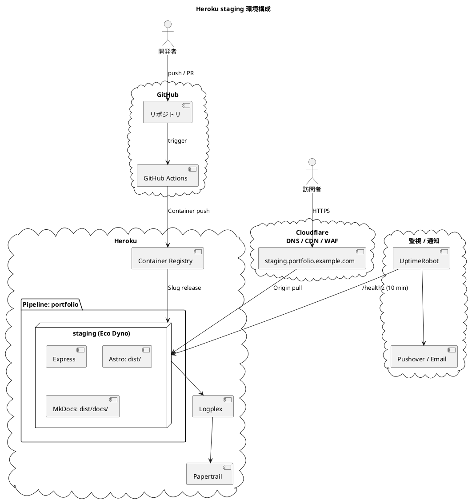
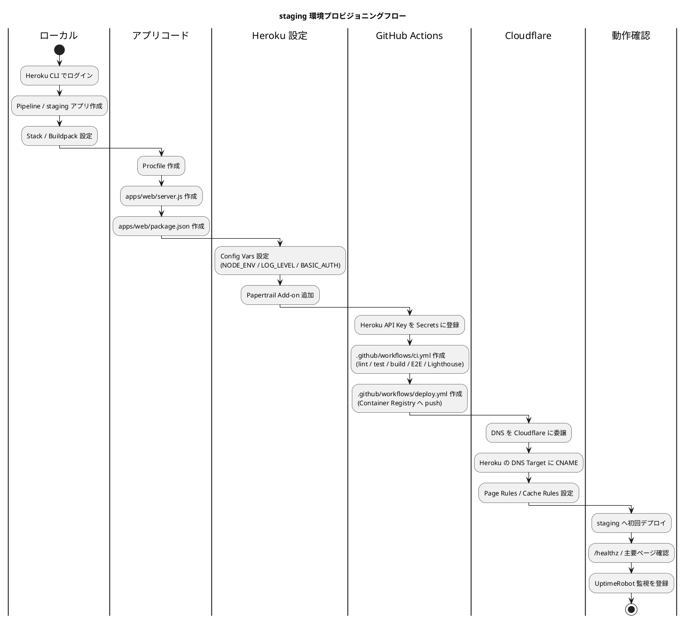
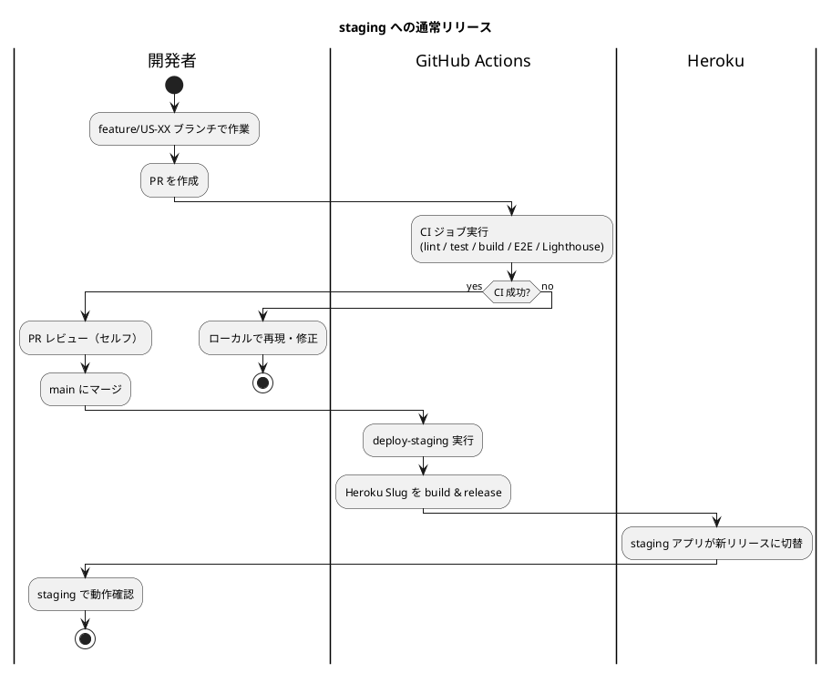

# Heroku staging 環境セットアップ手順書

## 概要

本ドキュメントは、**portfolio**（採用・営業向け個人ポートフォリオサイト）の **Heroku staging 環境**を構築する手順を説明します。

設計の背景：

- ホスティング先として Heroku を採用（[ADR-0002](../adr/0002-hosting-heroku.md)）
- ビルドは GitHub Actions に一本化、Heroku は Slug 受領のみ（[ADR-0005](../adr/0005-build-pipeline-unification.md)）
- Cloudflare 無料プランを前段に配置（[ADR-0004](../adr/0004-cloudflare-front-cdn.md)）
- staging は Eco Dyno（$5/月）+ Basic 認証 + `Disallow: /` で公開検索除け

| 環境 | Dyno タイプ | 月額 | 用途 |
|---|---|---|---|
| **staging** | Eco（512MB） | $5 | 統合確認、Lighthouse CI、レビューアプリ |
| production | Basic（512MB、スリープなし） | $7 | 公開（[次の段階](./heroku_production_setup.md)） |

> 本書は staging 環境の構築までを対象とします。production は別手順書 `heroku_production_setup.md` で扱います。

---

## アーキテクチャ



---

## 前提条件

### アカウント

- Heroku アカウント（2FA 有効化必須）
- Cloudflare アカウント（無料プラン）
- ドメインレジストラのアカウント（`portfolio.example.com` を保有）
- GitHub アカウント（リポジトリは `k2works/portfolio`）
- Pushover アカウント（Critical 通知用、任意）

### ツール

[アプリケーション開発環境セットアップ手順書](./local_setup.md) のセットアップが完了していること。加えて：

| ツール | バージョン | インストール |
|---|---|---|
| Heroku CLI | 最新 | `scoop install heroku-cli` / `brew tap heroku/brew && brew install heroku` |

```bash
heroku --version
heroku login
```

### 想定スキーマ

| 項目 | 値 |
|---|---|
| Heroku Pipeline 名 | `portfolio` |
| staging アプリ名 | `portfolio-staging`（要 Heroku 上でユニーク） |
| Stack | `heroku-24`（または最新） |
| Region | `us`（[ADR-0002](../adr/0002-hosting-heroku.md) の制約に従う） |
| Buildpack | `heroku/nodejs` のみ（[ADR-0005](../adr/0005-build-pipeline-unification.md)） |
| staging URL | `staging.portfolio.example.com` |

---

## セットアップフロー



---

## 1. Heroku Pipeline と staging アプリの作成

### 1.1 ログイン

```bash
heroku login
heroku container:login   # Container Registry も同時にログイン
```

### 1.2 Pipeline の作成

```bash
# Pipeline を作成（owner はあなたの個人 ID）
heroku pipelines:create portfolio \
  --app portfolio-staging \
  --stage staging \
  --team ""
```

これで `portfolio-staging` アプリと `portfolio` Pipeline が同時に作成されます。

### 1.3 Stack と Region の確認

```bash
heroku stack -a portfolio-staging
# heroku-24 になっていることを確認

heroku regions
heroku info -a portfolio-staging
```

`heroku-22` 以前の場合は `heroku stack:set heroku-24 -a portfolio-staging` で更新。

> **実機メモ（2026-04-30 時点）**: 新規 `heroku apps:create` で生成される URL はハッシュ付き形式（例: `<app>-<hash>.herokuapp.com`）。カスタムドメインを設定するまではこの URL を使う。

### 1.4 Buildpack の設定

```bash
# heroku/nodejs のみを設定（heroku-community/python は使わない）
heroku buildpacks:clear -a portfolio-staging
heroku buildpacks:add heroku/nodejs -a portfolio-staging

heroku buildpacks -a portfolio-staging
# heroku/nodejs だけが表示されることを確認
```

### 1.5 Eco Dyno の有効化

```bash
# アカウント全体で月 1000 時間まで Eco Dyno を共有（要 Eco サブスクリプション $5/月）
heroku ps:type eco -a portfolio-staging
heroku ps:scale web=1 -a portfolio-staging
```

> **コスト**: Eco Dyno はスリープ込みで $5/月。30 分アイドルでスリープし、再リクエスト時に 5〜10 秒のコールドスタートが発生します（staging では許容）。

> **実機メモ**: アプリ作成直後（デプロイ前）に `heroku ps:type eco` を実行すると `Error: No process types on <app>. Upload a Procfile to add process types.` が返る。これは **Procfile が反映されていないだけ**で、初回デプロイ後に再実行すれば成功する。

---

## 2. アプリ コードの最小準備

### 2.1 `Procfile` の作成

リポジトリルートに `Procfile`（拡張子なし）を作成：

```text
web: node apps/web/server.js
```

### 2.2 `apps/web/package.json` の最小構成

```json
{
  "name": "portfolio-web",
  "private": true,
  "type": "module",
  "engines": {
    "node": ">=22 <23"
  },
  "scripts": {
    "build": "astro build",
    "preview": "astro preview",
    "start": "node server.js",
    "dev": "astro dev",
    "test": "vitest run",
    "test:watch": "vitest",
    "test:e2e": "playwright test",
    "typecheck": "astro check && tsc --noEmit",
    "lint": "eslint .",
    "format": "prettier --write .",
    "check": "npm run typecheck && npm run lint && npm test"
  },
  "dependencies": {
    "astro": "^5.0.0",
    "@astrojs/check": "^0.9.0",
    "@astrojs/sitemap": "^3.0.0",
    "express": "^5.0.0",
    "helmet": "^8.0.0",
    "morgan": "^1.10.0"
  },
  "devDependencies": {
    "typescript": "^5.7.0",
    "vitest": "^2.0.0",
    "supertest": "^7.0.0",
    "@playwright/test": "^1.49.0",
    "@lhci/cli": "^0.14.0",
    "eslint": "^9.0.0",
    "eslint-plugin-astro": "^1.0.0",
    "prettier": "^3.0.0",
    "tailwindcss": "^4.0.0",
    "@tailwindcss/vite": "^4.0.0",
    "zod": "^3.0.0"
  }
}
```

詳細な依存リストは [技術スタック](../design/tech_stack.md) を参照。

### 2.3 `apps/web/server.js`

[バックエンドアーキテクチャ](../design/architecture_backend.md#実装方針) の最小実装をそのまま配置：

```javascript
import express from "express";
import helmet from "helmet";
import morgan from "morgan";
import path from "path";
import { fileURLToPath } from "node:url";

const __dirname = path.dirname(fileURLToPath(import.meta.url));
const app = express();
const port = process.env.PORT ?? 3000;
const distDir = path.resolve(__dirname, "dist");
const isProduction = process.env.NODE_ENV === "production";

app.set("trust proxy", true);

// HTTPS 強制（Cloudflare Always-HTTPS との二重化）
app.use((req, res, next) => {
  if (isProduction && req.headers["x-forwarded-proto"] !== "https") {
    return res.redirect(301, `https://${req.headers.host}${req.url}`);
  }
  next();
});

// staging のみ Basic 認証
if (process.env.BASIC_AUTH_USER && process.env.BASIC_AUTH_PASS) {
  const basicAuth = (req, res, next) => {
    if (req.path === "/healthz") return next();
    const auth = req.headers.authorization;
    if (!auth || !auth.startsWith("Basic ")) {
      res.set("WWW-Authenticate", 'Basic realm="staging"');
      return res.status(401).send("Authentication required");
    }
    const [user, pass] = Buffer.from(auth.slice(6), "base64").toString().split(":");
    if (user !== process.env.BASIC_AUTH_USER || pass !== process.env.BASIC_AUTH_PASS) {
      return res.status(401).send("Invalid credentials");
    }
    next();
  };
  app.use(basicAuth);
}

app.use(
  helmet({
    strictTransportSecurity: false, // Cloudflare 側で付与
    contentSecurityPolicy: {
      directives: {
        "default-src": ["'self'"],
        "script-src": ["'self'", "'unsafe-inline'"], // Astro hydration
        "style-src": ["'self'", "'unsafe-inline'"],
        "img-src": ["'self'", "data:", "https:"],
        "font-src": ["'self'"],
        "connect-src": ["'self'"],
        "frame-ancestors": ["'none'"],
        "base-uri": ["'self'"],
        "form-action": ["'self'"],
      },
    },
  })
);

app.use(morgan("combined"));

app.get("/healthz", (_, res) => res.status(200).send("ok"));

app.use(
  "/assets",
  express.static(path.join(distDir, "assets"), { maxAge: "365d", immutable: true })
);
app.use(
  express.static(distDir, {
    setHeaders: (res, filePath) => {
      if (filePath.endsWith(".html")) {
        res.setHeader("Cache-Control", "public, no-cache");
      }
    },
  })
);

app.use((req, res) => {
  res.status(404).sendFile(path.join(distDir, "404.html"));
});

app.listen(port, () => console.log(`listening on ${port}`));
```

### 2.4 ビルド成果物の構成

GitHub Actions で以下の構成にビルドします：

```text
apps/web/dist/
├── index.html              # Astro
├── assets/                 # Astro
├── 404.html
├── og/                     # OGP
└── docs/                   # MkDocs（apps/web/dist/docs/）
    ├── index.html
    └── ...
```

---

## 3. Heroku Config Vars の設定

```bash
# 必須
heroku config:set NODE_ENV=production -a portfolio-staging
heroku config:set LOG_LEVEL=debug -a portfolio-staging

# Basic 認証（staging のみ）
heroku config:set BASIC_AUTH_USER=<staging 用ユーザー名> -a portfolio-staging
heroku config:set BASIC_AUTH_PASS=<staging 用パスワード> -a portfolio-staging

# 確認
heroku config -a portfolio-staging
```

> **注意**: Heroku の `PORT` 環境変数は自動設定されるため、明示的に設定しないでください。

---

## 4. Add-on の追加

### 4.1 Papertrail（ログ集約・無料枠）

```bash
heroku addons:create papertrail:choklad -a portfolio-staging
heroku addons -a portfolio-staging
```

ログを確認：

```bash
heroku addons:open papertrail -a portfolio-staging
# ブラウザが開きログ検索 UI が表示される
```

### 4.2 Heroku Metrics（標準・追加課金なし）

Eco Dyno でも基本メトリクスは取得可能。Heroku ダッシュボード `https://dashboard.heroku.com/apps/portfolio-staging/metrics/web` で確認。

---

## 5. GitHub Actions の準備

### 5.1 Heroku API Key の取得

```bash
heroku authorizations:create -d "GitHub Actions for portfolio"
# Token: <長い文字列> をコピー
```

> 個人のログイン Token（`auth:token`）は使わず、必ず `authorizations:create` の長期トークンを使用。

### 5.2 GitHub Secrets に登録

リポジトリの `Settings → Secrets and variables → Actions → New repository secret` で以下を登録：

| Secret 名 | 値 |
|---|---|
| `HEROKU_API_KEY` | 上記で取得したトークン |
| `HEROKU_APP_STAGING` | `portfolio-staging` |
| `HEROKU_EMAIL` | Heroku アカウントのメール |

### 5.3 CI ワークフロー（`.github/workflows/ci.yml`）の骨格

```yaml
name: CI
on:
  pull_request:
  push:
    branches: [main]

jobs:
  lint-test:
    runs-on: ubuntu-latest
    steps:
      - uses: actions/checkout@v4
      - uses: actions/setup-node@v4
        with:
          node-version: 22
          cache: npm
          cache-dependency-path: apps/web/package-lock.json
      - run: npm ci
        working-directory: apps/web
      - run: npm run typecheck
        working-directory: apps/web
      - run: npm run lint
        working-directory: apps/web
      - run: npm test -- --coverage
        working-directory: apps/web

  build:
    runs-on: ubuntu-latest
    needs: lint-test
    steps:
      - uses: actions/checkout@v4
      - uses: actions/setup-node@v4
        with:
          node-version: 22
          cache: npm
          cache-dependency-path: apps/web/package-lock.json
      - uses: actions/setup-python@v5
        with:
          python-version: "3.12"
      - run: npm ci
        working-directory: apps/web
      - run: npm run build
        working-directory: apps/web
      - name: Build MkDocs
        run: |
          pip install -r ops/docker/mkdoc/requirements.txt
          mkdocs build -d apps/web/dist/docs
      - uses: actions/upload-artifact@v4
        with:
          name: web-dist
          path: apps/web/dist

  e2e:
    runs-on: ubuntu-latest
    needs: build
    steps:
      - uses: actions/checkout@v4
      - uses: actions/download-artifact@v4
        with:
          name: web-dist
          path: apps/web/dist
      - uses: actions/setup-node@v4
        with:
          node-version: 22
      - run: npm ci
        working-directory: apps/web
      - run: npx playwright install --with-deps
        working-directory: apps/web
      - run: npm run test:e2e
        working-directory: apps/web

  lighthouse:
    runs-on: ubuntu-latest
    needs: build
    steps:
      - uses: actions/checkout@v4
      - uses: actions/download-artifact@v4
        with:
          name: web-dist
          path: apps/web/dist
      - uses: actions/setup-node@v4
        with:
          node-version: 22
      - run: npm ci
        working-directory: apps/web
      - uses: treosh/lighthouse-ci-action@v12
        with:
          configPath: apps/web/lighthouserc.json
          uploadArtifacts: true
```

### 5.4 デプロイワークフロー（`.github/workflows/deploy.yml`）の骨格

```yaml
name: Deploy
on:
  push:
    branches: [main]
  workflow_dispatch:
    inputs:
      target:
        description: "Deploy target"
        required: true
        default: staging
        type: choice
        options: [staging, production-promote]

jobs:
  deploy-staging:
    if: github.event_name == 'push' || github.event.inputs.target == 'staging'
    runs-on: ubuntu-latest
    steps:
      - uses: actions/checkout@v4
      - uses: actions/setup-node@v4
        with:
          node-version: 22
      - uses: actions/setup-python@v5
        with:
          python-version: "3.12"
      - run: npm ci
        working-directory: apps/web
      - run: npm run build
        working-directory: apps/web
      - run: |
          pip install -r ops/docker/mkdoc/requirements.txt
          mkdocs build -d apps/web/dist/docs
      - name: Deploy to Heroku staging
        uses: akhileshns/heroku-deploy@v3.13.15
        with:
          heroku_api_key: ${{ secrets.HEROKU_API_KEY }}
          heroku_app_name: ${{ secrets.HEROKU_APP_STAGING }}
          heroku_email: ${{ secrets.HEROKU_EMAIL }}
          buildpack: heroku/nodejs
          # apps/web 配下のみを slug に含めず、リポジトリ全体（Procfile 必須）を渡す

  promote-to-production:
    if: github.event.inputs.target == 'production-promote'
    runs-on: ubuntu-latest
    steps:
      - uses: actions/checkout@v4
      - run: |
          curl https://cli-assets.heroku.com/install.sh | sh
          heroku pipelines:promote -a $HEROKU_APP_STAGING
        env:
          HEROKU_API_KEY: ${{ secrets.HEROKU_API_KEY }}
          HEROKU_APP_STAGING: ${{ secrets.HEROKU_APP_STAGING }}
```

> **補足**: 当初は `heroku-deploy` Action による slug プッシュで十分。Container Registry 経由は将来検討（`heroku container:push web` を Action で実装）。

---

## 6. Cloudflare の前段配置

### 6.1 ドメインを Cloudflare に登録

1. Cloudflare ダッシュボードで「Add a Site」→ ドメイン（例: `portfolio.example.com` のルート `portfolio.example.com` または親ドメイン）を入力
2. 「Free」プランを選択
3. 既存 DNS レコードのインポート確認
4. レジストラの NS を Cloudflare の指示通りに変更
5. ステータスが「Active」になるまで待つ（最長 24 時間、通常は数十分）

### 6.2 staging サブドメインの DNS

Cloudflare の DNS タブで以下を設定：

| Type | Name | Content | Proxy | TTL |
|---|---|---|---|---|
| CNAME | `staging` | `<heroku の DNS target>` | Proxied（オレンジクラウド） | Auto |

Heroku の DNS Target 取得：

```bash
heroku domains:add staging.portfolio.example.com -a portfolio-staging
heroku domains -a portfolio-staging
# DNS Target が表示される（例: <random>.herokudns.com）
```

### 6.3 SSL/TLS 設定

Cloudflare ダッシュボード → SSL/TLS → Overview → 「Full（strict）」を選択。

> **注意**: 「Full（strict）」は Heroku 側にも証明書が必要です。Heroku ACM を有効化：
>
> ```bash
> heroku certs:auto:enable -a portfolio-staging
> ```
>
> 暫定で「Flexible」を使う手もありますが、オリジン側が暗号化されないため非推奨。

### 6.4 Page Rules / Cache Rules

Cloudflare ダッシュボード → Rules → Page Rules（Free は 3 個まで）。staging では：

| URL パターン | 設定 |
|---|---|
| `staging.portfolio.example.com/*` | Cache Level: Bypass（staging は常に最新を返す）、Always Use HTTPS: On |

production では別途キャッシュ戦略を設定（[次の手順書](./heroku_production_setup.md)）。

### 6.5 検索エンジンからの隠蔽（staging のみ）

staging では検索インデックスを完全に拒否する。3 重防御：

#### A. `robots.txt` を `Disallow: /` で出力（Astro endpoint）

`apps/web/src/pages/robots.txt.ts` が `PUBLIC_ROBOTS_DISALLOW` 環境変数で挙動を切替（IT-3 タスク 1.1 で実装）：

```bash
# staging 用に Disallow 付きでビルド
PUBLIC_ROBOTS_DISALLOW=true npm --prefix apps/web run build

# 出力（apps/web/dist/robots.txt）:
# User-agent: *
# Disallow: /
```

GitHub Actions のビルドジョブで `env: PUBLIC_ROBOTS_DISALLOW: "true"` を staging デプロイ時のみ設定。production デプロイ時は未設定（または "false"）にすることで `Allow: /` + Sitemap が出力される。

#### B. `X-Robots-Tag: noindex,nofollow` ヘッダ（Cloudflare Transform Rules）

Cloudflare ダッシュボード → Rules → Transform Rules → Modify Response Header で：

| 条件 | アクション |
|---|---|
| Hostname equals `staging.portfolio.example.com` | Set static `X-Robots-Tag: noindex, nofollow` |

これにより Cloudflare エッジで全レスポンスにヘッダが付与される。Express 側に処理を持たせず一元管理。

#### C. MkDocs（`/docs/`）の `<meta robots>` 注入

[ADR-0003](../adr/0003-mkdocs-coexistence-strategy.md) で「初期は `noindex`」を決定。MkDocs ビルド成果物の各 HTML に `<meta name="robots" content="noindex,nofollow">` を含める：

`docs/overrides/main.html` を作成（IT-3 タスク 1.4）：

```html


<meta name="robots" content="noindex,nofollow">

```

`mkdocs.yml` に以下を追加：

```yaml
theme:
  name: material
  custom_dir: docs/overrides
```

> **注意**: `production` 公開時に `noindex` を解除するかは ADR-0003 の再評価トリガーに従う。少なくとも v0.1 リリース時点では noindex 維持。

#### 動作確認

```bash
# robots.txt（staging）
curl -fsS https://staging.portfolio.example.com/robots.txt
# 期待値: User-agent: *\nDisallow: /

# X-Robots-Tag（staging）
curl -I https://staging.portfolio.example.com/ | grep -i robots
# 期待値: X-Robots-Tag: noindex, nofollow

# MkDocs の meta（staging / production 両方）
curl -fsS https://staging.portfolio.example.com/docs/ | grep -i 'name="robots"'
# 期待値: <meta name="robots" content="noindex,nofollow">
```

### 6.6 Cloudflare 動作確認チェックリスト

DNS 委譲 + Page Rules 設定後の確認：

```bash
# 1. DNS が Cloudflare 経由か
dig staging.portfolio.example.com +short
# 期待値: Cloudflare の IP（104.21.x.x や 172.67.x.x）

# 2. Cloudflare のヘッダが付与されるか
curl -I https://staging.portfolio.example.com/ | grep -i 'cf-\|server'
# 期待値: server: cloudflare、cf-ray: ...

# 3. SSL/TLS が「Full (strict)」で動作
curl -I https://staging.portfolio.example.com/healthz
# 期待値: HTTP/2 200、cf-cache-status: BYPASS（staging は cache bypass）

# 4. Heroku への直接アクセスを遮断（任意）
# Cloudflare ダッシュボード → SSL/TLS → Edge Certificates → Authenticated Origin Pulls を有効化
```

| 項目 | 確認 |
|---|---|
| DNS は Cloudflare 経由 | [ ] |
| `server: cloudflare` ヘッダ付与 | [ ] |
| SSL は「Full (strict)」 | [ ] |
| Heroku ACM が有効 | [ ] |
| `robots.txt` が `Disallow: /` | [ ] |
| `X-Robots-Tag: noindex, nofollow` 付与 | [ ] |
| `/docs/` の HTML に `<meta robots noindex>` | [ ] |
| Page Rules でキャッシュ Bypass（staging） | [ ] |

---

## 7. 初回デプロイ

### 7.1 GitHub Actions 経由

1. v0.1 のコードを `feature/US-01` 系ブランチで作成
2. PR を main にマージ
3. `.github/workflows/deploy.yml` の `deploy-staging` ジョブが自動実行
4. デプロイ完了を Actions タブで確認
5. `https://staging.portfolio.example.com/healthz` にブラウザでアクセス

### 7.2 手動デプロイ（緊急時 / 初回動作確認）

```bash
# Heroku のリモートを追加
heroku git:remote -a portfolio-staging

# main ブランチを push（develop ブランチ運用なら develop:main で送る）
git push heroku main
# または
git push heroku develop:main

# ログを追跡
heroku logs --tail -a portfolio-staging
```

> 通常運用では CI 経由デプロイを優先。手動 push は緊急時、または GitHub Actions secrets 設定前の初回動作確認時のみ。

> **実機メモ**: Heroku Node.js Buildpack はデフォルトで「devDependencies もインストールしてビルド後に prune」する挙動のため、`NPM_CONFIG_PRODUCTION` を設定しなくても `astro build` が動く。実測では Astro v5 + Tailwind v4 + 全 devDependencies のインストール＋ビルドで Slug サイズ 134 MB、ビルド時間約 25 秒、デプロイ完了まで合計約 1〜2 分。

---

## 8. 動作確認

### 8.1 ヘルスチェック

```bash
curl -I https://staging.portfolio.example.com/healthz
# HTTP/2 200
# x-content-type-options: nosniff
# 等のヘッダが返る
```

### 8.2 主要ページ確認

| 確認項目 | URL | 期待値 |
|---|---|---|
| ホーム | `https://staging.portfolio.example.com/` | Basic 認証ダイアログ → 認証後にホーム表示 |
| MkDocs | `https://staging.portfolio.example.com/docs/` | Tech Notes 表示 |
| 404 | `https://staging.portfolio.example.com/nonexistent` | 404 ページ（Basic 認証要） |
| robots.txt | `https://staging.portfolio.example.com/robots.txt` | `Disallow: /` |

> **実機メモ**: Express の Basic 認証ミドルウェアは `/healthz` のみを除外しているため、staging では `/robots.txt` や `/sitemap-index.xml` も Basic 認証で守られる。これは staging の検索除けとして**意図通り**の挙動（クローラもアクセスできない）。production では Basic 認証を設定しないため公開アクセス可能。

### 8.3 セキュリティヘッダ確認

```bash
curl -I https://staging.portfolio.example.com/ \
  -u "$BASIC_AUTH_USER:$BASIC_AUTH_PASS"
```

確認項目：

- [ ] `Strict-Transport-Security: max-age=31536000; includeSubDomains; preload`（Cloudflare 付与）
- [ ] `Content-Security-Policy: default-src 'self'; ...`
- [ ] `X-Content-Type-Options: nosniff`
- [ ] `X-Frame-Options: DENY`
- [ ] `Referrer-Policy: strict-origin-when-cross-origin`

[Mozilla Observatory](https://observatory.mozilla.org/) で staging URL をスキャンし A 評価以上を確認。

---

## 9. 監視の登録

### 9.1 UptimeRobot

1. UptimeRobot で新規モニター作成（HTTP(s)）
2. URL: `https://staging.portfolio.example.com/healthz`
3. 監視間隔: **10 分**（staging は本番より緩く）
4. 連続失敗回数: 2 回
5. 通知先: メール + Pushover（Critical のみ）

### 9.2 Heroku Metrics

`https://dashboard.heroku.com/apps/portfolio-staging/metrics/web` を月次で確認。Dyno load、レスポンス時間、メモリ使用率を見る。

### 9.3 Papertrail Saved Searches

Papertrail で以下のクエリを Saved Search に登録：

| 名前 | クエリ |
|---|---|
| Errors | `level:error OR "ERROR"` |
| 5xx | `"status:5"` |
| Slow requests | `"duration:" AND ("3000" OR "4000" OR "5000")` |

---

## 10. CI/CD の典型フロー

### 10.1 通常リリース



### 10.2 ロールバック

```bash
# 直前のリリースに戻す
heroku releases -a portfolio-staging
heroku rollback v<N> -a portfolio-staging

# /healthz で復旧確認
curl -f https://staging.portfolio.example.com/healthz
```

---

## 11. 環境変数の同期

| 変数 | local（`.env`） | staging（Heroku Config Vars） | production |
|---|---|---|---|
| `NODE_ENV` | `development` | `production` | `production` |
| `LOG_LEVEL` | `debug` | `debug` | `info` |
| `BASIC_AUTH_USER` | -（未設定） | `staging-user` 等 | -（公開） |
| `BASIC_AUTH_PASS` | - | ランダム文字列 | - |
| `PORT` | `3000`（dev） | Heroku 自動 | Heroku 自動 |

設定変更時は `heroku config:set` で更新し、`.env.example` に項目を反映。

---

## 12. クリーンアップ

staging を一時的に停止する場合：

```bash
# Dyno を 0 にスケール
heroku ps:scale web=0 -a portfolio-staging

# 再開
heroku ps:scale web=1 -a portfolio-staging
```

完全削除（再構築前提）：

```bash
heroku apps:destroy portfolio-staging --confirm portfolio-staging
```

> **注意**: `apps:destroy` は不可逆。実行前に Pipeline / Add-on の関連付けと環境変数を控えてください。

---

## 13. トラブルシューティング

### Heroku Deploy が失敗（`buildpack` エラー）

| 症状 | 原因 | 対処 |
|---|---|---|
| `Could not detect Node.js version` | `engines.node` 未指定 | `apps/web/package.json` に `"engines": {"node": ">=22 <23"}` を追加 |
| `App not compatible with buildpack` | `package.json` がリポジトリルートに必要 | ルートに `package.json` 配置済みを確認、または slug の構成を見直し |
| `mkdocs: command not found` | Heroku 側で MkDocs ビルドしようとしている | [ADR-0005](../adr/0005-build-pipeline-unification.md) に従い CI 側でビルド済みの dist を含めて push |

### Cloudflare 経由でアクセスできない

| 症状 | 原因 | 対処 |
|---|---|---|
| `522: Connection timed out` | オリジン（Heroku）が応答しない | `heroku ps -a portfolio-staging` を確認、Eco Dyno がスリープ中なら直接アクセスでウォームアップ |
| `526: Invalid SSL certificate` | Cloudflare が「Full（strict）」で Heroku ACM 未有効 | `heroku certs:auto:enable -a portfolio-staging` |
| `1014: CNAME Cross-User Banned` | Cloudflare の他テナントが同名でドメイン保有 | サブドメイン名を変更 |

### `heroku rollback` できない

```bash
# プロセスがクラッシュ中の場合
heroku ps:restart -a portfolio-staging

# それでもダメなら一つ前に戻す
heroku releases -a portfolio-staging
heroku rollback v<N-1> -a portfolio-staging
```

### Basic 認証が効いていない

`Authorization` ヘッダの確認：

```bash
curl -I https://staging.portfolio.example.com/
# 401 Unauthorized
# WWW-Authenticate: Basic realm="staging"
```

返らない場合は `heroku config -a portfolio-staging` で `BASIC_AUTH_USER` / `BASIC_AUTH_PASS` が設定されているか確認。`server.js` のミドルウェアロジックも見直し。

### Lighthouse スコアが Heroku Eco で安定しない

[テスト戦略 M10](../design/test_strategy.md) に従い、Lighthouse CI は **CI ローカルの `astro preview`** で実行する。staging で計測する Lighthouse は退化検出のみ（main マージ後の週次など）に限定する。

---

## 14. ポート・URL 一覧

| 用途 | URL / ポート |
|---|---|
| ヘルスチェック | `https://staging.portfolio.example.com/healthz` |
| ホーム | `https://staging.portfolio.example.com/` |
| Tech Notes | `https://staging.portfolio.example.com/docs/` |
| Heroku ダッシュボード | `https://dashboard.heroku.com/apps/portfolio-staging` |
| Heroku Metrics | `https://dashboard.heroku.com/apps/portfolio-staging/metrics/web` |
| Papertrail | `https://papertrailapp.com/` |
| UptimeRobot | https://uptimerobot.com/ |
| Cloudflare ダッシュボード | https://dash.cloudflare.com/ |

---

## 15. セキュリティチェックリスト

- [ ] Heroku アカウントで 2FA を有効化
- [ ] `HEROKU_API_KEY` は GitHub Secrets で管理（`.env` に書かない）
- [ ] Basic 認証の credential はランダムで十分な長さ（20 文字以上）
- [ ] Cloudflare の SSL/TLS は「Full (strict)」
- [ ] Heroku ACM が有効
- [ ] `robots.txt` が `Disallow: /` を返す（staging）
- [ ] `X-Robots-Tag: noindex,nofollow` ヘッダが付与される
- [ ] CSP / HSTS / X-Frame-Options が付与される（Mozilla Observatory で A 以上）
- [ ] gitleaks が CI で実行されコミット混入を検出
- [ ] Papertrail に IP / User-Agent 以外の個人情報が記録されていない

---

## 関連ドキュメント

- [アプリケーション開発環境セットアップ手順書](./local_setup.md) — 前段階
- [Heroku production 環境セットアップ手順書](./heroku_production_setup.md) — 次段階（v1.0 直前で作成予定）
- [インフラストラクチャアーキテクチャ](../design/architecture_infrastructure.md)
- [運用要件](../design/operation.md)
- [非機能要件](../design/non_functional.md)
- [リリース計画](../development/release_plan.md)
- [ADR-0002: ホスティングプラットフォームに Heroku を採用](../adr/0002-hosting-heroku.md)
- [ADR-0004: Cloudflare 無料プランを前段に配置](../adr/0004-cloudflare-front-cdn.md)
- [ADR-0005: ビルド境界を GitHub Actions に一本化](../adr/0005-build-pipeline-unification.md)
