# 経営戦略分析ガイド

## 概要

本ガイドは、企業事例（ケーススタディ）の整理から経営戦略の立案までを一貫して行うための分析指針を提供します。与件文の作成、環境分析、そして企業戦略・事業戦略・機能戦略の 3 階層戦略の立案までを体系的に扱います。

中小企業診断士の事例問題、経営コンサルティング、社内プロジェクトの戦略立案など、「与件を整理して戦略を導出する」あらゆる場面で活用できます。

## 全体像

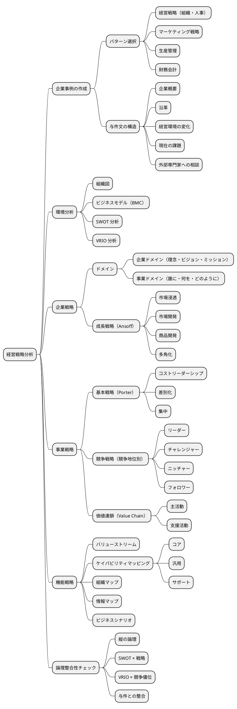

## 経営戦略分析とは

> 経営戦略分析とは、企業を取り巻く内部・外部環境を事実に基づいて整理し、そこから企業の方向性（企業戦略）、競争の仕方（事業戦略）、実行の仕組み（機能戦略）を階層的に導出するプロセスである。

戦略は「なぜそれを選ぶのか」の根拠が命です。与件（事実）から論理的に導かれない戦略は、主観の羅列にすぎません。本ガイドでは、事実 → 環境分析 → 3 階層戦略という一貫した論理のラインを引くことで、説得力のある戦略ドキュメントを作成することを目指します。

## 企業事例の作成

### 事例を先に整理する意義

戦略立案の前に、分析対象となる企業の事例（与件文）を整理することが重要です。事実を言語化することで、以降の分析における論点の抜け漏れを防ぎ、戦略の論拠となる材料を手元に揃えることができます。

### 4 つのパターン

事例のテーマによって以下から 1 つを選択します。複数テーマを含む場合は主テーマのパターンを採用し、副次的要素は他パターンから補完します。

| パターン | テーマ | 代表的な論点 |
| :--- | :--- | :--- |
| パターン 1 | 経営戦略（組織・人事） | 事業承継・組織設計・人材定着・役割分担 |
| パターン 2 | マーケティング戦略 | ターゲット顧客・商品戦略・チャネル・競争環境 |
| パターン 3 | 生産管理（生産・技術） | 工程管理・ボトルネック・技術継承・新規受注対応 |
| パターン 4 | 財務会計 | 財務分析・投資意思決定・資金調達・リスク |

### 共通する与件の構造

どのパターンでも、以下の段落構成が基本となります。

1. **企業概要**：資本金・従業員数・売上高・所在地・主力製品・主要取引先
2. **創業と沿革**：創業時の事業 → 代替わりを伴う事業変遷 → 現在までの転機
3. **経営環境の変化**：技術革新・景気変動・競争激化・感染症流行などへの対応
4. **現在の経営課題**：事業承継・組織・人事・生産・財務など、パターンに応じた論点
5. **外部専門家への相談**：どの方向で助言を求めているか

### 事実と解釈の分離

与件文を書く際には、事実（観測できる数値や出来事）と解釈（評価や推論）を明確に分けます。

- **事実**：「従業員数 45 名」「1968 年創業」「主要取引先は大手家電メーカー 3 社」
- **解釈**：「人員不足である」「技術的に優位である」「顧客依存度が高い」

解釈には必ず根拠（他社比較・業務量・業界平均など）を示します。この区別が、後の戦略立案で論拠の質を決定します。

### 匿名化のルール

事例として扱う場合は、固有名詞を必ず匿名化します。

- 企業名：「A 社」「B 社」「C 社」などの記号
- 地名：「X 県」「Y 市」のような記号的表現
- 取引先：「大手家電メーカー X 社」「中堅ホームセンター X 社」など業種で特定

## 環境分析

戦略を導く前に、事実を整理します。環境分析を飛ばすと、戦略は主観の羅列になります。

### 組織図

与件から読み取れる組織構造を可視化します。不明な階層は「推定」と注記します。

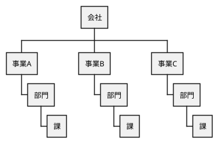

### ビジネスモデル（BMC）

ビジネスモデルキャンバス（BMC）の 9 要素をマインドマップとして整理します。与件に明示されていない要素は、業種の一般論から推定してよいですが、「推定」と明記します。

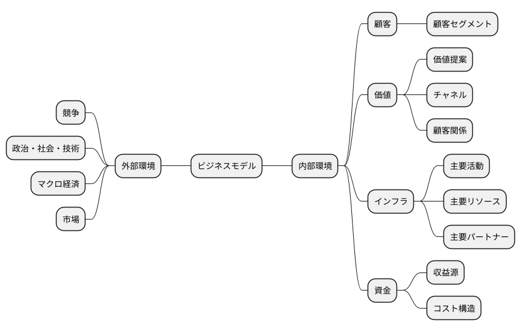

**BMC の 9 ブロック**：

| # | ブロック | 内容 |
| :--- | :--- | :--- |
| 1 | 顧客セグメント | 誰に価値を届けるか |
| 2 | 価値提案 | どんな価値を届けるか |
| 3 | チャネル | どのように届けるか |
| 4 | 顧客関係 | どんな関係を築くか |
| 5 | 収益源 | どうやって収益を上げるか |
| 6 | 主要リソース | 何が必要か（資産） |
| 7 | 主要活動 | 何をするか（活動） |
| 8 | 主要パートナー | 誰と組むか |
| 9 | コスト構造 | 何にお金がかかるか |

### SWOT 分析

強み・弱み・機会・脅威の 4 象限で内部環境と外部環境を整理します。単に 4 象限を埋めるだけでなく、「強み × 機会」「弱み × 脅威」の交差から戦略の種を見つける**クロス SWOT**を念頭に置きます。

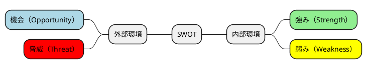

**クロス SWOT マトリクス**：

| 内部 × 外部 | 機会（O） | 脅威（T） |
| :--- | :--- | :--- |
| **強み（S）** | **積極戦略**：強みを活かして機会を取りに行く | **差別化戦略**：強みで脅威を回避する |
| **弱み（W）** | **改善戦略**：機会を活かすために弱みを克服する | **防衛戦略**：弱みを認識し脅威から逃げる |

### VRIO 分析

SWOT で抽出した強みを、持続的競争優位性の観点で評価します。強みすべてが競争優位の源泉ではありません。

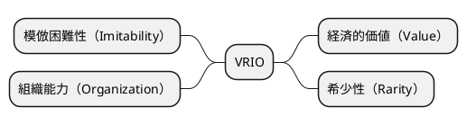

| 項目 | 問い |
| :--- | :--- |
| Value（経済的価値） | 顧客にとって価値があるか |
| Rarity（希少性） | 競合が持っていないか |
| Imitability（模倣困難性） | 簡単に真似されないか |
| Organization（組織能力） | 強みを活用する組織体制があるか |

4 項目すべてで高い評価を得た強みが、**持続的競争優位の源泉**となります。この強みこそが、事業戦略の基本戦略・競争戦略の軸となるべきです。

## 企業戦略

環境分析を踏まえて、「どの事業領域で戦うか」を定義します。

### ドメイン定義

ドメインは、企業が「何をする会社か」を定義するものです。企業ドメインと事業ドメインの 2 階層で整理します。

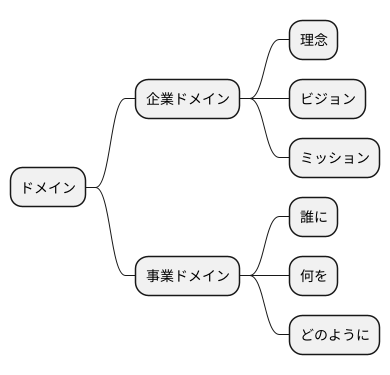

**企業ドメイン**は全社レベルの方向性を示し、**事業ドメイン**は「誰に（ターゲット顧客）」「何を（価値提案）」「どのように（提供方法）」の 3 要素で具体化します。与件から読み取れない場合は、相談内容から逆算して推定します。

### 成長戦略（Ansoff の成長マトリクス）

既存市場 / 新規市場 × 既存製品 / 新規製品の 4 象限でどこを狙うかを決めます。

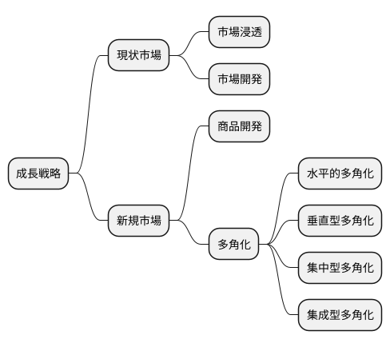

| 戦略 | 市場 | 製品 | 具体例 |
| :--- | :--- | :--- | :--- |
| 市場浸透 | 既存 | 既存 | 既存顧客への販売量増加、シェア拡大 |
| 市場開発 | 新規 | 既存 | 新規地域進出、新規顧客セグメント開拓 |
| 商品開発 | 既存 | 新規 | 既存顧客向けの新商品投入 |
| 多角化 | 新規 | 新規 | 新規事業への参入 |

与件の「外部専門家への相談内容」がどの戦略を求めているかの重要なヒントになります。

### 企業戦略のイシューツリー

ドメインと成長戦略を論点として、論理ツリーで整理します。

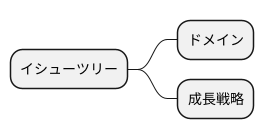

## 事業戦略

企業戦略で定めた事業ドメインに対して、「どう競争するか」を決めます。

### 基本戦略（Porter の 3 つの基本戦略）

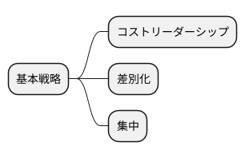

| 戦略 | 内容 | 中小企業にとっての現実性 |
| :--- | :--- | :--- |
| コストリーダーシップ | 業界最低コストの実現 | △ 規模の経済が必要 |
| 差別化 | 独自価値の提供 | ○ 中小企業が取りやすい |
| 集中 | 特定セグメントへの集中 | ◎ 中小企業の王道 |

中小企業は経営資源が限られるため、基本は「差別化」または「集中」が現実的です。VRIO で高評価を得た強みが選択の根拠になります。

### 競争戦略（競争地位別戦略）

市場シェアと規模から競争地位を判断し、地位に応じた戦略を採用します。

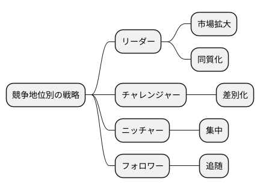

| 競争地位 | 戦略 | 説明 |
| :--- | :--- | :--- |
| リーダー | 市場拡大・同質化 | 市場全体を拡大しつつ、挑戦者の差別化を同質化で無効化 |
| チャレンジャー | 差別化 | リーダーと異なる価値でシェアを奪う |
| ニッチャー | 集中 | 特定セグメントに特化し、その領域で独占的地位を築く |
| フォロワー | 追随 | リーダーの戦略を低コストで追随 |

中小企業はニッチャーかフォロワーが多く、特に**ニッチャー戦略**が差別化戦略と相性が良い組み合わせとなります。

### 価値連鎖（Porter's Value Chain）

企業の活動を主活動と支援活動に分解し、各活動のうち強み（競争優位の源泉）と弱み（改善対象）を明示します。

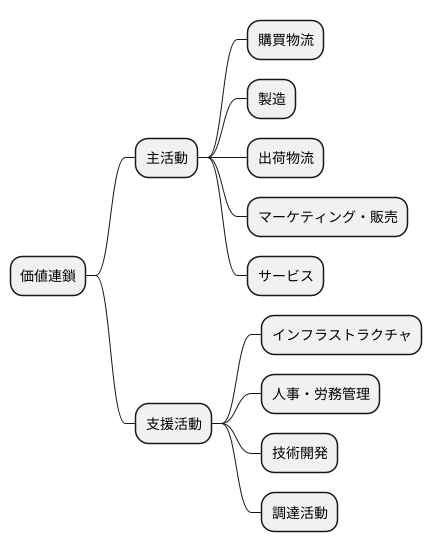

**主活動**（実際の価値創造プロセス）：

- 購買物流 → 製造 → 出荷物流 → マーケティング・販売 → サービス

**支援活動**（主活動を支える間接機能）：

- インフラストラクチャ、人事・労務管理、技術開発、調達活動

価値連鎖の分析により、「どの活動が競争優位を生み出しているのか」「どの活動が改善対象か」を明確にします。

### 事業戦略のイシューツリー

基本戦略・競争戦略・価値連鎖を論点として整理します。

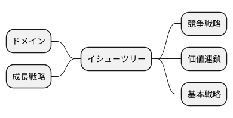

## 機能戦略

事業戦略を実行するための具体的な機能レベルの戦略を策定します。

### バリューストリーム

価値の流れを「主活動 → 支援活動 → 個別業務機能」の順で可視化します。事業戦略の価値連鎖と連動させ、事例の業種特性に合わせて調整します。

バリューストリームは「価値が顧客に届くまでの一連の流れ」を時系列で追うことで、どこに時間・コスト・品質のボトルネックがあるかを特定するのに役立ちます。

### ケイパビリティマッピング

組織が持つ能力を「コア / 汎用 / サポート」に分類します。

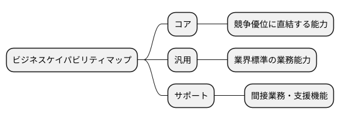

| 分類 | 説明 | 例 |
| :--- | :--- | :--- |
| コア | 競争優位に直結する能力 | 独自の製造技術、顧客対応力、ブランド |
| 汎用 | 業界標準の業務能力 | 販売管理、在庫管理、品質管理 |
| サポート | 業務を支える間接機能 | 会計、給与計算、人事管理 |

**戦略的示唆**：コアケイパビリティには積極的に投資し、汎用ケイパビリティは標準化・効率化、サポートケイパビリティはアウトソースや自動化を検討するのが基本方針となります。

### 組織マップ

ケイパビリティを組織構造にマッピングし、「どの部門がどのケイパビリティを担っているか」を可視化します。これにより、組織の歪み（重複・欠落）が見えてきます。

### 情報マップ

事業遂行に必要な主要情報エンティティと、情報の流れを整理します。後続のデータモデル設計の入力となります。

### ビジネスシナリオ

事業戦略を実現するためのシナリオを物語形式で記述します。アクター・ゴール・期待する結果を明示します。ビジネスシナリオは、抽象的な戦略を具体的な業務イメージに落とし込む橋渡しとなります。

## 論理整合性チェック

戦略ドキュメントを完成させる前に、以下を確認します。**3 階層の戦略が縦に貫かれているか**が最重要です。

| チェック項目 | 確認内容 |
| :--- | :--- |
| 縦の論理 | 環境分析 → 企業戦略 → 事業戦略 → 機能戦略 の論理ラインは成立しているか |
| SWOT × 戦略 | 強み・機会が採用した戦略の根拠になっているか |
| VRIO × 競争優位 | VRIO で高評価の強みが基本戦略・競争戦略の軸になっているか |
| 与件との整合 | 与件に記載された事実と矛盾していないか |
| 相談内容への回答 | 与件の「外部専門家への相談内容」に対する答えになっているか |

矛盾や飛躍があれば、環境分析に立ち戻って再整理します。戦略の結論を変えるのではなく、論拠を足す方向で調整するのが基本です。

## 戦略を導くコツ

### 事実と解釈を分ける

「従業員数 45 名」は事実、「人員不足である」は解釈です。解釈には必ず根拠（他社比較・業務量など）を示します。

### フレームワークに縛られない

SWOT・VRIO・Ansoff 等のフレームワークは道具であり目的ではありません。無理に全項目を埋めるより、事例に本当に関係する項目に集中します。

### 与件にない情報は「仮定」と明記

推定が必要な場合、「業界平均から推定すると …」「同業他社の一般的な傾向から …」と明示します。

### イシューツリーは戦略の地図

各階層のイシューツリーは、その階層で答えるべき論点のリストです。埋まらないイシューがあれば、その戦略は不完全です。

### 中小企業ならではの戦略パターン

中小企業診断士の事例でよく見られるパターン：

- **ニッチャー × 差別化**：特定セグメントに特化して独自価値を提供
- **集中戦略 × 顧客密着**：少数の重要顧客との深い関係構築
- **技術の深化 × 世代交代**：熟練技術の承継と若手への教育
- **外部環境変化への適応**：コロナ禍・デジタル化・人口減少への対応

## 経営戦略分析の手順

以下の順序で進めることで、論理的整合性の高い分析ができます。

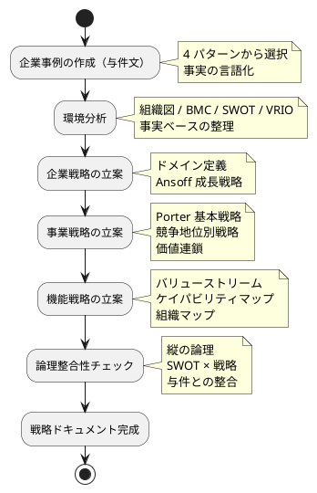

各ステップは前のステップの出力を入力とするため、順序を守ることで整合性の高い分析ができます。

## 経営戦略分析とビジネスアーキテクチャ分析の関係

経営戦略分析（本ガイド）とビジネスアーキテクチャ分析（[ビジネスアーキテクチャ分析ガイド](ビジネスアーキテクチャ分析ガイド.md)）は、視点と目的が異なります。

| 項目 | 経営戦略分析 | ビジネスアーキテクチャ分析 |
| :--- | :--- | :--- |
| 視点 | 戦略（why）| 構造（how / what）|
| 目的 | 方向性の決定 | 構造の文書化 |
| 主な成果物 | SWOT・VRIO・3 階層戦略 | BMC・ケイパビリティマップ・情報マップ |
| 主な読者 | 経営者・コンサルタント | アーキテクト・開発者 |

両者は排他ではなく相補的です。経営戦略分析で決まった方向性を、ビジネスアーキテクチャ分析で構造として整理することで、戦略と実装の橋渡しができます。

## 関連ガイド

- [ビジネスアーキテクチャ分析ガイド](ビジネスアーキテクチャ分析ガイド.md) — 後続のアーキテクチャ分析
- [要件定義ガイド](要件定義ガイド.md) — 後続の要件定義
- [ロジカルシンキング](ロジカルシンキング.md) — 論理展開の基本
- [ユースケース作成ガイド](ユースケース作成ガイド.md) — 機能戦略から要件への展開
- [企業経営論](企業経営論.md) — 経営論の基礎知識

## 参考文献

- 『企業戦略論 上巻 基本編 戦略経営と競争優位』ジェイ・B・バーニー
- 『競争の戦略』マイケル・ポーター
- 『ビジネスモデル・ジェネレーション』アレックス・オスターワルダー
- 『中小企業診断士 事例 II マーケティング・流通』関連書籍
