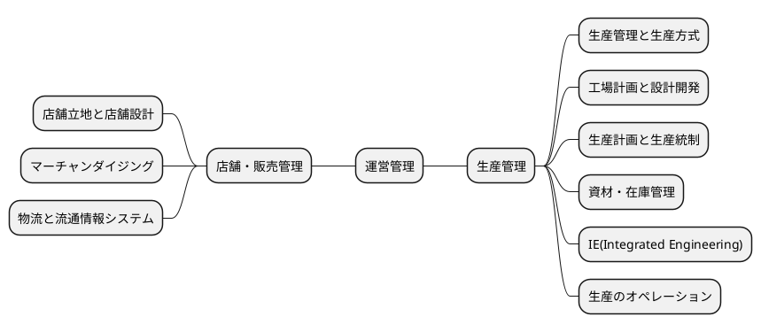
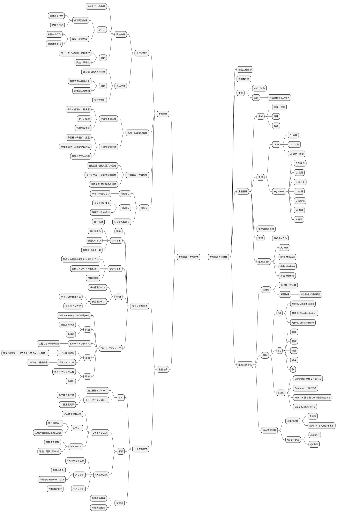
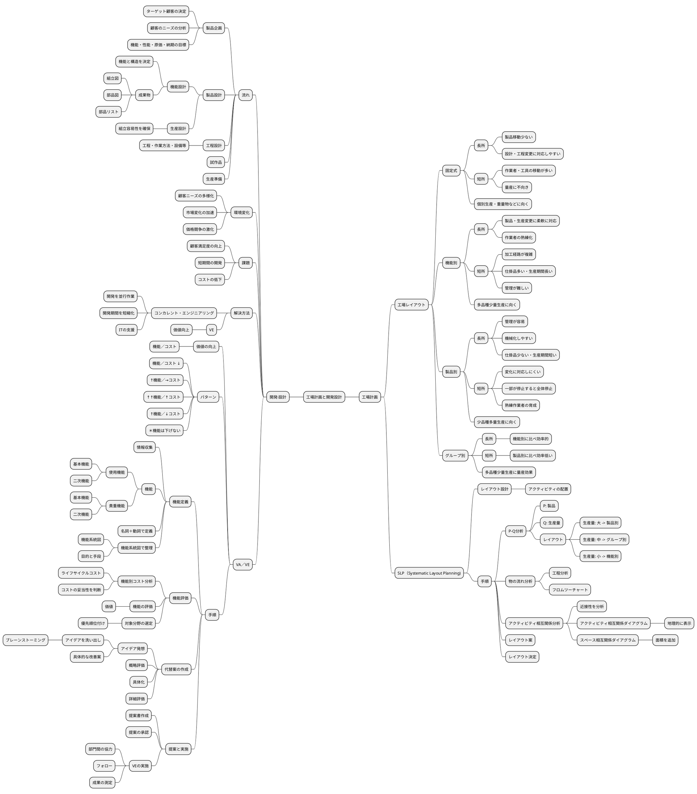
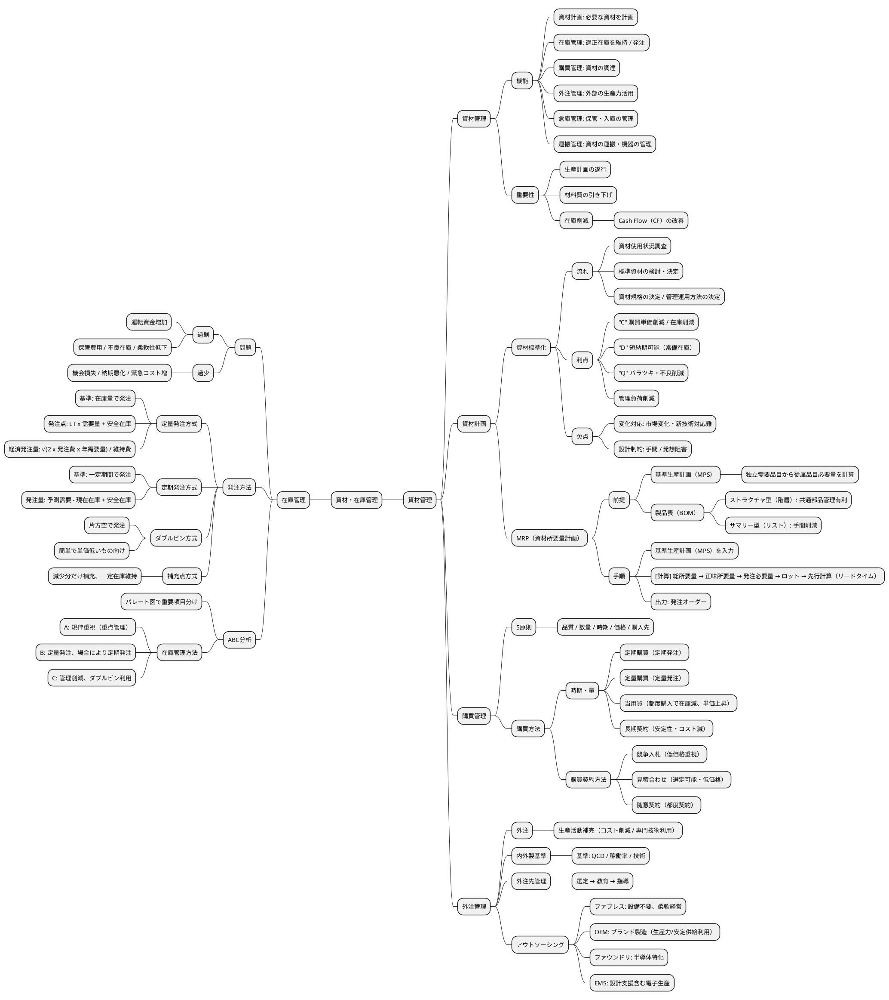
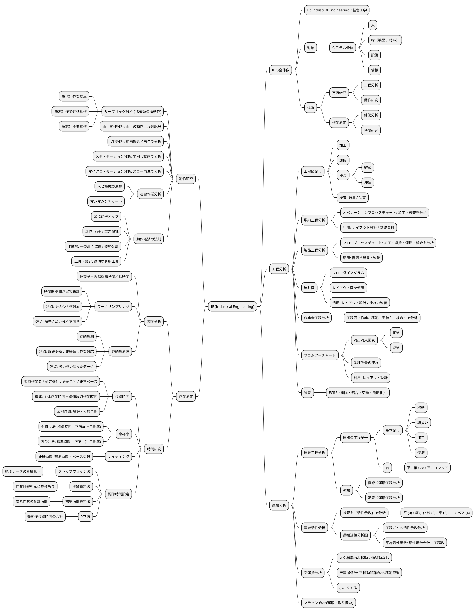

# 運営管理

## 全体像

## 生産管理

### 生産管理と生産方式

#### 生産管理の全体像

**生産とは**

- ものづくり
- 変換：付加価値の高い財へ

**生産管理の構成**

- 開発・設計
- 調達
- 製造

**生産管理の目標**

- **QCD**
  - Q: 品質
  - C: コスト
  - D: 納期・数量
- **PQCDSME**
  - P: 生産性
  - Q: 品質
  - C: コスト
  - D: 納期
  - S: 安全性
  - M: 意欲
  - E: 環境

**生産の４M**

- 人: Man
- 材料: Material
- 機会: Machine
- 方法: Method

**生産の効率化**

生産性 = 産出量／投入量

労働生産性 = 付加価値／従業員数

**原則**

- **3S**
  - 単純化: Simplification
  - 標準化: Standardization
  - 専門化: Specialization
- **5S**
  - 整理
  - 整頓
  - 清掃
  - 清潔
  - 躾
- **ECRS**
  - Eliminate: やめる・捨てる
  - Combine: 一緒にする
  - Replace: 置き換える・順番を変える
  - Simplify: 単純化する

**自主管理活動**

- 小集団活動：自主性、能力・やる気を引き出す
- QCサークル：品質向上、QC手法

#### 生産形態

**受注／見込**

- **受注生産**
  - 注文してから生産
  - タイプ
    - 個別受注生産：設計から行う、納期が長い
    - 繰返し受注生産：生産から行う、設計は標準化
  - 課題：リードタイム短縮・納期遵守、受注の平準化
- **見込生産**
  - 注文前に見込みで生産
  - 課題：需要予測の精度向上、柔軟な生産体制

**品種・生産量の分類**

- 小品種多量生産：少ない品種・大量生産、ライン生産、効率的な生産
- 多品種少量生産：多品種・少量ずつ生産、需要多様化・市場変化に対応、管理に工夫が必要

**仕事の流し方の分類**

- 個別生産: 個別の注文で生産
- ロット生産: 一定の生産量単位
- 連続生産: 同じ製品を連続

**段取り**

- 外段取り：ライン停止しない
- 内段取り：ライン停止する、外段取り化を検討
- シングル段取り：10分未満

#### 生産方式

**ライン生産方法**

- メリット：高い生産性、管理しやすい、単能工による分業
- デメリット：製品・生産量の変化に対応しにくい、設備レイアウトの制約多い、作業が単純
- 分類
  - 単一品種ライン
  - 多品種ライン：ライン切り替え方式、混合ライン方式

**ラインバランシング**

- 作業ステーションの作業均一化
- 問題：仕掛品の停滞、手待ち
- ピッチダイアグラム：工程ごとの作業時間
- 指標
  - ライン編成効率 = 作業時間合計／（サイクルタイム×工程数）
  - バランスロス率 = 1－ライン編成効率
- 改善：ボトルネックの工程、山崩し

**セル生産方式**

- セル：加工機械のグループ
- グループテクノロジー：多品種少量生産、大量生産効果
- 形態
  - **U字ライン方式**
    - 少人数で複数工程
    - メリット：待ち時間なし、生産計画変更に柔軟に対応
    - デメリット：多能工を前提、習熟に時間がかかる
  - **1人生産方式**
    - 1人で全ての工程
    - メリット：仕掛品なし、作業者のモチベーション
    - デメリット：作業者に依存
- 留意点：作業者の育成、改善の仕組み

### 工場計画と設計開発

#### 工場計画

**工場レイアウト**

| レイアウト | 長所 | 短所 | 適用 |
|-----------|------|------|------|
| 固定式 | 製品移動少ない 設計・工程変更に対応しやすい | 作業者・工具の移動が多い 量産に不向き | 個別生産・重量物 |
| 機能別 | 製品・生産変更に柔軟に対応 作業者の熟練化 | 加工経路が複雑 仕掛品多い・生産期間長い 管理が難しい | 多品種少量生産 |
| 製品別 | 管理が容易 機械化しやすい 仕掛品少ない・生産期間短い | 変化に対応しにくい 一部が停止すると全体停止 熟練作業者の育成 | 少品種多量生産 |
| グループ別 | 機能別に比べ効率的 | 製品別に比べ効率低い | 多品種少量生産に量産効果 |

**SLP（Systematic Layout Planning)**

- レイアウト設計：アクティビティの配置
- 手順
  1. P-Q分析（P: 製品、Q: 生産量）

     - 生産量大 → 製品別
     - 生産量中 → グループ別
     - 生産量小 → 機能別
  2. 物の流れ分析：工程分析、フロムツーチャート
  3. アクティビティ相互関係分析

     - アクティビティ相互関係ダイアグラム：地理的に表示
     - スペース相互関係ダイアグラム：面積を追加
  4. レイアウト案
  5. レイアウト決定

#### 開発・設計

**流れ**

1. 製品企画

   - ターゲット顧客の決定
   - 顧客のニーズの分析
   - 機能・性能・原価・納期の目標
2. 製品設計

   - 機能設計：機能と構造を決定（組立図、部品図、部品リスト）
   - 生産設計：組立容易性を確保
3. 工程設計：工程・作業方法・設備等
4. 試作品
5. 生産準備

**環境変化と課題**

- 環境変化：顧客ニーズの多様化、市場変化の加速、価格競争の激化
- 課題：顧客満足度の向上、短期間の開発、コストの低下

**解決方法**

- コンカレント・エンジニアリング：開発を並行作業、開発期間を短縮化、ITの支援
- VE：価値向上

**VA／VE**

- 価値の向上 = 機能／コスト
- パターン
  - 機能↓／コスト↓
  - 機能↑／コスト→
  - 機能↑↑／コスト↑
  - 機能↑／コスト↓
  - ＊機能は下げない
- 手順
  1. 機能定義

     - 使用機能（基本機能、二次機能）
     - 貴重機能（基本機能、二次機能）
     - 名詞＋動詞で定義
     - 機能系統図で整理（目的と手段）
  2. 機能評価

     - 機能別コスト分析：ライフサイクルコスト、コストの妥当性を判断
     - 機能の評価：価値
     - 対象分野の選定：優先順位付け
  3. 代替案の作成

     - アイデア発想：ブレーンストーミング
     - 概略評価、具体化、詳細評価
  4. 提案と実施

     - 提案書作成、提案の承認
     - VEの実施：部門間の協力、フォロー、成果の測定

### 生産計画と生産統制

#### 資材管理

**資材管理の機能**

- 資材計画: 必要な資材を計画
- 在庫管理: 適正在庫を維持 / 発注
- 購買管理: 資材の調達
- 外注管理: 外部の生産力活用
- 倉庫管理: 保管・入庫の管理
- 運搬管理: 資材の運搬・機器の管理

**重要性**

- 生産計画の遂行
- 材料費の引き下げ
- 在庫削減：Cash Flow（CF）の改善

**資材計画**

- **資材標準化**
  - 流れ：資材使用状況調査 → 標準資材の検討・決定 → 資材規格の決定 / 管理運用方法の決定
  - 利点：C（購買単価削減 / 在庫削減）、D（短納期可能）、Q（バラツキ・不良削減）、管理負荷削減
  - 欠点：変化対応（市場変化・新技術対応難）、設計制約（手間 / 発想阻害）
- **MRP（資材所要量計画）**
  - 前提
    - 基準生産計画（MPS）：独立需要品目から従属品目必要量を計算
    - 製品表（BOM）：ストラクチャ型（階層）、サマリー型（リスト）
  - 手順：基準生産計画（MPS）を入力 → 総所要量 → 正味所要量 → 発注必要量 → ロット → 先行計算（リードタイム） → 発注オーダー

**購買管理**

- 5原則：品質 / 数量 / 時期 / 価格 / 購入先
- 購買方法
  - 時期・量：定期購買、定量購買、当用買、長期契約
  - 購買契約方法：競争入札、見積合わせ、随意契約

**外注管理**

- 外注：生産活動補完（コスト削減 / 専門技術利用）
- 内外製基準：QCD / 稼働率 / 技術
- 外注先管理：選定 → 教育 → 指導
- アウトソーシング
  - ファブレス: 設備不要、柔軟経営
  - OEM: ブランド製造（生産力/安定供給利用）
  - ファウンドリ: 半導体特化
  - EMS: 設計支援含む電子生産

#### 在庫管理

**問題**

- 過剰：運転資金増加、保管費用 / 不良在庫 / 柔軟性低下
- 過少：機会損失 / 納期悪化 / 緊急コスト増

**発注方法**

- **定量発注方式**
  - 基準: 在庫量で発注
  - 発注点 = LT × 需要量 + 安全在庫
  - 経済発注量 = √(2 × 発注費 × 年需要量) / 維持費
- **定期発注方式**
  - 基準: 一定期間で発注
  - 発注量 = 予測需要 - 現在在庫 + 安全在庫
- **ダブルビン方式**：片方空で発注、簡単で単価低いもの向け
- **補充点方式**：減少分だけ補充、一定在庫維持

**ABC分析**

- パレート図で重要項目分け
- 在庫管理方法
  - A: 規律重視（重点管理）
  - B: 定量発注、場合により定期発注
  - C: 管理削減、ダブルビン利用

### IE(Integrated Engineering)

#### IEの全体像

**IE: Industrial Engineering / 経営工学**

対象：システム全体（人、物、設備、情報）

**体系**

- 方法研究：工程分析、動作研究
- 作業測定：稼働分析、時間研究

#### 工程分析

**工程図記号**

- 加工
- 運搬
- 停滞（貯蔵、滞留）
- 検査: 数量 / 品質

**分析手法**

- 単純工程分析：オペレーションプロセスチャート（加工・検査を分析）
- 製品工程分析：フロープロセスチャート（加工・運搬・停滞・検査を分析）
- 流れ図：フローダイアグラム（レイアウト図を使用）
- 作業者工程分析：工程図（作業、移動、手待ち、検査）で分析
- フロムツーチャート：流出流入図表（正流、逆流）、多種少量の流れ

改善：ECRS（排除・結合・交換・簡略化）

#### 運搬分析

**運搬工程分析**

- 基本記号：移動、取扱い、加工、停滞
- 台：平 / 箱 / 枕 / 車 / コンベア
- 種類：直線式運搬工程分析、配置式運搬工程分析

**運搬活性分析**

- 活性示数：平(0) / 箱(1) / 枕(2) / 車(3) / コンベア(4)
- 平均活性示数 = 活性示数合計／工程数

**空運搬分析**

- 空運搬係数 = 空移動距離/物の移動距離
- 小さくする

#### 動作研究

**サーブリッグ分析** (18種類の微動作)

- 第1類: 作業基本
- 第2類: 作業遅延動作
- 第3類: 不要動作

**分析手法**

- 両手動作分析: 両手の動作工程図記号
- VTR分析: 動画撮影と再生で分析
- メモ・モーション分析: 早回し動画で分析
- マイクロ・モーション分析: スロー再生で分析
- 連合作業分析：人と機械の連携、マンマシンチャート

**動作経済の法則**

- 身体: 両手 / 重力慣性
- 作業場: 手の届く位置 / 姿勢配慮
- 工具・設備: 適切な専用工具

#### 作業測定

**稼働分析**

- 稼働率＝実際稼働時間／総時間
- **ワークサンプリング**
  - 利点: 労力少 / 多対象
  - 欠点: 誤差 / 深い分析不向き
- **連続観測法**
  - 利点: 詳細分析 / 非繰返し作業対応
  - 欠点: 労力多 / 偏ったデータ

**時間研究**

- **標準時間**
  - 習熟作業者 / 所定条件 / 必要余裕 / 正常ペース
  - 構成: 主体作業時間 + 準備段取作業時間
  - 余裕時間: 管理 / 人的余裕
- **余裕率**
  - 外掛け法: 標準時間＝正味×(1+余裕率)
  - 内掛け法: 標準時間＝正味／(1-余裕率)
- **レイティング**：正味時間 = 観測時間 × ペース係数
- **標準時間設定**
  - ストップウォッチ法：観測データの直接修正
  - 実績資料法：作業日報を元に見積もり
  - 標準時間資料法：要素作業の合計時間
  - PTS法：微動作標準時間の合計

### 生産のオペレーション

#### 品質管理

**定義**

- 要求に合った商品を経済的に作る
- QC（Quality Control）

**種類**

- 設計品質（ねらいの品質）
- 製造品質（結果の品質、適合の品質）

**変遷**

- SQC（統計的品質管理）
- TQC（全社的品質管理）：日本のQCサークル
- TQM（総合的品質管理）：トップダウン、３つの原則（目的、手段、組織運営）
- ISO9000（品質マネジメントシステム）
- TPM
- LCA

**品質保証**

- 活動
  - 検査（不良品を外に出さない）
  - 製造（不良品を作らない）
  - 設計（品質を設計から作り込む）
- 検査の目的：不良品を次工程に渡さない、不良品防止・品質向上、品質向上に対する意欲向上
- 検査種類
  - 全数検査：利点（不良品を確実に除去）、欠点（コスト高い）
  - 抜取検査：利点（コスト安い）、欠点（生産者危険 / 消費者危険）

**QC 7つ道具**

1. 管理図：測定値を継続管理（管理限界線：上方/下方）、異常パターン（外れ・一定の傾向）
2. パレート図：項目を多い順に並べ、重点管理（応用: ABC分析）
3. ヒストグラム：データの頻度と範囲を分析
4. 散布図：2変数間の相関分析（正・負・無相関、偽相関）
5. 特性要因図：原因と結果を整理
6. チェックシート：データ記録と点検
7. 層別：母集団を層に分ける分析

新QC7つ道具もある

#### 設備管理

**設備ライフサイクル管理**

**2つの保全活動**

- 維持活動
  - 予防保全（故障を防ぐ）
  - 事後保全（故障した後に修理）
- 改善活動
  - 改良保全（故障を防ぐために改良）
  - 保全予防（過去実績から計画）

**設備効率**

- 指標
  - 時間稼働率（稼働時間／負荷時間）
  - 性能稼働率（正味稼働時間／稼働時間）
  - 良品率（価値稼働時間）
- 設備総合効率 = 時間稼働率 × 性能稼働率 × 良品率

#### 廃棄物等の管理

**環境保全法規**

- 環境基本法（保全理念と基本計画）
- 循環型社会形成推進基本法
  - 優先順位: 発生抑制 > 再利用 > 再生利用 > 熱回収 > 適正処分
  - 排出者責任
  - 拡大生産者責任（リサイクル）
- 個別法：廃棄物処理法、容器包装リサイクル法、家電リサイクル法、食品リサイクル法、建設リサイクル法、自動車リサイクル法

**廃棄物処理管理（3R）**

- リデュース（廃棄物抑制）
- リユース（再利用）
- リサイクル（回収して別用途で活用）

ゼロエミッション（廃棄物ゼロ）

#### 生産情報システム

**設計**

- CAD（製品設計、設計データモデル）
- CAM（CADデータを加工機械へ）
- CAE（製品シミュレーション、試作前に試験）
- PDM（製品情報一元管理システム、コンカレントエンジニアリング）

**製造**

- 機械：NC（数値制御）、CNC（コンピュータ制御）、MC（複数加工機能）
- 工程の固まり: FMC
- 工程全体: FMS（多品種少量生産対応）
- 工場全体: FA
- オペレーション全体: CIM

**シミュレーション**

- バーチャルマニュファクチャリング（仮想的生産）

**SCM（サプライチェーン・マネジメント）**

- サプライチェーン全体の最適化
- 情報共有: 販売需要と生産
- 効果：在庫削減、コスト削減、リードタイム短縮
- IT活用：リアルタイム情報共有、MRP（資材所要量計画）

## 店舗・販売管理

### 店舗立地と店舗計画

#### 店舗立地

**立地条件**：業種により異なる

**商圏**

- 集客できる範囲
- 商圏調査：人口・世帯、競合店、通行料
- 理論
  - **ライリーの法則**：２つの都市の吸引力、購買金額（人口に比例、距離２乗に反比例、買回品のみ）
  - **ライリー＆コンバースの法則**：商圏分岐点
  - **ハフ・モデル**

#### 商業集積

**商店街**

- 自然発生
- 中心市街地の衰退
- 機能：利便性、安全性、快適性、情報性、娯楽性、文化性、コミュニティ

**共同店舗**

- 複数の店舗：テナントビル、ワンストップショッピング
- 国による支援
- 経営：協同組合・合弁会社、運営が難しい
- 課題：コンセプト、魅力ある店舗、メンバーの協力体制、共同の活動

**SC（ショッピングセンター）**

- 計画的：デベロッパー、統一されたコンセプト
- 構成：核店舗（キーテナント）、専門店、飲食店、娯楽施設、駐車場
- 種類
  - **アウトレットモール**：アウトレット店舗（在庫処分）、ファクトリー（工場）、リテール（小売）
  - **パワーセンター**：カテゴリーキラーの集合（特定分野の大型店、商圏を独占）、集客力高い

#### 店舗に関する法律

**まちづくり３法**

- 目的：中心市街地の活性化、コンパクトなまちづくり
- **都市計画法**
  - 無秩序な開発を防ぐ
  - 区域
    - 都市計画区域：市街化区域（計画的に市街化）、市街化調整区域（市街化を抑制）
    - 準都市計画区域（乱開発を防ぐ）
- **大店立地法**
  - 大規模小売店出店、大店法に代わって制定
  - 対象：1000平方メートル超
  - 規制：渋滞・駐車駐輪・騒音・廃棄物
  - 地域住民への説明会義務
- **中心市街地活性化法**
  - 国：基本方針・支援措置
  - 市町村：中心市街地の制定・基本計画作成
  - 市町村・民間：事業推進

**建築基準法**

- 建築物の最低基準を制定
- 建築確保制度（工事着工前に必要）
- 用語
  - 敷地面積（土地）
  - 建築面積（建築物）
  - 床面積（各階）
  - 延べ面積（床面積の合計）
  - 建ぺい率（建築面積÷敷地面積）
  - 容積率（延べ面積÷敷地面積）

#### 店舗設計

**ストアコンセプト**：誰に・何を・どのように販売

**店舗の機能**

- 訴求機能：知らせる・注意を引く（看板・店構え・ショーウィンドウ）
- 誘導機能：店の奥まで誘導（店頭・案内表示・通路）
- 演出機能：魅力演出・購買意欲高める（展示陳列・色彩・照明・BGM）
- 選択機能：手に取る・選ぶ（商品陳列）
- 購入促進機能：購買行動を促進（POP・接客）
- 情報発信機能：情報発信（案内板・館内放送・チラシ）

**販売形態**

| 形態 | 利点 | 欠点 |
|------|------|------|
| 対面販売 | 商品管理しやすい 細かい説明 | 自由に手に取れない 販売員コスト・余分なスペース |
| 側面販売 | 自由に選べる 対面より低コスト | 高額品には不向き |
| セルフサービス | 自由・自分のペース 運営コストが安い | 商品説明が聞きにくい 管理が不十分・商品ロス |

**外装**

- ファサード：正面、店舗の顔
- 店頭：広義（ファサードと同じ）、狭義（ファサードの下部）
- パラペット：ファサードの上部
- 看板：パラペット看板、屋上看板（広告塔）、袖看板（突き出し看板）、スタンド看板

**出入口**

- 誘導機能
- 開放度：開け放たれた度合い、高いと出入りしやすい
- 透視度（解放感）：内部が見通せる割合、高いと親しみやすい、低いと高級なイメージ

**売場レイアウト**

- **動線**
  - 客動線（なるべく長く・くまなく）：ワンウェイコントロール（一方に制御）
  - 従業員動線（なるべく短く）：客動線と重ならない
  - 商品動線（客動線と重ならない）
- **通路**
  - 主通路（多くの顧客が通る、店内の奥まで誘導）
  - 副通路（枝分かれ、くまなく歩かせる）
- **ゾーニング**
  - 商品グループの配置
  - マグネット（磁石）：売れ筋・話題・季節商品・特売品、動線をコントロール
  - ポイント
    - 商品価格（安い：店頭近辺、高い：店奥）
    - 計画購買性（計画：店奥、非計画：店頭近辺）
    - 購買頻度（高い：店頭近辺、低い：店奥）

**什器**

- ショーウィンドウ（店内に誘導）
- ステージ（重点商品）
- 陳列台：ゴンドラ（複数の棚、スーパー／コンビニ）
- ショーケース
  - オープン型
  - クローズ型：リーチインケース（前から補充）、ウォークインケース（後ろから補充、先入れ先出し）

**照明・色彩**

- 種類：全体照明（ベース照明）、重点照明（スポットライト）、装飾照明（装飾を重視）
- 方法：直接照明、間接照明、半直接照明、半間接照明、拡散照明
- 単位
  - 光束（光源の明るさ、ルーメン：lm）
  - 照度（面の明るさ、ルクス：lx）
  - 色温度（色合い、ケルビン：K）：高い（青白い）、低い（赤い）

### マーチャンダイジング

#### 定義

**５つの適正**

- 商品
- 価格
- 時期
- 数量
- 場所

**要素**

- 品揃え
- 仕入
- 価格
- 陳列
- 販売促進

#### 品揃え

**商品ミックス**

- ライン：品種、幅
- アイテム：品目、深さ

**戦略**

- 限定ライン戦略：ライン狭い、専門店、中小に多い
- フルライン戦略：ライン広い、百貨店、ワンストップショッピング（利点）、ストアコンセプト不明確（欠点）

#### 仕入れ

- **買取仕入**：商品買取、在庫リスク有り
- **委託仕入**：メーカーが在庫所有、在庫リスク無し、販売手数料
- **消化仕入**：売上仕入、売上と同時に仕入、在庫リスク無し

#### 価格設定

**値入**

- マークアップ、コスト志向の価格設定
- 値入率
  - 売価基準：値入額÷売価
  - 原価基準：値入額÷原価

**価格政策**

- ロスリーダー：目玉商品だけ値入率低い
- EDLP政策：全商品が値入率低い
- プライスラインとプライスポイント

#### 陳列

**原則**

- 探しやすい
- 見やすい
- 選びやすい
- 手に取りやすい

**分類**

- 量感陳列：ボリューム感、最寄品
- 展示陳列：テーマを演出、重点商品・買回品

**陳列方法**

- **ゴンドラ陳列**：定番品、前進立体陳列
- **エンド陳列**：ゴンドラエンド、マグネット（客動線の設計、副通路の誘導）、非計画購買（特売品、目玉商品）
- **ジャンブル陳列**：投げ込み陳列、安い小物、手に取りやすい、高額商品には不向き
- **島出し陳列**：通路にはみ出す、陳列に変化（活気、顧客の注目）、移動を邪魔しないように
- **カットケース陳列**：ダンボール箱をカット、手間少ない、安さ訴求、ディスカウントストア
- **レジ前陳列**：ついで買い・衝動買い、利益率高い商品

**陳列範囲**

- 有効陳列範囲：手が届く、60～210cm
- ゴールデンゾーン：最も手に取りやすい、目～指先の高さ
  - 男性：80～140cm
  - 女性：70～130cm
  - 売れ筋・重点商品

**陳列方向**

- 縦割り陳列：アイテム探しやすい、原則
- 横割り陳列：アイテム探しにくい

**フェイシング管理**

- フェイス：商品の顔
- フェイス数：顧客の目に触れる数、売上実績に基づいて決定、重点商品で多く

**ビジュアルマーチャンダイジング**

- 視覚的、ストアコンセプトに基づく提案
- 品揃え・陳列・インテリア・什器・POP等
- 3つの売場区分：IP(Item Presentation)、PP(Point of Sales. Presentation)、VP(Visual Presentation)

#### 販売促進

**ISM（インストアマーチャンダイジング）**

- 店内で客単価を増やす方法
- 非計画購買を促進（背景：非計画購買が９割）
- 客単価：動線長、立寄率、視認率、買上率、買上個数、商品単価
- インストアプロモーション
  - 価格手動型：特売・値引き・クーポン等
  - 非価格手動型：デモ販売・サンプル、クロスマーチャンダイジング（関連陳列）
- スペースマネジメント
  - スペースアロケーション：売場の配置、販売データに基づく
  - プラノグラム：棚割（陳列位置、フェイス数）、販売データに基づく

**カテゴリーマネジメント**

- カテゴリー：顧客の視点、品揃え・陳列・販売促進、戦略事業単位
- 関連購買を促進
- 課題：カテゴリー単位の組織、メーカーや卸との協業

#### 商品予算計画

**GMROI**

- 粗利益÷平均在庫高（原価）
- ＝粗利益率×商品投下資本回転率
- 商品投下資本回転率 = 売上高÷平均在庫高（原価）= 商品回転率（売価）÷（1－売価値入率）
- ＝粗利率×商品回転率÷（1－売価値入率）

**交差比率**

- 粗利益÷平均在庫高（売価）
- ＝GMROI×（1－売価値入率）

**商品回転率**

- 売価基準：売上高÷平均在庫高（売価）
- 原価基準：売上原価÷平均在庫高（原価）

**売上高予算**：販売予測

**在庫高予算**

- **基準在庫法**（商品回転率が6以下）
  - 月初在庫高予算＝当月売上高予算＋年間売上高予算／年間予定商品回転率－年間売上高予算／12
- **百分率変異法**（商品回転率が6以上）
  - 月初在庫高予算＝年間売上高予算／年間予定商品回転率×1／2（1＋当月売上高予算／月平均売上高）

**値入高予算**：販売価格の決定、値入率（売価基準、原価基準）

**仕入高予算**＝売上高予算＋期末在庫高予算（売価）－期首在庫高予算（売価）

### 物流と流通情報システム

#### 物流

**機能**

- 輸送
- 保管
- 荷役
- 包装
- 流通加工
- 情報処理

**種類**

- 調達物流
- 社内物流
- 販売物流
- 回収物流

**物流チャネル**

- 物流の経路：メーカー → 卸売業者 → 小売業者
- 物流拠点：倉庫、物流センター
- 卸の中抜き

**物流センター**

- **入荷**：荷受け、検品（事前出荷明細、バーコード）
- **保管**
    - 在庫管理
    - ロケーション管理：固定（定番品）、フリー（スペース効率良、自動倉庫）
- **ピッキング**
    - 種まき方式：トータル、後で店舗に仕分け、効率的（利点）、品種多いと非効率（欠点）、少品種多量
    - 積み取り方式：オーダー、店舗単位、仕分けと同時（利点）、移動距離長い（欠点）、多品種少量
- **流通加工**：製品加工、値札・ラベル・包装・検品、人手がかかる
- **仕分け**：店舗別、カテゴリー別
- **出荷**

**一括物流センター**

- 一括物流：一括して小売に配達
- 小売の要望：カテゴリー納品、定時定配、ノー検品
- 種類
  - **在庫型：DC**
      - 利点：リードタイム短い、カテゴリー納品、EDI対応
      - 欠点：費用大
  - **通貨型：TC**
      - ベンダー仕分型：事前に店別仕分け
      - センター仕分型：センター内で仕分け
      - 利点：費用小
      - 欠点：リードタイム長い、カテゴリー納品難（特にベンダー仕分け型）、EDI対応難
      - クロスドッキング：在庫せずに出荷

**共同物流**

- 複数事業者が共同で物流
- メリット：卸（コスト削減）、小売（受入作業軽減）
- 課題：業者の連携、運営ノウハウ
- 国が支援

**輸送手段**

- モーダルシフト：貨物の輸送方法の転換、環境負荷の軽減
- パレット：一貫パレチゼーション
  - 種類：平パレット、ワンウェイパレット、ロールボックスパレット

**３PL**：物流機能の委託（アセット型、ノンアセット型）

**物流技術**

- **RFID**
    - 電波で認識
    - ICタグ：小さい、読み書き自由、数メートルまで可、複数同時読み込み
    - 一般：自動改札・電子マネー等
    - 流通：在庫管理・検品等、作業効率化
    - トレーサビリティ：履歴管理、食品業界
    - 課題：プライバシー保護

#### 流通情報システム

**POS**

- 販売時点情報管理
- 構成：バーコード、POSレジ（精算、販売情報収集、PI値）
- 利点
    - ハード：レジ作業効率化、入力ミス排除
    - ソフト：販売情報活用、仮説・検証による
- 活用
    - 売れ筋・死に筋分析：ABC分析、品揃え・陳列
    - バスケット分析：関連購買の分析、関連陳列・セット販売
    - プラノグラム：場所による売上の分析、棚割の決定
    - 顧客分析：会員カード、CRM（顧客の購買を分析）、FSP（優良顧客を判別、優良顧客の囲い込み）

**バーコード**

- **JAN**
    - 商品共通コード（日本：JIS）
    - 種類：標準（13桁、国際：EAN互換）、短縮（8桁）
    - 構成：国・メーカー・商品・チェックデジット
- **ITF**
    - 標準物流コード（包装容器）
    - 構成：黒と白のバー、5本のうち2本が太い
    - 特徴：情報密度高い、桁落ちしやすい
- **GTIN**：GS1標準、商品識別コード
- **付与**
    - ソースマーキング：生産者、要メーカーコード、価格情報なし
    - インストアマーキング：小売店、先頭の2桁で指定
- **価格情報**：なし（PLU）、あり（NonPLU）

**EOS/EDI**

- **EOS（電子受発注システム）**
  - メリット
    - 小売：発注省力化、ミスの防止、リードタイム短縮、在庫削減
    - 卸：受注効率化、倉庫業務効率化
  - 方法：オーダーブック方式（冊子）、バーコード棚札方式（棚）、EOB（オーダーブックの電子化）
- **EDI（電子データ交換）**
  - 受発注、各種情報交換
  - 従来：専用線・VAN
  - Web-EDI：インターネット使用、コスト安い