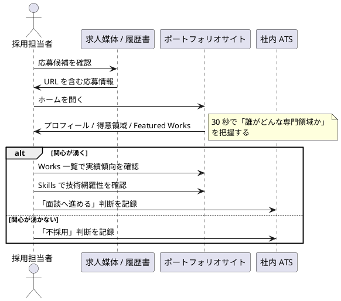
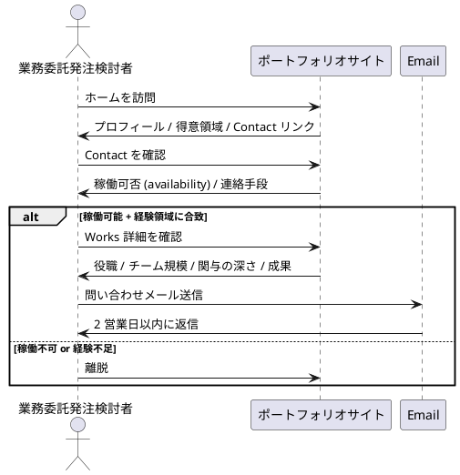
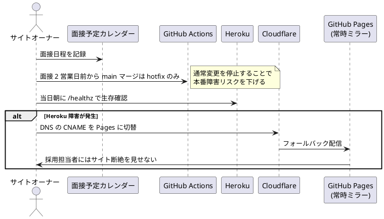
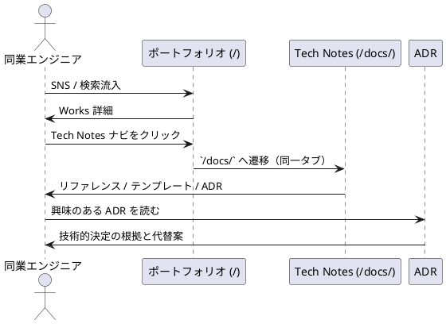

# ビジネスユースケース

## 概要

ポートフォリオサイトを取り巻くビジネス活動（採用 / 営業 / 学習継続）を、訪問者の業務視点で記述する。システムユースケースの上位文脈となる。

## アクター

| アクター | 役割 | 主な関心事 |
|---|---|---|
| 採用担当者 | 人事・技術リーダー、応募者を評価 | 専門性 / 経験 / 人柄 / 入社判断 |
| 業務委託発注検討者 | 営業案件の決裁者 | 稼働可否 / 経験領域 / 料金感 / 連絡可否 |
| 同業エンジニア | 興味本位の閲覧者 | 技術的深さ / 思考プロセス / 参考になるか |
| サイトオーナー | 自分自身（k2works） | 自己ブランディング / 持続可能な運用 |

## ビジネスユースケース一覧

| BUC ID | ユースケース | 主アクター | 関連 |
|---|---|---|---|
| BUC-01 | 候補者の一次スクリーニングを行う | 採用担当者 | UC-01〜04 |
| BUC-02 | 候補者の技術評価を行う | 採用担当者 / 採用技術リーダー | UC-02, UC-03 |
| BUC-03 | 業務委託先の検討・選定 | 業務委託発注検討者 | UC-01, UC-03, UC-04, UC-05 |
| BUC-04 | 連絡を取る | 訪問者全般 | UC-06 |
| BUC-05 | 技術的好奇心の充足 | 同業エンジニア | UC-07 |
| BUC-06 | コンテンツの追加・更新 | サイトオーナー | UC-08 |
| BUC-07 | 採用面接前後のサイト稼働確保 | サイトオーナー | UC-09 |
| BUC-08 | 緊急時の障害対応 | サイトオーナー | UC-10 |

## 主要ビジネスフロー

### BUC-01: 候補者の一次スクリーニング

**成功基準**: 採用担当者が 2 分以内に「面談へ進めるかどうか」の判断ができる。

### BUC-03: 業務委託先の検討・選定

**成功基準**: 業務委託発注検討者が「問い合わせる価値があるか」を 5 分以内に判断できる。

### BUC-07: 採用面接前後のサイト稼働確保

**成功基準**: 面接前後 24 時間で SLO（99.5%）を超えた可用性を維持できる。

### BUC-05: 技術的好奇心の充足（同業エンジニア）

**成功基準**: 同業エンジニアが技術的詳細・思考プロセスに満足し、SNS でシェアする等の二次行動を起こす。

## ビジネスルール

| BR ID | ルール | 由来 |
|---|---|---|
| BR-01 | 連絡には 2 営業日以内に返信する | UI 設計 (S05) |
| BR-02 | 面接 2 営業日前から hotfix 以外の変更を停止 | レビュー（User Rep） |
| BR-03 | Tech Notes は採用ノイズになるため初期は noindex | [ADR-0003](../adr/0003-mkdocs-coexistence-strategy.md) |
| BR-04 | コンタクト手段は外部チャネル（mailto/GitHub/LinkedIn）に集約、フォームは v1 では持たない | ヒアリング 2-A |
| BR-05 | コンテンツ更新は Markdown + Git で完結する（CMS は導入しない） | 持続可能性 |
| BR-06 | 個人情報（氏名以外）はサイト上で記録・収集しない | プライバシー |
| BR-07 | Cookie バナーは設定しない（クッキー未使用） | [非機能要件](../design/non_functional.md) |

## 関連ドキュメント

- [要件定義書](./requirements_definition.md)
- [システムユースケース](./system_usecase.md)
- [ユーザーストーリー](./user_story.md)
- [UI 設計](../design/ui_design.md)
