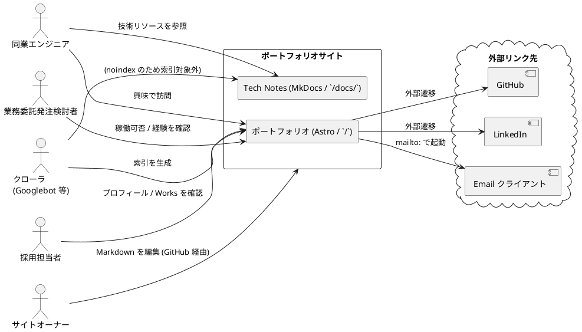

# 要件定義書

## 概要

採用・営業向けの個人ポートフォリオサイトの要件を RDRA 2.0 の 4 層構造（システム価値 / システム外部環境 / システム境界 / システム）で整理する。

設計ドキュメントが先行している現状の整合性を保ちつつ、後追いで上流要件を文書化する。

## システム価値

### 要求モデル

| 要求 ID | 主要要求 | 優先度 | 由来 |
|---|---|---|---|
| R-01 | 採用担当者がポートフォリオを通じて応募者の専門性・実績・人柄を把握できる | 高 | ヒアリング 1-A |
| R-02 | 業務委託発注検討者が稼働可否・経験領域・連絡手段を確認できる | 高 | レビュー（User Rep） |
| R-03 | 同業エンジニアが技術的好奇心を満たすリソースに到達できる | 中 | レビュー（User Rep） |
| R-04 | サイトオーナーがコンテンツ追加を Markdown + Git で完結できる | 高 | 持続可能な運用 |
| R-05 | 採用面接前後の停止リスクを最小化できる | 高 | レビュー（User Rep） |
| R-06 | 月額 $30 以下の運用コストで持続できる | 高 | 個人サイト前提 |
| R-07 | 検索エンジン経由で速い初期表示（LCP < 2.5s）を提供できる | 高 | 採用担当者の離脱防止 |
| R-08 | 多様な訪問者環境（モバイル / ダークモード / スクリーンリーダー）に対応できる | 中 | アクセシビリティ |

### システムコンテキスト

## システム外部環境

### ビジネスコンテキスト

| 要素 | 内容 |
|---|---|
| 提供主体 | 個人開発者 / サイトオーナー（k2works） |
| 提供価値 | 採用・営業活動の自己ブランディング基盤 |
| 主な接点 | 検索エンジン、SNS シェア、名刺・履歴書記載 URL、GitHub プロフィール |
| 競合 | 他のポートフォリオサイト、GitHub プロフィール、LinkedIn、Wantedly |
| 差別化軸 | 自前管理（Markdown + Git）、ドキュメント駆動の技術実績の透明性、Tech Notes による学習継続性アピール |

詳細は [ビジネスユースケース](./business_usecase.md) を参照。

### 利用シーン

| シーン | 訪問者 | 流入経路 | 目的 | 滞在時間想定 |
|---|---|---|---|---|
| 一次スクリーニング | 採用担当者 | 検索 / 履歴書 URL | 30 秒で人物像把握 | 30 秒〜2 分 |
| 二次評価 | 採用技術リーダー | 一次担当者からの共有 URL | Works 詳細を読み込む | 5〜15 分 |
| 業務委託検討 | 営業発注検討者 | 検索 / SNS / 知人紹介 | 稼働可否・経験領域・連絡先確認 | 3〜10 分 |
| 技術参考 | 同業エンジニア | SNS / 検索 | Tech Notes / ADR を読む | 不定（深堀り型） |
| コンテンツ追加 | オーナー | ローカル開発 → GitHub | Works / Skills 更新 | 月 1〜2 回 |
| 緊急時対応 | オーナー | アラート受信時 | 障害確認・復旧 | 不定 |

## システム境界

### 機能スコープ（v1）

| 機能 | スコープ | v1 | v2+ |
|---|---|:---:|:---:|
| プロフィール表示 | ホーム画面 | ✓ | - |
| 成果物一覧表示 | Works コレクション | ✓ | - |
| 成果物詳細表示 | Works シングルビュー | ✓ | - |
| スキル一覧表示 | Skills 画面 | ✓ | - |
| 連絡先表示 | Contact 画面 | ✓ | - |
| 外部リンク（GitHub/LinkedIn/Email） | 各画面に配置 | ✓ | - |
| ダークモード切替 | ヘッダートグル | ✓ | - |
| Tech Notes（MkDocs）配信 | `/docs/` 配下 | ✓ | - |
| 多言語化（英語版） | i18n | - | ✓ |
| コンタクトフォーム | 送信機能 | - | ✓ |
| ブログ機能 | 記事投稿・RSS | - | ✓ |
| 訪問者数の動的表示 | カウンター | - | ✓ |
| 検索機能 | サイト内検索（Pagefind） | - | ✓ |
| 認証付き管理画面 | CMS | - | ✓ |

詳細は [システムユースケース](./system_usecase.md) と [ユーザーストーリー](./user_story.md) を参照。

### 段階リリース

| バージョン | スコープ | リリース基準 |
|---|---|---|
| v0.1（Walking Skeleton） | ホームのみ（プロフィール + Featured Works 静的記述 + Contact リンク） | Lighthouse Performance ≥ 80, A11y ≥ 90, SEO ≥ 90 |
| v0.2 | + Works 一覧 / Works 詳細 | 上記維持 |
| v0.3 | + Skills / Contact 専用 / ダークモード | 上記維持 |
| v1.0 | 全画面 + Tech Notes 同居 | Lighthouse Performance ≥ 90, A11y ≥ 95, SEO ≥ 95 |

詳細は [リリース計画](../development/release_plan.md) を参照。

## システム

### 情報モデル

ポートフォリオサイトに永続化されるデータはなく、Git で管理する Markdown フロントマターが情報の正本となる。

| エンティティ | 説明 | 主属性 |
|---|---|---|
| Profile | サイト所有者本人 | name / role / bio / availability / photo / social_links |
| Work | 成果物・プロジェクト実績 | title / summary / role / period / tech / repo / cover / context / challenge / solution / outcome[] / featured / team_size / position / involvement / domain / category |
| Skill | スキル項目 | category / name / since（年） / level / status（current/past） / works[]（Work への逆参照） |
| Contact | 連絡手段 | channel（email/github/linkedin） / url |

属性の詳細は [UI 設計](../design/ui_design.md) と Astro Content Collections のスキーマ（[フロントエンドアーキテクチャ](../design/architecture_frontend.md)）に対応する。

### 状態モデル

訪問者操作で状態遷移するのは UI のローカル状態のみ。

| 状態 | 例 | 永続化 |
|---|---|---|
| ダークモード | light / dark / system | localStorage |
| ハンバーガーメニュー | open / closed | メモリ |
| Works フィルタ | all / 各タグ | URL query string |

サーバー側の状態は持たない（ステートレス）。

## 制約

| 種別 | 内容 |
|---|---|
| 技術的制約 | Heroku Common Runtime（US/EU のみ）、Cloudflare Free（Page Rules 3 個まで） |
| コスト制約 | 月額 $30 以下、初期 $12（[ADR-0002](../adr/0002-hosting-heroku.md)） |
| 運用制約 | 個人運用、24/7 オンコール不可、業務時間外は best effort |
| 法令制約 | GDPR / 改正個人情報保護法（クッキー利用なしで対応） |
| 著作権 | 自作以外の素材は使用しない、または明示クレジット |

## 関連ドキュメント

- [ビジネスユースケース](./business_usecase.md)
- [システムユースケース](./system_usecase.md)
- [ユーザーストーリー](./user_story.md)
- [UI 設計](../design/ui_design.md)
- [非機能要件](../design/non_functional.md)
- [運用要件](../design/operation.md)
- [リリース計画](../development/release_plan.md)
