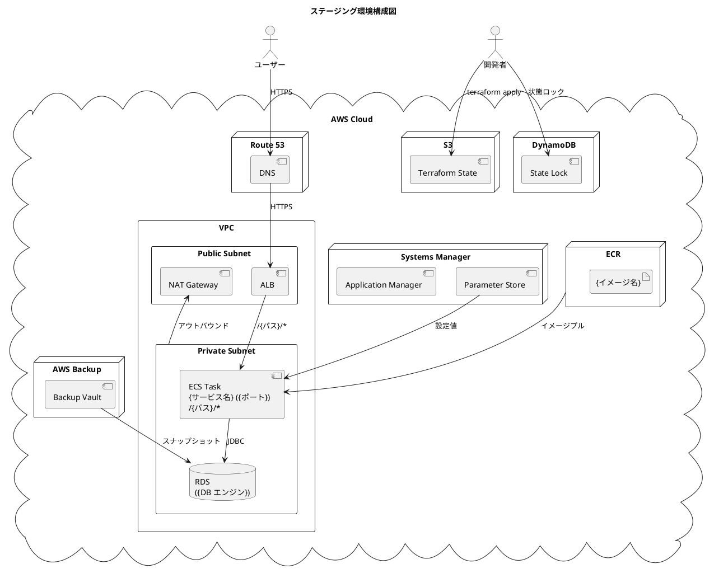
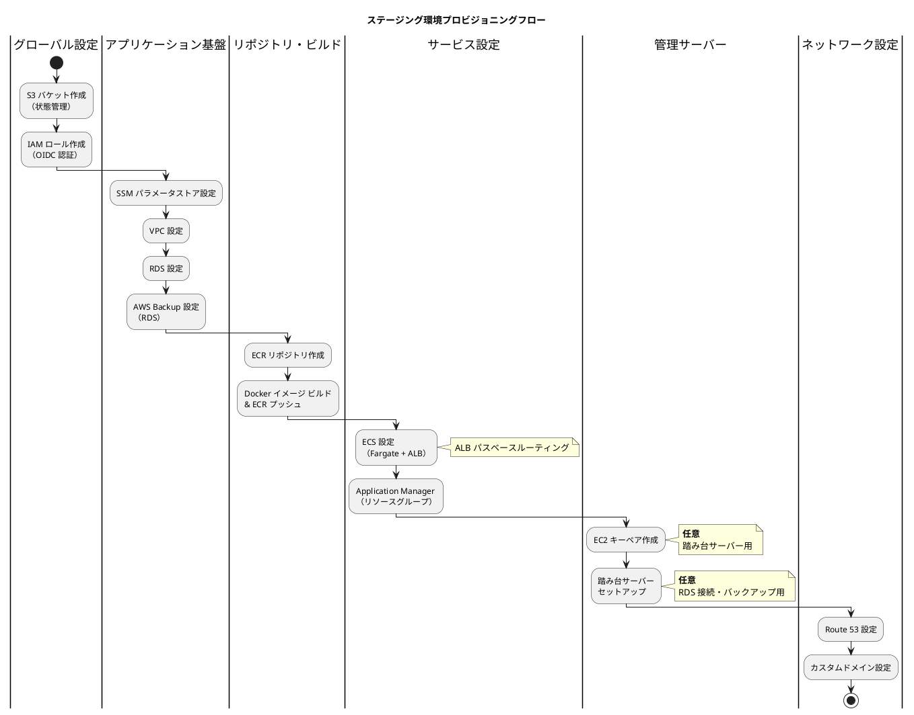
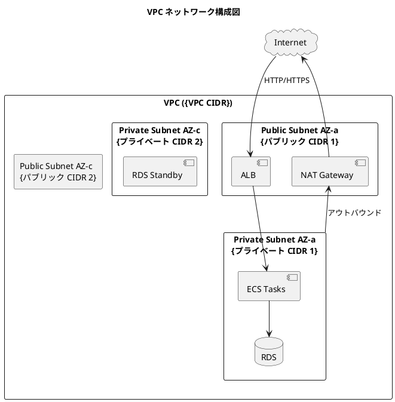
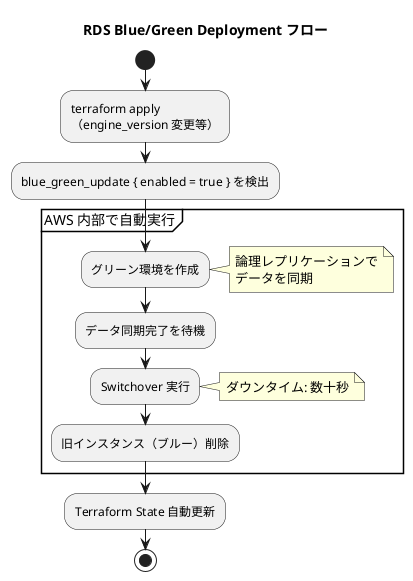
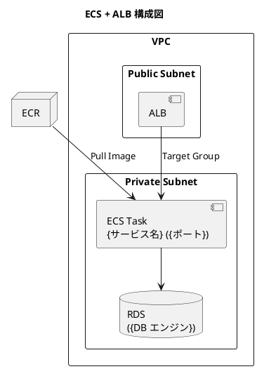
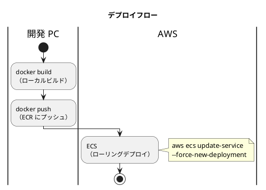
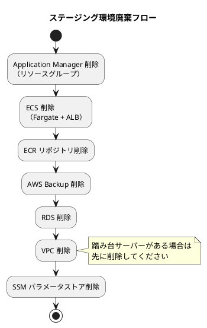
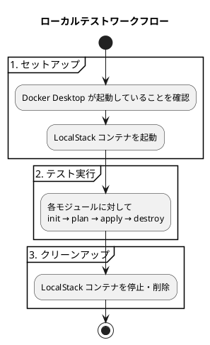

# AWS ステージング環境セットアップ手順書

## 概要

Terraform を使用して AWS 上に{プロジェクト名}のステージング環境を構築するための手順を説明します。

Infrastructure as Code（IaC）により、インフラストラクチャの一貫性、再現性、バージョン管理を保証します。

| サービス | 略称 | コンテナイメージ | ポート | 説明 |
|---------|------|----------------|--------|------|
| {サービス名} | {略称} | {イメージ名} | {ポート} | {説明} |

---

## アーキテクチャ



### AWS サービス構成

| サービス | 用途 |
|---------|------|
| Route 53 | DNS 管理・カスタムドメイン設定 |
| ECS (Fargate) | コンテナベースのアプリケーション実行（ALB 連携・パスベースルーティング） |
| ALB | ECS タスクへのトラフィック分散 |
| ECR | Docker イメージレジストリ |
| RDS ({DB エンジン}) | データベース |
| VPC | ネットワーク分離（パブリック / プライベートサブネット） |
| NAT Gateway | プライベートサブネットからのアウトバウンド通信 |
| Systems Manager | パラメータストア（DB 認証情報等） |
| CloudWatch Logs | ECS タスクのコンテナログ |
| S3 | Terraform 状態ファイル管理 |
| DynamoDB | Terraform 状態ロック |
| Resource Groups | Application Manager 用リソースグループ（タグベース） |
| AWS Backup | RDS スナップショットの自動取得 |

---

## 前提条件

- AWS アカウント（適切な IAM 権限）
- パッケージマネージャー
  - Windows: [Scoop](https://scoop.sh/)
  - macOS: [Homebrew](https://brew.sh/)
- Terraform >= 1.0.0, < 2.0.0
- AWS CLI v2
- aws-vault（開発環境での認証管理）
- Node.js >= 18 / npm（タスクランナー実行用）
- Docker Desktop（LocalStack テスト用）
- Go >= 1.21（Terratest 実行時）
- Git

---

## インストール

### 1. AWS CLI のセットアップ

#### 1.1 AWS CLI のインストール

**Windows（Scoop）**:

```bash
scoop install aws
```

**macOS（Homebrew）**:

```bash
brew install awscli
```

インストール確認:

```bash
aws --version
```

#### 1.2 aws-vault のインストール

aws-vault は AWS の認証情報を OS のキーチェーンに安全に保存し、一時的なセッション認証情報を自動生成するツールです。

**Windows（Scoop）**:

```bash
scoop install aws-vault
```

**macOS（Homebrew）**:

```bash
brew install aws-vault
```

インストール確認:

```bash
aws-vault --version
```

#### 1.3 開発環境の認証設定（aws-vault 使用）

1. マネジメントコンソールからアクセスキーを作成します
2. aws-vault にプロファイルを登録します

```bash
aws-vault add <profile_name>
```

3. `~/.aws/config` にプロファイルのリージョンを設定します

```text
[profile <profile_name>]
region={リージョン}
```

> **重要**: リージョンが設定されていないと `aws-vault exec` 実行時にエラーが発生します。

4. 登録後、AWS リソースへのアクセスを確認します

```bash
aws-vault exec <profile_name> -- aws s3 ls
```

5. `~/.aws/credentials` に以下を追加します

```text
[<profile_name>]
credential_process=aws-vault exec <profile_name> --json --prompt=wincredui
region={リージョン}
output=json
```

> **補足**: macOS の場合は `--prompt=osascript` に変更してください。

#### 1.4 手動で実行する場合

手動で Terraform や AWS CLI コマンドを実行する場合は、必ず `aws-vault exec` 経由で実行してください。

```bash
# Terraform の初期化
aws-vault exec <profile_name> -- terraform init --backend-config=backend.hcl

# Terraform の plan / apply
aws-vault exec <profile_name> -- terraform plan
aws-vault exec <profile_name> -- terraform apply

# AWS CLI コマンド
aws-vault exec <profile_name> -- aws s3 ls
```

#### 1.5 マネジメントコンソールにログイン

```bash
# aws-vault login（推奨）
aws-vault login <profile_name>
```

---

## 設定

### 2. Terraform ディレクトリ構成

Terraform コードは `ops/terraform/` 配下に以下の構成で配置します。

```text
ops/terraform/
├── live/
│   ├── global/
│   │   ├── variables/          # プロジェクト共通変数
│   │   ├── s3/                 # Terraform 状態管理用 S3 バケット
│   │   └── iam/                # OIDC 認証用 IAM ロール
│   ├── stage/
│   │   ├── ssm/
│   │   │   ├── paramstore/     # SSM パラメータストア
│   │   │   └── appmanager/     # Application Manager リソースグループ
│   │   ├── vpc/                # VPC・サブネット・NAT Gateway
│   │   ├── data-stores/
│   │   │   └── rds/            # RDS
│   │   ├── backup/             # AWS Backup
│   │   ├── repository/
│   │   │   └── ecr/            # ECR リポジトリ（サービスごと）
│   │   ├── services/
│   │   │   └── ecs/            # ECS (Fargate + ALB)
│   │   └── variables/          # ステージ変数
│   └── mgmt/
│       └── stage/
│           └── bastion/        # 踏み台サーバー
├── modules/
│   ├── iam/
│   │   └── ecs/                # ECS タスクロール / タスク実行ロール
│   ├── networking/
│   │   └── vpc/                # VPC モジュール
│   ├── data-stores/
│   │   └── rds/                # RDS モジュール
│   ├── backup/                 # AWS Backup モジュール
│   ├── repository/
│   │   └── ecr/                # ECR モジュール
│   └── services/
│       └── ecs/                # ECS モジュール（クラスター・ALB・サービス）
└── test/
    ├── unit/                   # 単体テスト
    └── integration/            # 結合テスト
```

### 3. Terraform 状態管理用 S3 バケットの作成

Terraform の状態ファイル（`.tfstate`）を S3 に保存し、DynamoDB テーブルで状態ロック（同時実行防止）を行います。他のすべてのリソースのバックエンドとなるため、最初に作成する必要があります。

#### 3.1 リソース定義

```hcl
resource "aws_s3_bucket" "terraform_state" {
  bucket = "${local.project_name}-staging-terraform-state"

  lifecycle {
    prevent_destroy = false
  }
}

resource "aws_s3_bucket_versioning" "enabled" {
  bucket = aws_s3_bucket.terraform_state.bucket
  versioning_configuration {
    status = "Enabled"
  }
}

resource "aws_s3_bucket_public_access_block" "public_access" {
  bucket                  = aws_s3_bucket.terraform_state.id
  block_public_acls       = true
  block_public_policy     = true
  ignore_public_acls      = true
  restrict_public_buckets = true
}

resource "aws_dynamodb_table" "terraform_locks" {
  name         = "${local.project_name}-staging-terraform-state-locks"
  billing_mode = "PAY_PER_REQUEST"
  hash_key     = "LockID"

  attribute {
    name = "LockID"
    type = "S"
  }
}
```

#### 3.2 プロビジョニング手順

作業ディレクトリ: `ops/terraform/live/global/s3`

```bash
terraform init
terraform plan
terraform apply
```

> **重要**: S3 バケットと DynamoDB テーブルは Terraform 状態の保存先です。他のすべてのリソースより先に作成してください。

### 4. GitHub Actions 用 IAM ロールの作成

作業ディレクトリ: `ops/terraform/live/global/iam`

OIDC プロバイダーと GitHub Actions 用の IAM ロールを作成します。

aws-vault 使用時は `--no-session` が必要です（STS 一時認証情報では IAM API が制限されるため）。

```bash
aws-vault exec <profile_name> --no-session -- terraform init
aws-vault exec <profile_name> --no-session -- terraform plan
aws-vault exec <profile_name> --no-session -- terraform apply
```

作成後:

1. 出力された IAM ロールの ARN をコピー
2. GitHub Actions の `AWS_ROLE_ARN` シークレットに設定

---

## タスクランナーによる自動化

Terraform プロビジョニング / 廃棄作業はタスクランナーで自動化できます。

| 変数 | 説明 | 例 |
|------|------|----|
| `STG_AWS_PROFILE` | aws-vault で使用するプロファイル名 | `{プロファイル名}` |

```bash
# 代表的なコマンド
{セットアップコマンド}               # 初回セットアップ
{全リソースプロビジョニングコマンド}    # 全リソースの一括プロビジョニング
{plan コマンド}                     # 全リソースの plan のみ
{destroy コマンド}                  # 全リソースの一括廃棄
{ヘルプコマンド}                    # ヘルプ
```

---

## プロビジョニング

### プロビジョニングフロー



### 5. SSM パラメータストアの設定

AWS Systems Manager Parameter Store を使用して、RDS の認証情報（ユーザー名・パスワード）を `SecureString` として暗号化管理します。

#### 5.1 リソース定義

```hcl
resource "aws_ssm_parameter" "db_username" {
  name  = "${local.ssm_parameter_key}/DB_USERNAME"
  type  = "SecureString"
  value = var.db_username

  tags = {
    Name              = local.resource_name
    ResourceGroupName = local.resource_name
  }
}

resource "aws_ssm_parameter" "db_password" {
  name  = "${local.ssm_parameter_key}/DB_PASSWORD"
  type  = "SecureString"
  value = var.db_password

  tags = {
    Name              = local.resource_name
    ResourceGroupName = local.resource_name
  }
}
```

#### 5.2 プロビジョニング手順

1. `secret.tfvars` ファイルを作成します

```text
db_username = "<DB ユーザー名>"
db_password = "<DB パスワード>"
```

> **重要**: `secret.tfvars` は Git 管理外にしてください（`.gitignore` に追加済み）。

2. Terraform を実行します

作業ディレクトリ: `ops/terraform/live/stage/ssm/paramstore`

```bash
terraform init --backend-config=backend.hcl
terraform plan --var-file=secret.tfvars
terraform apply --var-file=secret.tfvars
```

### 6. VPC の設定

パブリックサブネット（ALB・NAT Gateway・踏み台サーバー）とプライベートサブネット（ECS タスク・RDS）を複数のアベイラビリティゾーンに分散配置し、高可用性とセキュリティを確保します。

#### 6.1 ネットワーク構成



#### 6.2 サブネット設定

| サブネット | CIDR | AZ | 用途 |
|-----------|------|----|------|
| Public AZ-a | `{CIDR}` | {AZ-a} | ALB、NAT Gateway、踏み台サーバー |
| Public AZ-c | `{CIDR}` | {AZ-c} | ALB（マルチ AZ） |
| Private AZ-a | `{CIDR}` | {AZ-a} | ECS タスク、RDS プライマリ |
| Private AZ-c | `{CIDR}` | {AZ-c} | RDS スタンバイ（マルチ AZ） |

#### 6.3 主要リソース定義

```hcl
resource "aws_vpc" "main" {
  cidr_block           = var.vpc_cidr
  instance_tenancy     = "default"
  enable_dns_support   = true
  enable_dns_hostnames = true

  tags = {
    Name              = var.tags_name
    ResourceGroupName = var.tags_name
  }
}
```

**NAT Gateway（プライベートサブネットのアウトバウンド通信用）:**

```hcl
resource "aws_eip" "nat" {
  count  = var.nat_gw_enable ? 1 : 0
  domain = "vpc"
}

resource "aws_nat_gateway" "main" {
  count         = var.nat_gw_enable ? 1 : 0
  allocation_id = aws_eip.nat[0].id
  subnet_id     = aws_subnet.public_1a.id
}
```

#### 6.4 プロビジョニング手順

作業ディレクトリ: `ops/terraform/live/stage/vpc`

```bash
terraform init --backend-config=backend.hcl
terraform plan
terraform apply
```

### 7. RDS の設定

作業ディレクトリ: `ops/terraform/live/stage/data-stores/rds`

```bash
terraform init --backend-config=backend.hcl
terraform plan
terraform apply
```

#### 7.1 RDS 設定パラメータ

| パラメータ | ステージング値 | 説明 |
|-----------|-------------|------|
| `instance_class` | `{インスタンスタイプ}` | インスタンスタイプ |
| `allocated_storage` | `{容量}` GB | ストレージ容量 |
| `engine` / `engine_version` | `{エンジン}` / `{バージョン}` | DB エンジン |
| `backup_retention_period` | `{日数}` | 自動バックアップ保持日数 |
| `enable_blue_green_update` | `true` | Blue/Green Deployment 有効 |
| `skip_final_snapshot` | `false` | 削除時に最終スナップショットを取得 |
| `deletion_protection` | `false` | 削除保護（ステージングは無効） |
| `apply_immediately` | `true` | 変更を即時適用 |

#### 7.2 Blue/Green Deployment

RDS の Blue/Green Deployment は、エンジンバージョンアップグレードやパラメータグループ変更をダウンタイム数十秒で実行する仕組みです。



### 8. AWS Backup (RDS)

AWS Backup により RDS のスナップショットを日次・週次で自動取得します。`Backup = "true"` タグが付与された RDS インスタンスが対象です。

#### 8.1 バックアップポリシー

| ルール | スケジュール | 保持期間 |
|--------|-------------|---------|
| daily | 毎日 JST 0:00（UTC 15:00） | {日数} 日 |
| weekly | 毎週日曜 JST 0:00（UTC 15:00） | {日数} 日 |

#### 8.2 主要リソース定義

```hcl
resource "aws_backup_vault" "main" {
  name = "${var.app_env_name}-backup-vault"
}

resource "aws_backup_plan" "main" {
  name = "${var.app_env_name}-backup-plan"

  rule {
    rule_name         = "daily"
    target_vault_name = aws_backup_vault.main.name
    schedule          = "cron(0 15 * * ? *)"   # JST 0:00
    start_window      = 60
    completion_window = 180
    lifecycle {
      delete_after = var.daily_retention_days
    }
  }

  rule {
    rule_name         = "weekly"
    target_vault_name = aws_backup_vault.main.name
    schedule          = "cron(0 15 ? * SUN *)"
    start_window      = 60
    completion_window = 180
    lifecycle {
      delete_after = var.weekly_retention_days
    }
  }
}

resource "aws_backup_selection" "tagged" {
  name         = "${var.app_env_name}-backup-selection"
  iam_role_arn = aws_iam_role.backup.arn
  plan_id      = aws_backup_plan.main.id

  selection_tag {
    type  = "STRINGEQUALS"
    key   = "Backup"
    value = "true"
  }
}
```

#### 8.3 プロビジョニング手順

作業ディレクトリ: `ops/terraform/live/stage/backup`

```bash
terraform init --backend-config=backend.hcl
terraform plan
terraform apply
```

### 9. ECR リポジトリの設定

各サービスの Docker イメージリポジトリを ECR に作成します。

#### 9.1 リソース定義

```hcl
resource "aws_ecr_repository" "app" {
  name = var.repository_name
}
```

#### 9.2 プロビジョニング手順

各サービスの ECR リポジトリを個別に作成します。

作業ディレクトリ: `ops/terraform/live/stage/repository/ecr/{サービス名}`

```bash
terraform init --backend-config=backend.hcl
terraform plan
terraform apply
```

### 10. Docker イメージ ビルド & ECR プッシュ

ECR リポジトリ作成後、ECS でサービスを作成する前に、各サービスの Docker イメージをビルドして ECR にプッシュします。

#### 10.1 タスクランナー（推奨）

```bash
{ビルドコマンド}           # 全サービスをローカルビルド
{プッシュコマンド}          # ECR にログイン & 全イメージをプッシュ
```

#### 10.2 手動実行

```bash
# 1. ECR ログイン
aws-vault exec <profile_name> -- aws ecr get-login-password --region {リージョン} | \
  docker login --username AWS --password-stdin <アカウント ID>.dkr.ecr.{リージョン}.amazonaws.com

# 2. イメージをビルド & プッシュ
docker build -t <アカウント ID>.dkr.ecr.{リージョン}.amazonaws.com/{イメージ名}:latest {Dockerfile ディレクトリ}
docker push <アカウント ID>.dkr.ecr.{リージョン}.amazonaws.com/{イメージ名}:latest
```

### 11. ECS の設定

ECS（Elastic Container Service）+ Fargate を使用したデプロイ構成です。ALB（Application Load Balancer）を前段に配置し、パスベースルーティングで各サービスにトラフィックを振り分けます。

#### 11.1 ECS の全体構成



主要コンポーネント:

| コンポーネント | 説明 |
|-------------|------|
| ECS クラスター | Fargate 起動タイプ |
| タスク定義 | コンテナイメージ、CPU/メモリ、環境変数、ログ設定を定義 |
| ECS サービス | タスクの希望数を維持し、ALB と連携 |
| ALB | パブリックサブネットに配置。パスベースルーティング |
| ターゲットグループ | サービスごとのパスベースルーティング |
| セキュリティグループ | ALB 用（80/443 許可）と ECS タスク用（ALB からのみ許可） |

#### 11.2 パスベースルーティングとコンテキストパス

| サービス | パスパターン | コンテキストパス | ヘルスチェックパス | ポート |
|---------|------------|----------------|------------------|--------|
| {サービス名} | `/{パス}`, `/{パス}/*` | `/{パス}` | `/{パス}/{ヘルスチェック}` | {ポート} |

#### 11.3 環境変数

各 ECS タスクに設定する環境変数:

| 環境変数 | 説明 | 例 |
|---------|------|-----|
| `SPRING_PROFILES_ACTIVE` | アプリケーションプロファイル | `{プロファイル名}` |
| `SPRING_DATASOURCE_URL` | JDBC 接続 URL | `{JDBC URL}` |
| `SERVER_SERVLET_CONTEXT_PATH` | サーブレットコンテキストパス | `/{パス}` |
| `PORT` | コンテナポート番号 | `{ポート}` |

#### 11.4 IAM ロールの設定

ECS タスクには 2 種類の IAM ロールが必要です。

**タスクロール** — タスク内のコンテナが AWS リソースにアクセスする際に使用:

```hcl
resource "aws_iam_role" "task_role" {
  name               = "${var.resource_name}-task-role"
  assume_role_policy = data.aws_iam_policy_document.ecs_assume_role.json
}
```

**タスク実行ロール** — ECR イメージ取得、CloudWatch Logs 書き込み、SSM パラメータ取得に必要:

```hcl
resource "aws_iam_role" "task_exec_role" {
  name               = "${var.resource_name}-task-exec-role"
  assume_role_policy = data.aws_iam_policy_document.ecs_assume_role.json
}
```

タスク実行ロールに必要な権限:

| 権限 | 説明 |
|------|------|
| `ecr:GetAuthorizationToken`, `ecr:BatchGetImage` 等 | ECR からのイメージプル |
| `logs:CreateLogStream`, `logs:PutLogEvents` | CloudWatch Logs への書き込み |
| `ssm:GetParameters` | SSM パラメータの取得 |
| `kms:Decrypt` | SecureString パラメータの復号 |

#### 11.5 セキュリティグループの設定

**ALB 用** — 外部からの HTTP/HTTPS アクセスを許可:

```hcl
resource "aws_security_group" "alb" {
  name   = "${var.resource_name}-alb-sg"
  vpc_id = var.vpc_id
}

# HTTP (80) と HTTPS (443) のインバウンドルール
# 全アウトバウンドを許可
```

**ECS タスク用** — ALB からのトラフィックのみ許可:

```hcl
resource "aws_security_group" "ecs_tasks" {
  name   = "${var.resource_name}-ecs-tasks-sg"
  vpc_id = var.vpc_id
}

# サービスごとのポートに対して ALB セキュリティグループからのインバウンドを許可
# 全アウトバウンドを許可
```

#### 11.6 ALB（Application Load Balancer）の設定

```hcl
# ALB 本体
resource "aws_lb" "alb" {
  name               = "${var.resource_name}-alb"
  internal           = false
  load_balancer_type = "application"
  subnets            = var.public_subnet_ids
  security_groups    = [aws_security_group.alb.id]
}

# ターゲットグループ（サービスごとに for_each で作成）
resource "aws_alb_target_group" "service" {
  for_each = var.services

  name        = "${var.resource_name}-${each.key}-tg"
  port        = each.value.container_port
  protocol    = "HTTP"
  vpc_id      = var.vpc_id
  target_type = "ip"  # Fargate では ip を指定

  health_check {
    path                = each.value.health_check_path
    protocol            = "HTTP"
    healthy_threshold   = 3
    unhealthy_threshold = 3
    timeout             = 5
    interval            = 30
  }
}

# パスベースルーティング
resource "aws_alb_listener_rule" "service" {
  for_each     = var.services
  listener_arn = local.listener_arn

  action {
    type             = "forward"
    target_group_arn = aws_alb_target_group.service[each.key].arn
  }

  condition {
    path_pattern {
      values = each.value.path_pattern
    }
  }
}
```

> **注意**: ALB やターゲットグループには **32 文字以内・英数字とハイフンのみ** という命名制約があります。

#### 11.7 ECS クラスターとタスク定義

```hcl
resource "aws_ecs_cluster" "cluster" {
  name = var.cluster_name
}

resource "aws_ecs_task_definition" "service" {
  for_each = var.services

  family                   = "${var.resource_name}-${each.key}-task"
  requires_compatibilities = ["FARGATE"]
  network_mode             = "awsvpc"
  cpu                      = each.value.cpu
  memory                   = each.value.memory
  task_role_arn            = var.task_role_arn
  execution_role_arn       = var.task_exec_role_arn

  container_definitions = jsonencode([
    {
      name      = each.value.name
      image     = "${each.value.ecr_repo_url}:latest"
      cpu       = each.value.cpu
      memory    = each.value.memory
      essential = true
      portMappings = [
        {
          containerPort = each.value.container_port
          hostPort      = each.value.container_port
        }
      ]
      environment = [
        for k, v in each.value.environment : {
          name  = k
          value = v
        }
      ]
      secrets = [
        for k, v in each.value.secrets : {
          name      = k
          valueFrom = v
        }
      ]
      logConfiguration = {
        logDriver = "awslogs"
        options = {
          awslogs-group         = aws_cloudwatch_log_group.ecs.name
          awslogs-region        = "{リージョン}"
          awslogs-stream-prefix = each.key
        }
      }
    }
  ])
}
```

#### 11.8 ECS サービスの作成

```hcl
resource "aws_ecs_service" "service" {
  for_each = var.services

  name            = "${var.resource_name}-${each.key}-svc"
  cluster         = aws_ecs_cluster.cluster.id
  task_definition = aws_ecs_task_definition.service[each.key].arn
  desired_count   = each.value.desired_count
  launch_type     = "FARGATE"

  network_configuration {
    subnets          = var.private_subnet_ids
    security_groups  = [aws_security_group.ecs_tasks.id]
    assign_public_ip = false
  }

  load_balancer {
    target_group_arn = aws_alb_target_group.service[each.key].arn
    container_name   = each.value.name
    container_port   = each.value.container_port
  }
}
```

#### 11.9 プロビジョニング手順

作業ディレクトリ: `ops/terraform/live/stage/services/ecs/`

```bash
terraform init --backend-config=backend.hcl
terraform plan
terraform apply
```

#### 11.10 デプロイ手順

ECS デプロイでは、ECR にプッシュ済みの最新イメージを使用してローリングデプロイを実行します。

```bash
# タスクランナー（推奨）
{ECS デプロイコマンド}           # 全サービス: ビルド → プッシュ → ECS デプロイ
{ECS デプロイのみコマンド}        # デプロイのみ（イメージ更新後）
{ECS ステータスコマンド}          # ECS サービス状態
```

### 12. Application Manager（リソースグループ）

タグベースのリソースグループを作成し、全リソースを一元管理します。

#### 12.1 リソース定義

```hcl
resource "aws_resourcegroups_group" "app" {
  name        = "${local.resource_name}-app"
  description = "{プロジェクト名} staging environment resource group"

  resource_query {
    query = jsonencode({
      ResourceTypeFilters = ["AWS::AllSupported"]
      TagFilters = [{
        Key    = "ResourceGroupName"
        Values = [local.tags_name]
      }]
    })
  }
}
```

#### 12.2 タグ設計

全モジュールで `ResourceGroupName` タグを統一的に付与します。

```hcl
tags = {
  Name              = "<リソース名>"
  ResourceGroupName = var.tags_name
}
```

#### 12.3 プロビジョニング手順

作業ディレクトリ: `ops/terraform/live/stage/ssm/appmanager`

```bash
terraform init --backend-config=backend.hcl
terraform plan
terraform apply
```

> **補足**: Application Manager はリソースのグルーピングのみを行います。全リソースの作成後に実行してください。

### 13. EC2 キーペアの作成（踏み台サーバー用・任意）

踏み台サーバーの SSH 接続に使用する EC2 キーペアを作成します。

```bash
aws-vault exec <profile_name> -- aws ec2 create-key-pair \
  --key-name {キーペア名} \
  --key-type rsa \
  --region {リージョン} \
  --query "KeyMaterial" \
  --output text > {キーペア名}.pem

# 公開鍵の生成
ssh-keygen -y -f {キーペア名}.pem > {キーペア名}.pem.pub
```

> **重要**: 秘密鍵ファイル（`.pem`）は再ダウンロードできません。安全な場所に保管してください。

### 14. 踏み台サーバーのセットアップ（任意）

作業ディレクトリ: `ops/terraform/live/mgmt/stage/bastion`

1. `secret.tfvars` ファイルを作成します

```text
vpc_id     = "<ステージング VPC の ID>"
subnet_ids = ["<パブリックサブネット 1>", "<パブリックサブネット 2>"]
postgres_config = {
  address = "<RDS エンドポイント>"
  port    = "5432"
}
```

2. Terraform を実行します

```bash
terraform init --backend-config=backend.hcl
terraform plan --var-file=secret.tfvars
terraform apply --var-file=secret.tfvars
```

3. RDS への接続

```bash
# SSH トンネル経由
ssh -L 5432:<RDS エンドポイント>:5432 ec2-user@<踏み台 IP> -i {キーペア名}.pem

# 別ターミナルで DB に接続
psql -h 127.0.0.1 -p 5432 -U <ユーザー名> -d <データベース名>
```

### 15. Route 53・カスタムドメインの設定

ALB の DNS 名に対して Route 53 の CNAME レコードまたは Alias レコードを作成します。

HTTPS を使用する場合は、ACM（AWS Certificate Manager）で証明書を発行し、ECS モジュールの `certificate_arn` 変数に設定します。

```hcl
module "ecs" {
  source          = "../../../../modules/services/ecs"
  certificate_arn = var.certificate_arn  # ACM 証明書の ARN
}
```

---

## デプロイ

### デプロイフロー



### デプロイタスク

```bash
# 典型的なデプロイフロー（ECS）
{ビルドコマンド}              # 1. ローカルでイメージビルド
{プッシュコマンド}             # 2. ECR にプッシュ
{ECS デプロイコマンド}         # 3. ECS をローリングデプロイ
```

---

## アップグレード

### RDS メジャーバージョンアップグレード

Blue/Green Deployment を利用して、ダウンタイムを最小限に抑えたメジャーバージョンアップグレードを実行します。

#### 手順

1. 共有変数モジュールの `db_engine_version` を変更
2. `terraform apply` を実行（Blue/Green Deployment が自動実行）
3. `terraform plan` で "No changes." を確認

> **注意**: Blue/Green Deployment は長時間かかるため、`aws-vault` のセッショントークンが途中で失効する場合があります。その場合は State ロック解除 → errored.tfstate のプッシュ → 手動 Switchover の順でリカバリしてください。

---

## 環境廃棄

プロビジョニング済みのステージング環境を廃棄する場合は、**構築時と逆の順序**で実行します。

### 廃棄フロー



各リソースの削除コマンド:

```bash
# 各リソースの作業ディレクトリで実行
terraform init --backend-config=backend.hcl
terraform destroy
```

> **注意**: `secret.tfvars` を使用しているリソース（SSM、踏み台等）は `terraform destroy --var-file=secret.tfvars` を使用してください。

---

## データバックアップ

### AWS Backup（自動バックアップ）

| ルール | スケジュール | 保持期間 |
|--------|-------------|---------|
| daily | 毎日 JST 0:00 | {日数} 日 |
| weekly | 毎週日曜 JST 0:00 | {日数} 日 |

#### AWS Backup からのリストア

1. AWS コンソール → AWS Backup → バックアップボールト → リカバリポイントを選択
2. 「復元」をクリック → リストア先の DB インスタンス識別子を指定
3. リストア完了後、必要に応じてアプリケーションの接続先を切り替え

> **警告**: AWS Backup からのリストアは既存インスタンスへの上書きではなく、新しい RDS インスタンスとして作成されます。

### SSH トンネル経由のバックアップ（手動）

```bash
# 1. SSH トンネルを確立
ssh -L 5432:<RDS エンドポイント>:5432 ec2-user@<踏み台 IP> -i {キーペア名}.pem

# 2. スキーマ単位でバックアップ
PGPASSWORD=<パスワード> pg_dump -h 127.0.0.1 -p 5432 -U <ユーザー名> -d <DB 名> -n {スキーマ名} -Fc -f {スキーマ名}_backup.dump

# 3. リストア
PGPASSWORD=<パスワード> pg_restore -h 127.0.0.1 -p 5432 -U <ユーザー名> -d <DB 名> --clean --if-exists {スキーマ名}_backup.dump
```

---

## テスト

Terraform コードの品質を保証するため、3 段階のテスト戦略を採用しています。

| テスト | ツール | AWS 接続 | 対象 |
|-------|--------|:--------:|------|
| ローカルテスト | LocalStack (Docker) | 不要 | S3, SSM 等の基本サービス |
| 単体テスト | Terratest (Go) | 不要 | `terraform validate` による構文検証 |
| 結合テスト | Terratest (Go) | 必要 | S3 backend 付きの構文検証 |

### ローカルテスト（LocalStack）

LocalStack を使って Terraform コードをローカル環境で検証します。



#### LocalStack の対象と制約

| テスト対象 | Community 版 | 確認内容 |
|-----------|:---:|------|
| S3 バケット | OK | バケット作成・暗号化設定 |
| DynamoDB | OK | テーブル作成・キー設定 |
| SSM パラメータ | OK | パラメータ登録・取得 |
| IAM ロール | 制限あり | OIDC 非対応 |
| VPC | 制限あり | 基本的な作成のみ |
| RDS / ECR / ECS | 非対応 | Terratest で検証 |

### 単体テスト（Terratest）

```bash
cd ops/terraform/test
go test -v -timeout 30m ./unit/...
```

### 結合テスト（Terratest）

```bash
cd ops/terraform/test
aws-vault exec <profile_name> -- go test -v -timeout 30m ./integration/...
```

---

## トラブルシューティング

### aws-vault 関連

| 症状 | 原因 | 対処 |
|------|------|------|
| `an AWS region is required` | `~/.aws/config` に region 未設定 | プロファイルに `region={リージョン}` を追加 |
| `InvalidClientTokenId` (IAM 操作) | STS 一時認証情報の制約 | `aws-vault exec --no-session` を使用 |
| `EntityAlreadyExists` (OIDC) | OIDC プロバイダーは AWS アカウントに 1 つ | `data` ソースで既存を参照 |

### Terraform 関連

| 症状 | 原因 | 対処 |
|------|------|------|
| `terraform init` が失敗 | S3 バケット未作成 | `live/global/s3` を先に適用 |
| 状態ロックエラー | 前回の apply が中断 | `terraform force-unlock <lock-id>` |
| `backend-config` エラー | `backend.hcl` が見つからない | 作業ディレクトリを確認 |

### ECS 関連

| 症状 | 原因 | 対処 |
|------|------|------|
| ALB/TG 名が長すぎるエラー | リソース名が 32 文字超過 | 短い `resource_name` を使用 |
| ターゲットが unhealthy | ヘルスチェックパスが不正 | `/{パス}/{ヘルスチェック}` に設定 |
| コンテナが 404 を返す | コンテキストパス未設定 | `SERVER_SERVLET_CONTEXT_PATH` を設定 |
| ポートの不一致 | 環境変数 `PORT` が未設定 | ECS タスク定義で `PORT` を明示的に設定 |
| 環境変数変更が反映されない | `ignore_changes` 設定 | AWS CLI でタスク定義の新リビジョンを登録し `--force-new-deployment` |

### RDS 関連

| 症状 | 原因 | 対処 |
|------|------|------|
| 接続できない | セキュリティグループ設定 | プライベートサブネットからのアクセスを許可 |
| 認証エラー | SSM パラメータの値が不正 | パラメータストアの値を確認 |
| `terraform destroy` が遅い | 削除保護が有効 | `deletion_protection = false` にしてから再実行 |
| Blue/Green 後に差異 | コンソールで手動実行 | `terraform apply -refresh-only` で State を同期 |
| Blue/Green 作成失敗 | PK なしテーブルが存在 | 全テーブルに Primary Key を追加 |

### ネットワーク関連

| 症状 | 原因 | 対処 |
|------|------|------|
| プライベートサブネットから外部接続不可 | NAT Gateway 未設定 | VPC 設定を確認 |
| 踏み台サーバーに SSH 接続できない | セキュリティグループ | 自分の IP からのインバウンドを許可 |

---

## セキュリティチェックリスト

- [ ] `secret.tfvars` が `.gitignore` に追加されている
- [ ] DB 認証情報が SSM パラメータストアで管理されている
- [ ] RDS がプライベートサブネットに配置されている
- [ ] 踏み台サーバーの SSH アクセスが IP 制限されている
- [ ] OIDC 認証で GitHub Actions と AWS が連携している
- [ ] S3 バケットの暗号化が有効になっている
- [ ] DynamoDB の状態ロックが設定されている

---

## 関連ドキュメント

- {関連ドキュメント 1}
- {関連ドキュメント 2}
