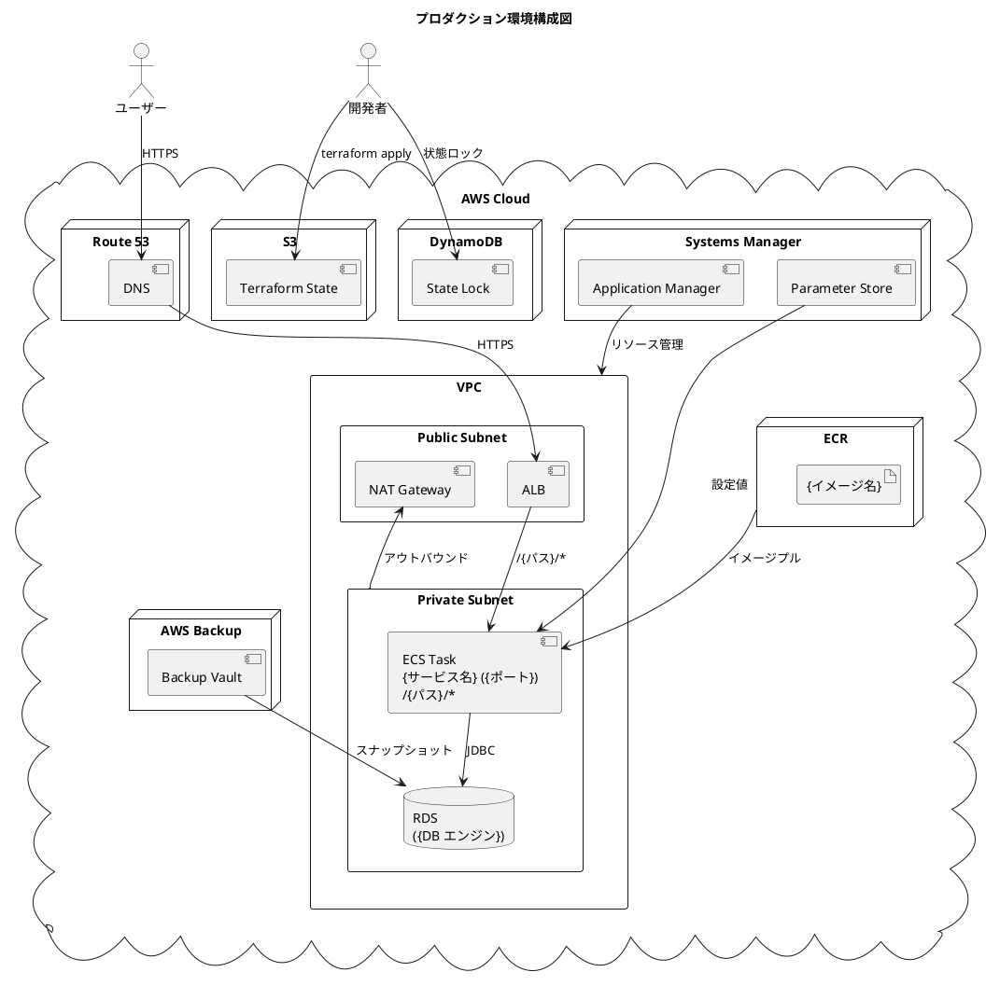
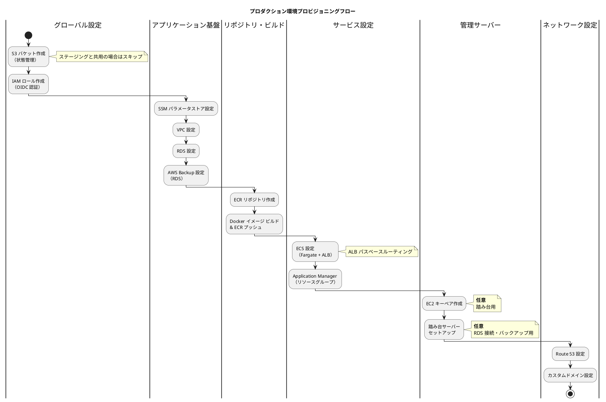
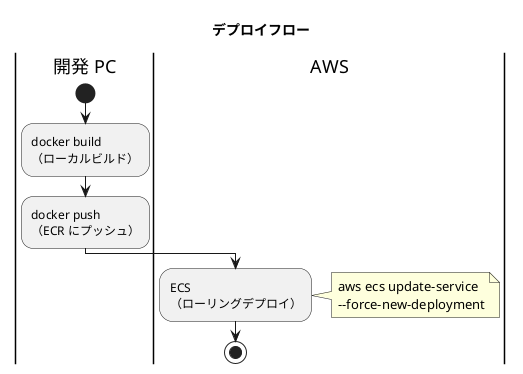
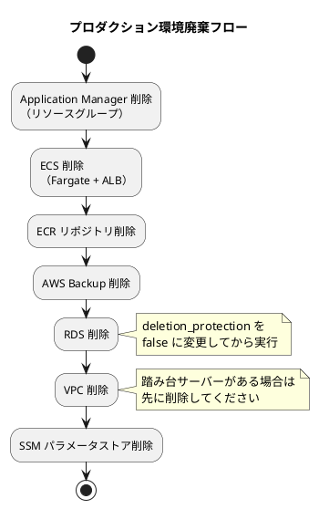

# AWS プロダクション環境セットアップ手順書

## 概要

Terraform を使用して AWS 上に{プロジェクト名}のプロダクション環境を構築するための手順を説明します。

各ステップの設計意図・実装詳細・トラブルシューティングは [ステージング環境セットアップ手順書](AWSステージング環境セットアップ手順書.md) を参照してください。

| サービス | 略称 | コンテナイメージ | ポート | 説明 |
|---------|------|----------------|--------|------|
| {サービス名} | {略称} | {イメージ名} | {ポート} | {説明} |

---

## アーキテクチャ



### AWS サービス構成

| サービス | 用途 |
|---------|------|
| Route 53 | DNS 管理・カスタムドメイン設定 |
| ECS (Fargate) | コンテナベースのアプリケーション実行（ALB 連携・パスベースルーティング） |
| ALB | ECS タスクへのトラフィック分散 |
| ECR | Docker イメージレジストリ |
| RDS ({DB エンジン}) | データベース |
| VPC | ネットワーク分離（パブリック / プライベートサブネット） |
| NAT Gateway | プライベートサブネットからのアウトバウンド通信 |
| Systems Manager | パラメータストア（DB 認証情報等） |
| CloudWatch Logs | ECS タスクのコンテナログ |
| S3 | Terraform 状態ファイル管理 |
| DynamoDB | Terraform 状態ロック |
| Resource Groups | Application Manager 用リソースグループ（タグベース） |
| AWS Backup | RDS スナップショットの自動取得 |

---

## 前提条件

- AWS アカウント（適切な IAM 権限）
- Terraform >= 1.0.0, < 2.0.0
- AWS CLI v2
- Docker Desktop（イメージビルド用）
- Git

> **補足**: AWS CLI・Terraform のインストール、認証設定（aws-vault / IAM ユーザー）の詳細は [ステージング環境セットアップ手順書 > インストール](AWSステージング環境セットアップ手順書.md#インストール) を参照してください。

---

## ステージング環境との主な差異

| 項目 | ステージング | プロダクション |
|------|------------|--------------|
| 環境名 | `staging` | `production` |
| ディレクトリ | `ops/terraform/live/stage/` | `ops/terraform/live/prod/` |
| ドメイン | `stg.{ドメイン}` | `{ドメイン}` |
| DB 名 | `{プロジェクト名}_staging` | `{プロジェクト名}_production` |
| DB インスタンス | `{ステージング用インスタンス}` | 要件に応じて選定 |
| 削除保護 | `false` | `true` |
| 管理サーバー | 踏み台・その他 | 踏み台のみ |

---

## Terraform ディレクトリ構成

```text
ops/terraform/
├── live/
│   ├── global/
│   │   ├── variables/          # プロジェクト共通変数
│   │   ├── s3/                 # Terraform 状態管理用 S3 バケット（共用）
│   │   └── iam/                # OIDC 認証用 IAM ロール
│   └── prod/
│       ├── ssm/
│       │   ├── paramstore/     # SSM パラメータストア
│       │   └── appmanager/     # Application Manager リソースグループ
│       ├── vpc/                # VPC・サブネット・NAT Gateway
│       ├── data-stores/
│       │   └── rds/            # RDS
│       ├── backup/             # AWS Backup (RDS)
│       ├── repository/
│       │   └── ecr/            # ECR リポジトリ（サービスごと）
│       ├── services/
│       │   └── ecs/            # ECS (Fargate + ALB)
│       └── variables/          # プロダクション変数
├── modules/                    # ステージングと共有
│   ├── iam/
│   │   └── ecs/                # ECS タスクロール / タスク実行ロール
│   ├── networking/
│   │   └── vpc/                # VPC モジュール
│   ├── data-stores/
│   │   └── rds/                # RDS モジュール
│   ├── backup/                 # AWS Backup モジュール
│   ├── repository/
│   │   └── ecr/                # ECR モジュール
│   └── services/
│       └── ecs/                # ECS モジュール（クラスター・ALB・サービス）
└── test/
```

> **補足**: `modules/` はステージング環境と共有します。環境固有の設定は `live/prod/variables/` で管理します。

---

## タスクランナーによる自動化

プロビジョニング・デプロイ・SSH 運用作業はタスクランナーで自動化されています。

| 変数 | 説明 | 例 |
|------|------|----|
| `PRD_AWS_PROFILE` | aws-vault で使用するプロファイル名 | `{プロファイル名}` |

```bash
# プロビジョニング
{全リソースプロビジョニングコマンド}    # 全リソースを順番にプロビジョニング
{plan コマンド}                      # 全リソースの plan のみ実行
{ヘルプコマンド}                     # プロビジョニングヘルプ

# デプロイ
{ECS デプロイコマンド}                # 全サービスの一括デプロイ（ビルド → プッシュ → ECS）
{ECS ステータスコマンド}              # ECS サービス状態を確認
{デプロイヘルプコマンド}              # デプロイヘルプ

# SSH・踏み台
{SSH トンネルコマンド}                # RDS への SSH トンネル
{バックアップコマンド}                # DB バックアップ
{SSH ヘルプコマンド}                  # SSH ヘルプ
```

---

## 1. プロビジョニング

### プロビジョニングフロー



### 1.1 Terraform 状態管理用 S3 バケットの作成

> ステージング環境で作成済みの S3 バケットを共用する場合はスキップしてください。

作業ディレクトリ: `ops/terraform/live/global/s3`

```bash
terraform init
terraform plan
terraform apply
```

### 1.2 GitHub Actions 用 IAM ロールの作成

作業ディレクトリ: `ops/terraform/live/global/iam`

> **詳細**: [ステージング環境セットアップ手順書 > IAM ロールの作成](AWSステージング環境セットアップ手順書.md#4-github-actions-用-iam-ロールの作成) を参照してください。

```bash
terraform init
terraform plan
terraform apply
```

### 1.3 SSM パラメータストアの設定

作業ディレクトリ: `ops/terraform/live/prod/ssm/paramstore`

1. `secret.tfvars` ファイルを作成します

```text
db_username = "<DB ユーザー名>"
db_password = "<DB パスワード>"
```

> **重要**: `secret.tfvars` は Git 管理外にしてください（`.gitignore` に追加済み）。

2. Terraform を実行します

```bash
terraform init --backend-config=backend.hcl
terraform plan --var-file=secret.tfvars
terraform apply --var-file=secret.tfvars
```

### 1.4 VPC の設定

作業ディレクトリ: `ops/terraform/live/prod/vpc`

```bash
terraform init --backend-config=backend.hcl
terraform plan
terraform apply
```

### 1.5 RDS の設定

作業ディレクトリ: `ops/terraform/live/prod/data-stores/rds`

```bash
terraform init --backend-config=backend.hcl
terraform plan
terraform apply
```

> **詳細**: RDS 設定パラメータ、Blue/Green Deployment、パラメータグループの自動管理については [ステージング環境セットアップ手順書 > RDS の設定](AWSステージング環境セットアップ手順書.md#7-rds-の設定) を参照してください。

### 1.6 AWS Backup (RDS)

作業ディレクトリ: `ops/terraform/live/prod/backup`

```bash
terraform init --backend-config=backend.hcl
terraform plan
terraform apply
```

> **詳細**: バックアップポリシー（スケジュール・保持期間）、リストア手順については [ステージング環境セットアップ手順書 > データバックアップ](AWSステージング環境セットアップ手順書.md#データバックアップ) を参照してください。

### 1.7 ECR リポジトリの設定

各サービスの ECR リポジトリを作成します。

作業ディレクトリ: `ops/terraform/live/prod/repository/ecr/{サービス名}`

```bash
terraform init --backend-config=backend.hcl
terraform plan
terraform apply
```

> 各サービスのリポジトリごとに上記を繰り返します。

### 1.8 Docker イメージ ビルド & ECR プッシュ

ECR リポジトリ作成後、ECS でサービスを作成する前に、各サービスの Docker イメージをビルドして ECR にプッシュします。

```bash
# タスクランナー（推奨）
{ビルドコマンド}           # 全サービスを一括でビルド
{プッシュコマンド}          # 全サービスを一括で ECR にプッシュ
```

> **詳細**: 手動でのビルド & プッシュ手順は [ステージング環境セットアップ手順書 > Docker イメージ ビルド & ECR プッシュ](AWSステージング環境セットアップ手順書.md#10-docker-イメージ-ビルド--ecr-プッシュ) を参照してください。

### 1.9 ECS の設定

作業ディレクトリ: `ops/terraform/live/prod/services/ecs`

```bash
terraform init --backend-config=backend.hcl
terraform plan
terraform apply
```

> **詳細**: ECS の全体構成（ALB パスベースルーティング、セキュリティグループ、タスク定義、環境変数）については [ステージング環境セットアップ手順書 > ECS の設定](AWSステージング環境セットアップ手順書.md#11-ecs-の設定) を参照してください。

#### 1.9.1 ECS デプロイ手順

ECS デプロイでは、ECR にプッシュ済みの最新イメージを使用してローリングデプロイを実行します。

```bash
# タスクランナー（推奨）
{ECS 全サービスデプロイコマンド}     # 全サービス: ビルド → プッシュ → ECS デプロイ
{ECS デプロイのみコマンド}          # デプロイのみ（イメージ更新後）
{ECS ステータスコマンド}            # ECS サービス状態
```

### 1.10 Application Manager（リソースグループ）

タグベースのリソースグループを作成し、プロダクション環境の全リソースを一元管理します。

作業ディレクトリ: `ops/terraform/live/prod/ssm/appmanager`

```bash
terraform init --backend-config=backend.hcl
terraform plan
terraform apply
```

#### 確認手順

1. AWS コンソール → Systems Manager → Application Manager でリソースグループが表示されることを確認
2. リソースグループ内に VPC、RDS、ECS、ECR 等のリソースが含まれていることを確認

> **補足**: Application Manager はリソースのグルーピングのみを行います。全リソースの作成後（ECS セットアップ後）に実行してください。

### 1.11 EC2 キーペアの作成（踏み台サーバー用・任意）

踏み台サーバーを使用する場合のみ実行します。

```bash
aws ec2 create-key-pair \
  --key-name {キーペア名} \
  --key-type rsa \
  --region {リージョン} \
  --query "KeyMaterial" \
  --output text > {キーペア名}.pem
```

> **重要**: 秘密鍵ファイル（`.pem`）は再ダウンロードできません。安全な場所に保管してください。

### 1.12 踏み台サーバーのセットアップ（任意）

RDS への直接接続・バックアップが必要な場合のみ実行します。

作業ディレクトリ: `ops/terraform/live/mgmt/prod/bastion`

1. `secret.tfvars` ファイルを作成します

```text
vpc_id     = "<プロダクション VPC の ID>"
subnet_ids = ["<パブリックサブネット 1>", "<パブリックサブネット 2>"]
postgres_config = {
  address = "<RDS エンドポイント>"
  port    = "5432"
}
```

2. Terraform を実行します

```bash
terraform init --backend-config=backend.hcl
terraform plan --var-file=secret.tfvars
terraform apply --var-file=secret.tfvars
```

> **詳細**: 踏み台サーバーの接続方法・DB バックアップ / リストア手順は [ステージング環境セットアップ手順書 > 踏み台サーバーのセットアップ](AWSステージング環境セットアップ手順書.md#14-踏み台サーバーのセットアップ任意) を参照してください。

### 1.13 Route 53・カスタムドメインの設定

プロダクション環境のカスタムドメイン（`{ドメイン}`）の DNS 設定を行います。

ALB の DNS 名に対して Route 53 の CNAME レコードまたは Alias レコードを作成します。HTTPS を使用する場合は、ACM（AWS Certificate Manager）で証明書を発行し、ECS モジュールの `certificate_arn` 変数に設定します。

> **詳細**: [ステージング環境セットアップ手順書 > Route 53・カスタムドメインの設定](AWSステージング環境セットアップ手順書.md#15-route-53カスタムドメインの設定) を参照してください。

---

## 2. デプロイ

### 2.1 デプロイフロー



### 2.2 デプロイタスク

```bash
# 典型的なデプロイフロー
{ビルドコマンド}              # 1. ローカルでイメージビルド
{プッシュコマンド}             # 2. ECR にプッシュ
{ECS デプロイコマンド}         # 3. ECS をローリングデプロイ

# または一括実行
{ECS 全サービスデプロイコマンド}
```

> **詳細**: デプロイの仕組みの詳細は [ステージング環境セットアップ手順書 > デプロイ](AWSステージング環境セットアップ手順書.md#デプロイ) を参照してください。

---

## アップグレード

### RDS メジャーバージョンアップグレード

Blue/Green Deployment を利用して、ダウンタイムを最小限に抑えたメジャーバージョンアップグレードを実行します。

1. `ops/terraform/live/prod/variables/main.tf` の `db_engine_version` を変更
2. Terraform を実行

```bash
cd ops/terraform/live/prod/data-stores/rds
terraform init --backend-config=backend.hcl
terraform plan
terraform apply
```

> **詳細**: Blue/Green Deployment の仕組み・前提条件・セッショントークン切れ時のリカバリ手順は [ステージング環境セットアップ手順書 > アップグレード](AWSステージング環境セットアップ手順書.md#アップグレード) を参照してください。

---

## 環境廃棄

プロビジョニング済みのプロダクション環境を廃棄する場合は、**構築時と逆の順序**で実行します。

> **警告**: プロダクション環境の廃棄は十分な確認と承認のもとで実行してください。`deletion_protection = true` の設定を事前に `false` に変更する必要があります。

### 廃棄フロー



### Application Manager の削除

```bash
cd ops/terraform/live/prod/ssm/appmanager
terraform init --backend-config=backend.hcl
terraform destroy
```

### ECS の削除

```bash
cd ops/terraform/live/prod/services/ecs
terraform init --backend-config=backend.hcl
terraform destroy
```

### ECR リポジトリの削除

各サービスのリポジトリを個別に削除します。

```bash
cd ops/terraform/live/prod/repository/ecr/{サービス名}
terraform init --backend-config=backend.hcl
terraform destroy
```

### AWS Backup の削除

```bash
cd ops/terraform/live/prod/backup
terraform init --backend-config=backend.hcl
terraform destroy
```

### RDS の削除

> **重要**: `deletion_protection = true` の場合、先に `false` に変更して `terraform apply` を実行してから `terraform destroy` を実行してください。

```bash
cd ops/terraform/live/prod/data-stores/rds
terraform init --backend-config=backend.hcl
terraform destroy
```

### VPC の削除

踏み台サーバーが存在する場合は先に削除してください。

```bash
# 踏み台サーバーの削除（存在する場合）
cd ops/terraform/live/mgmt/prod/bastion
terraform init --backend-config=backend.hcl
terraform destroy --var-file=secret.tfvars

# VPC の削除
cd ops/terraform/live/prod/vpc
terraform init --backend-config=backend.hcl
terraform destroy
```

### SSM パラメータストアの削除

```bash
cd ops/terraform/live/prod/ssm/paramstore
terraform init --backend-config=backend.hcl
terraform destroy --var-file=secret.tfvars
```

---

## セキュリティチェックリスト

- [ ] `secret.tfvars` が `.gitignore` に追加されている
- [ ] DB 認証情報が SSM パラメータストアで管理されている
- [ ] RDS がプライベートサブネットに配置されている
- [ ] RDS の `deletion_protection` が `true` に設定されている
- [ ] 踏み台サーバーの SSH アクセスが IP 制限されている
- [ ] OIDC 認証で GitHub Actions と AWS が連携している
- [ ] S3 バケットの暗号化が有効になっている
- [ ] DynamoDB の状態ロックが設定されている
- [ ] ALB で HTTPS（TLS 1.3）が有効になっている
- [ ] ACM 証明書が設定されている

---

## 関連ドキュメント

- [ステージング環境セットアップ手順書](AWSステージング環境セットアップ手順書.md) — 設計意図・実装詳細・トラブルシューティング
- {関連ドキュメント 1}
- {関連ドキュメント 2}
