# 企業分析

## 環境分析

### 組織図

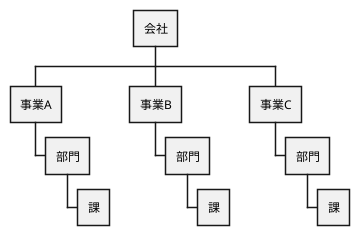

### ビジネスモデル

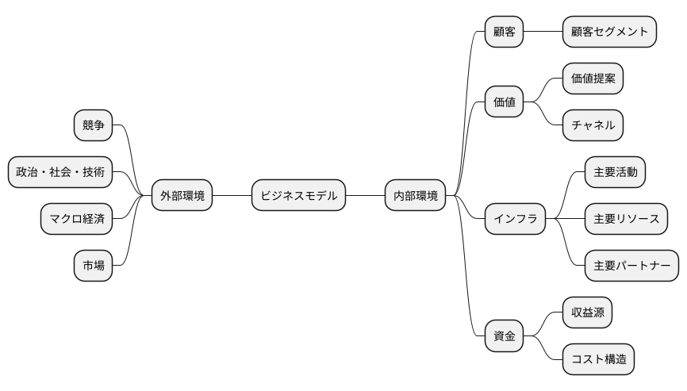

### SWOT分析

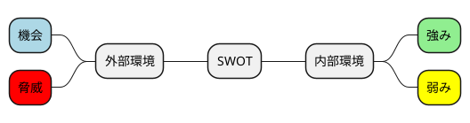

### VRIO分析

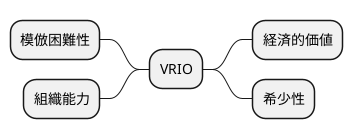

## 事業分析

### 企業戦略

#### ドメイン

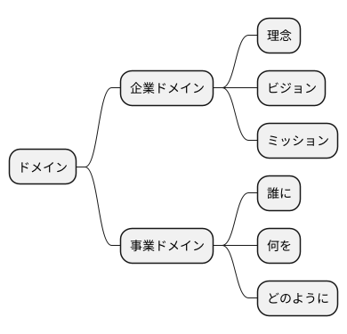

#### 成長戦略

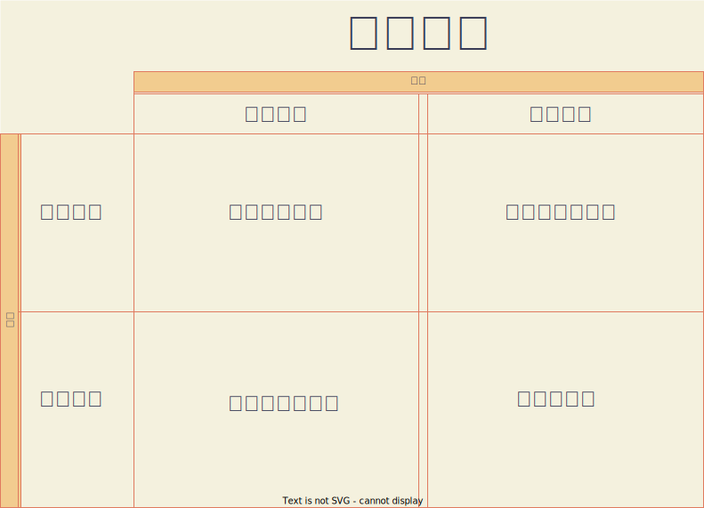

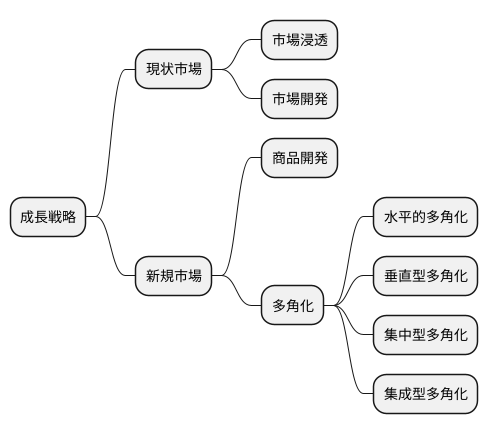

#### イシューツリー

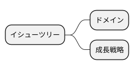

### 事業戦略

#### 基本戦略

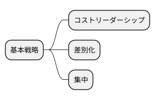

#### 競争戦略

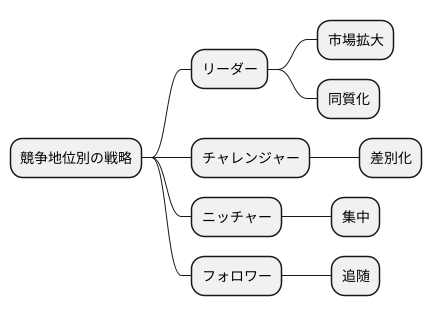

#### 価値連鎖

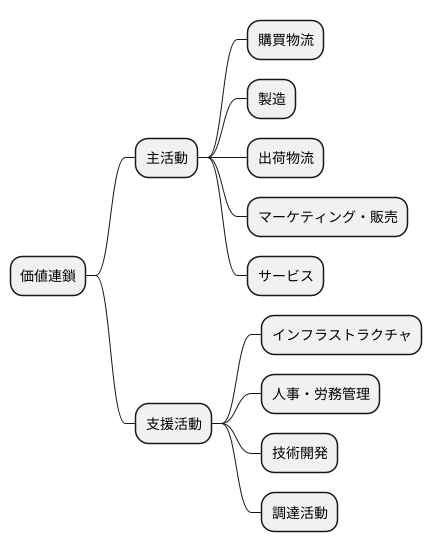

#### イシューツリー

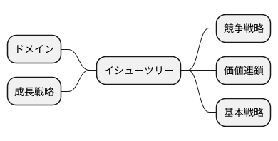

### 機能戦略

#### バリューストリーム

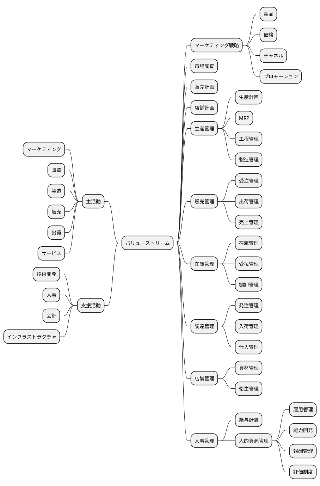

#### ケイパビリティマッピング

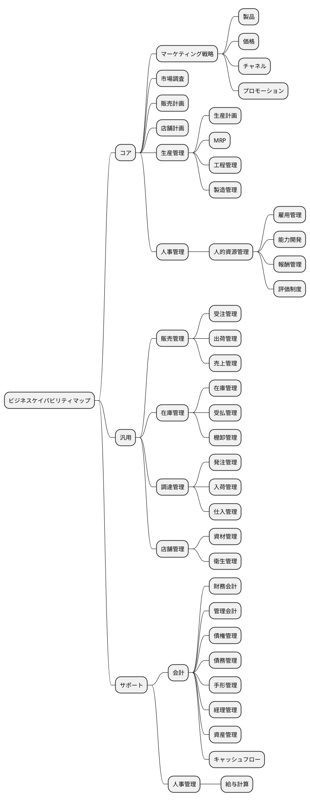

#### 組織マップ

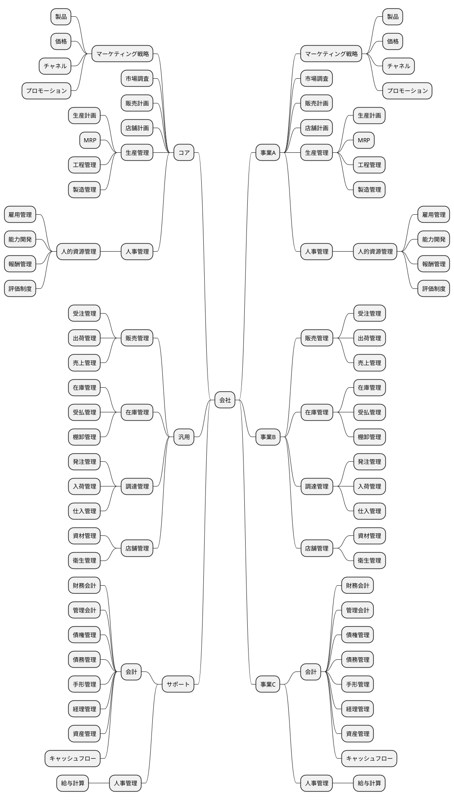

#### 情報マップ

#### ビジネスシナリオ

#### イシューツリー

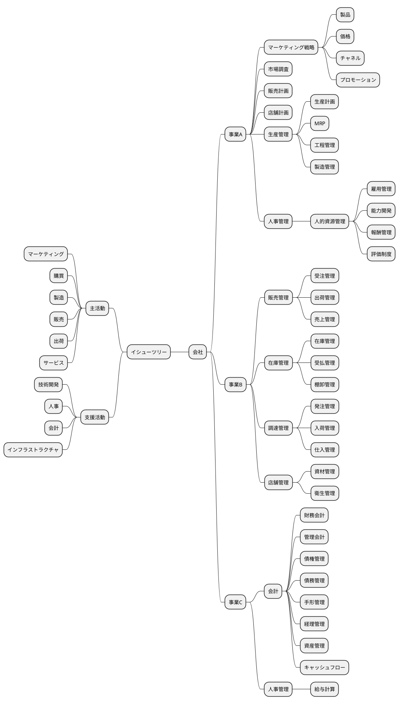

## 業務分析

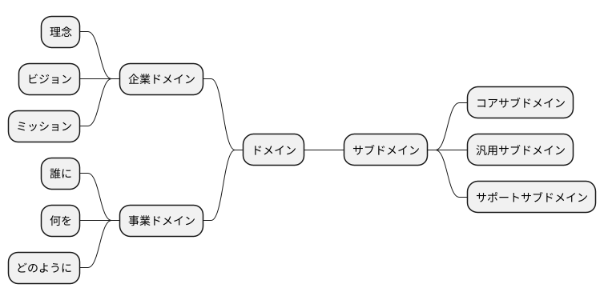

### 業務領域（サブドメイン）

#### 中核の業務領域（コアサブドメイン）

#### 一般的な業務領域（汎用サブドメイン）

#### 補完的な業務領域（サポートサブドメイン）

### ビジネスコンテキスト

### ビジネスユースケース

#### 業務

##### ユースケース図

#### シーケンス図

#### 業務フロー図

##### 業務

