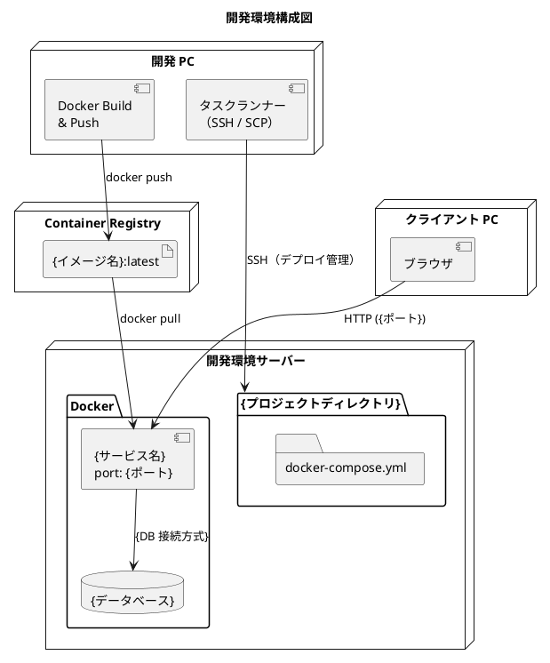
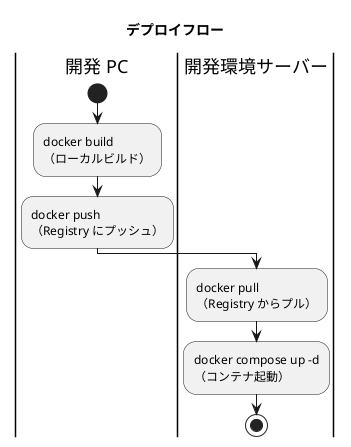

# 開発環境セットアップ手順書

## 概要

{開発環境サーバー}を開発環境として使用し、{プロジェクト名}を Docker ベースで運用するための環境構築手順を説明します。

Docker イメージは開発 PC でビルドし、Container Registry 経由で開発環境サーバーにデプロイします。サーバー上での Docker ビルドは不要です。

| サービス | 略称 | コンテナ名 | ポート | 説明 |
|---------|------|-----------|--------|------|
| {サービス名} | {略称} | {コンテナ名} | {ポート} | {説明} |



### デプロイフロー



## 前提条件

- 開発環境サーバー（{サーバー OS / バージョン}）
- 管理者権限を持つアカウント
- サーバーへのネットワークアクセス（SSH）
- SFTP サービスが有効（SCP ファイル転送に必要）
- Container Registry のアカウント（{Registry 名}）
- 開発 PC に Docker Desktop がインストール済み

---

## セットアップ手順

### 1. SSH・SFTP サービスの設定

#### 1.1 SSH サービスの有効化

1. サーバー管理画面にアクセス
2. SSH サービスを有効にする
3. ポート番号を確認（デフォルト: 22）

#### 1.2 SSH ユーザー権限の確認

SSH 接続には管理者グループに所属するユーザーが必要です。

1. 使用するユーザーが SSH アクセスを許可されていることを確認
2. 管理者グループに所属していることを確認

#### 1.3 SFTP サービスの有効化

SCP によるファイル転送に SFTP サブシステムが必要です。

1. サーバー管理画面で SFTP サービスを有効にする

> **注意**: SFTP が無効の場合、`scp` コマンドで `subsystem request failed on channel 0` エラーが発生します。

#### 1.4 SSH 接続の確認

開発 PC からの SSH 接続を確認します。

```bash
ssh <ユーザー名>@<サーバー IP>
```

接続後、以下を確認します:

```bash
# ホスト名と日時を表示
echo "接続成功: $(hostname) / $(date)"

# Docker が利用可能か確認
docker --version
```

#### 1.5 SSH 鍵認証の設定（推奨）

##### 鍵の生成（開発 PC で実行）

```bash
ssh-keygen -t ed25519 -C "your_email@example.com"
```

##### 公開鍵をサーバーにコピー

```bash
ssh-copy-id -i ~/.ssh/id_ed25519.pub <ユーザー名>@<サーバー IP>
```

##### SSH 接続の設定ファイル（推奨）

`~/.ssh/config` に設定を追記します。

```text
Host {ホスト名}
    HostName <サーバー IP>
    User <ユーザー名>
    IdentityFile ~/.ssh/id_ed25519
```

設定後は `ssh {ホスト名}` で接続できます。

##### SSH 鍵認証がうまくいかない場合

サーバーにパスワードでログインし、以下を実行します。

```bash
chmod 755 ~
chmod 700 ~/.ssh
chmod 600 ~/.ssh/authorized_keys
```

#### 1.6 sudo パスワード省略の設定

```bash
sudo chmod u+w /etc/sudoers
sudo vi /etc/sudoers
```

末尾に以下を追加（ユーザー名に合わせて変更）:

```text
{ユーザー名} ALL=(ALL) NOPASSWD: ALL
```

編集後、権限を元に戻します:

```bash
sudo chmod u-w /etc/sudoers
```

> **注意**: OS アップデートで `/etc/sudoers` がリセットされる場合があります。

---

### 2. プロジェクトディレクトリの作成

SSH でサーバーに接続し、プロジェクト用ディレクトリを作成します。

```bash
ssh <ユーザー名>@<サーバー IP>

sudo mkdir -p {プロジェクトディレクトリ}
sudo chown $(whoami) {プロジェクトディレクトリ}
```

### ディレクトリ構造

サーバー上にはソースコードや Dockerfile は配置しません。docker-compose.yml のみで管理します。

```text
{プロジェクトディレクトリ}/
├── docker-compose.yml       # Docker Compose 設定（image ベース）
└── docs/                    # ドキュメント成果物（任意）
```

---

### 3. Docker のインストール

サーバーに Docker をインストールします。

```bash
# インストール方法はサーバー OS に依存
# 例: パッケージマネージャからインストール
{Docker インストールコマンド}
```

#### Docker Compose の確認

```bash
docker --version
docker compose version
```

---

### 4. Container Registry の設定

Docker イメージは Container Registry で管理します。

#### 4.1 認証情報の作成

Registry へのアクセスに必要な認証情報を作成します。

| 項目 | 設定値 |
|------|--------|
| 名前 | `{トークン名}` |
| 有効期限 | `90 days` または `No expiration` |
| 権限 | `read:packages`、`write:packages` |

> **重要**: トークンは一度しか表示されない場合があります。紛失した場合は再発行が必要です。

#### 4.2 必要な権限

| 権限 | 説明 | 用途 |
|------|------|------|
| `read:packages` | パッケージのダウンロード | サーバーでのイメージプル |
| `write:packages` | パッケージのアップロード | 開発 PC からのイメージプッシュ |

#### 4.3 サーバーからの Registry ログイン

```bash
ssh <ユーザー名>@<サーバー IP>

# トークンを使用してログイン
echo '<トークン>' | sudo docker login {Registry URL} -u <ユーザー名> --password-stdin
```

#### 4.4 開発 PC の .env 設定

プロジェクトルートの `.env` に以下を設定します。

```dotenv
# SSH 接続情報
DEV_SSH_HOST=<サーバー IP>
DEV_SSH_USER=<ユーザー名>
DEV_SSH_PORT=22
DEV_SSH_KEY=~/.ssh/id_ed25519

# Registry 認証情報
REGISTRY_USER=<ユーザー名>
REGISTRY_TOKEN=<トークン>

# オプション（デフォルト値あり）
# REGISTRY_URL={Registry URL}
# REGISTRY_OWNER={組織名}
# REGISTRY_TAG=latest
# DEV_REMOTE_PROJECT_PATH={プロジェクトディレクトリ}
```

---

### 5. Docker Compose 設定

`{プロジェクトディレクトリ}/docker-compose.yml` は `image:` ベースで構成します。Registry からイメージをプルして起動します。

```yaml
services:
  {サービス名}:
    image: {Registry URL}/{組織名}/{イメージ名}:latest
    container_name: {コンテナ名}
    restart: unless-stopped
    environment:
      PORT: {ポート}
    ports:
      - "{ポート}:{ポート}"
    healthcheck:
      test: ["CMD-SHELL", "{ヘルスチェックコマンド}"]
      interval: 10s
      timeout: 5s
      retries: 12
      start_period: 60s
```

> **補足**: docker-compose.yml はデプロイスクリプトが自動生成・配置する構成も可能です。

---

### 6. イメージのビルドとプッシュ（開発 PC）

開発 PC で Docker イメージをビルドし、Registry にプッシュします。

#### 6.1 イメージ構成

| サービス | Dockerfile | イメージ名 |
|---------|------------|-----------|
| {サービス名} | `{Dockerfile パス}` | `{Registry URL}/{組織名}/{イメージ名}:latest` |

#### 6.2 タスクランナーによるビルド・プッシュ

```bash
# 全サービスをローカルビルド
{ビルドコマンド}

# 全イメージを Registry にプッシュ
{プッシュコマンド}
```

#### 6.3 手動でのビルド・プッシュ

```bash
# Registry にログイン
echo $REGISTRY_TOKEN | docker login {Registry URL} -u $REGISTRY_USER --password-stdin

# イメージのビルドとプッシュ
docker build -t {Registry URL}/{組織名}/{イメージ名}:latest {Dockerfile ディレクトリ}
docker push {Registry URL}/{組織名}/{イメージ名}:latest
```

#### 6.4 イメージの確認

```bash
# ビルドされたイメージを確認
docker images | grep {イメージ名}
```

---

### 7. 初回セットアップ

#### 7.1 タスクランナーによる自動セットアップ

開発 PC からビルド・プッシュ・デプロイまで一括でセットアップできます。

```bash
{セットアップコマンド}
```

自動セットアップは以下を実行します:

1. ローカルで Docker イメージをビルド
2. Registry にログイン & プッシュ
3. SSH 接続確認
4. プロジェクトディレクトリの作成
5. サーバーから Registry にログイン
6. docker-compose.yml の生成・配置
7. イメージのプル & コンテナ起動

#### 7.2 手動セットアップ

```bash
# サーバーに SSH 接続
ssh <ユーザー名>@<サーバー IP>

# Registry にログイン
echo '<トークン>' | sudo docker login {Registry URL} -u <ユーザー名> --password-stdin

# プロジェクトディレクトリに移動
cd {プロジェクトディレクトリ}

# docker-compose.yml を作成（セクション 5 の内容）
vi docker-compose.yml

# イメージをプル
sudo docker compose pull

# コンテナを起動
sudo docker compose up -d

# 起動状態を確認
sudo docker compose ps
```

#### 7.3 起動確認

すべてのコンテナが `healthy` 状態になるまで待機します（約 1〜2 分）。

```bash
# 全コンテナの状態を確認
docker compose ps

# 期待される出力:
# NAME             SERVICE      STATUS          PORTS
# {コンテナ名}      {サービス名}   Up (healthy)    0.0.0.0:{ポート}->{ポート}/tcp
```

---

### 8. 動作確認

#### 8.1 ヘルスチェック

```bash
# 各サービスのヘルスチェック
curl http://<サーバー IP>:{ポート}/{ヘルスチェックパス}
```

期待されるレスポンス:

```json
{"status":"UP"}
```

#### 8.2 ブラウザからのアクセス

| 確認項目 | URL |
|---------|-----|
| {サービス名} アプリ | `http://<サーバー IP>:{ポート}/` |
| {サービス名} API ドキュメント | `http://<サーバー IP>:{ポート}/{API ドキュメントパス}` |
| {サービス名} DB 管理ツール | `http://<サーバー IP>:{ポート}/{DB 管理パス}` |

---

### 9. 個別デプロイ（更新手順）

サービスを更新する場合は、開発 PC でビルド・プッシュし、サーバーでプルします。

#### 9.1 典型的なデプロイフロー

```bash
# 1. 開発 PC でイメージをビルド
{ビルドコマンド}

# 2. Registry にプッシュ
{プッシュコマンド}

# 3. サーバーでプル & 再起動
{デプロイコマンド}
```

#### 9.2 特定サービスの更新

```bash
# 特定サービスのみビルド・プッシュ・デプロイ
{サービス別ビルドコマンド}
{サービス別プッシュコマンド}
{サービス別デプロイコマンド}
```

#### 9.3 手動での更新

```bash
# サーバーに SSH 接続
ssh <ユーザー名>@<サーバー IP>

cd {プロジェクトディレクトリ}

# 最新イメージをプル
sudo docker compose pull

# コンテナを再作成
sudo docker compose up -d

# 特定サービスのみ更新する場合
sudo docker compose pull {サービス名}
sudo docker compose up -d {サービス名}
```

---

### 10. Docker 管理コマンド

```bash
# プロジェクトディレクトリに移動
cd {プロジェクトディレクトリ}

# コンテナの状態確認
docker compose ps

# 全コンテナの起動
docker compose up -d

# 全コンテナの停止
docker compose down

# 全コンテナの再起動
docker compose restart

# 特定コンテナの再起動
docker compose restart {サービス名}

# 最新イメージをプルして再起動
docker compose pull && docker compose up -d

# ログの確認（リアルタイム）
docker compose logs -f

# 特定コンテナのログ
docker compose logs -f {サービス名}

# ログの確認（直近 100 行）
docker compose logs --tail=100 {サービス名}

# コンテナに接続
docker exec -it {コンテナ名} sh

# 使用していないイメージの削除
docker image prune -f
```

---

### 11. 環境のクリーンアップ

開発環境を完全にクリーンアップする場合:

```bash
cd {プロジェクトディレクトリ}

# コンテナの停止・削除（イメージも削除）
docker compose down --rmi all

# docker-compose.yml の削除
rm -f docker-compose.yml

# Registry ログアウト
docker logout {Registry URL}
```

---

### 12. Web サーバーによるポータルサイト設定（任意）

ポータルサイトを Web サーバーで公開する場合の設定手順です。

#### 12.1 Web サーバーのインストール

サーバーに Web サーバー（Nginx / Apache 等）をインストールします。

#### 12.2 ポータルファイルの配置

```bash
ssh <ユーザー名>@<サーバー IP>

# ドキュメントルートにディレクトリを作成
sudo mkdir -p {Web ルートディレクトリ}
sudo chown $(whoami) {Web ルートディレクトリ}
```

開発 PC からポータルファイルを転送します。

```bash
# タスクランナーを使用（推奨）
{ポータルデプロイコマンド}

# または手動で転送
scp -r {ポータルソースディレクトリ}/* <ユーザー名>@<サーバー IP>:{Web ルートディレクトリ}/
```

#### 12.3 動作確認

```bash
# ブラウザで以下にアクセス
curl http://<サーバー IP>/{ポータルパス}/
```

---

### 13. デプロイスクリプト一覧

主要なデプロイタスクの一覧です。

```bash
# 典型的なデプロイフロー
{ビルドコマンド}                    # 1. ローカルでイメージビルド
{プッシュコマンド}                   # 2. Registry にプッシュ
{デプロイコマンド}                   # 3. サーバーでプル & 再起動

# 初回セットアップ（ビルド → プッシュ → ログイン → プル → 起動 を一括実行）
{セットアップコマンド}

# 管理
{ステータス確認コマンド}              # コンテナ状態を確認
{ログ確認コマンド}                   # コンテナログを表示
{クリーンアップコマンド}              # 開発環境を完全削除
{ヘルプコマンド}                    # ヘルプを表示
```

---

### 14. トラブルシューティング

#### Registry からプルできない（401 Unauthorized）

| 原因 | 対処 |
|------|------|
| トークンの権限不足 | `read:packages` 権限があるか確認 |
| トークンの有効期限切れ | 新しいトークンを発行し、`.env` と設定を更新 |
| Registry 未ログイン | `docker login {Registry URL}` を実行 |

#### イメージが見つからない

| 原因 | 対処 |
|------|------|
| イメージ未プッシュ | ビルド・プッシュコマンドを実行 |
| イメージ名のスペルミス | イメージ名を確認 |
| 組織のパッケージ権限 | 管理者にパッケージへの Read 権限を依頼 |

#### コンテナが起動しない

```bash
cd {プロジェクトディレクトリ}

# コンテナのログを確認
docker compose logs {サービス名}
```

| 症状 | 原因 | 対処 |
|------|------|------|
| `image not found` | イメージ未プル | `docker compose pull` |
| `EADDRINUSE` | ポートが使用中 | `docker compose down` で既存コンテナを停止 |
| `OOM` / メモリ不足 | サーバーのメモリ不足 | 不要なコンテナを停止、メモリ増設を検討 |
| `healthcheck` が失敗 | アプリ起動に時間がかかる | `start_period` を延長 |

#### SSH から docker login できない

| 原因 | 対処 |
|------|------|
| トークンに特殊文字 | トークンをシングルクォートで囲む |
| Docker 未起動 | Docker サービスが起動しているか確認 |

#### トークンの更新手順

トークンの有効期限が切れた場合:

1. 新しいトークンを発行（セクション 4.1 参照）
2. 開発 PC の `.env` の `REGISTRY_TOKEN` を更新
3. サーバーで Registry 再ログイン

---

## ポート一覧

| サービス | ポート | 外部公開 | 備考 |
|---------|--------|---------|------|
| {サービス名} | {ポート} | はい | {備考} |
| SSH | 22 | 制限付き | 管理者のみ |

---

## 接続情報まとめ

| 用途 | 接続先 |
|------|--------|
| {サービス名} アプリ | `http://<サーバー IP>:{ポート}/` |
| {サービス名} API ドキュメント | `http://<サーバー IP>:{ポート}/{パス}` |
| SSH | `ssh <ユーザー名>@<サーバー IP>` |

---

## セキュリティチェックリスト

- [ ] SSH 鍵認証を設定した
- [ ] ファイアウォールで不要なポートをブロックした
- [ ] DB 管理ツールへのアクセスをローカルネットワークに制限した
- [ ] サーバー管理画面のアクセスを制限した
- [ ] Registry のトークンを安全に管理している（.env は Git 管理外）
- [ ] Registry のトークンの有効期限を把握している

---

## 関連ドキュメント

- {関連ドキュメント 1}
- {関連ドキュメント 2}
